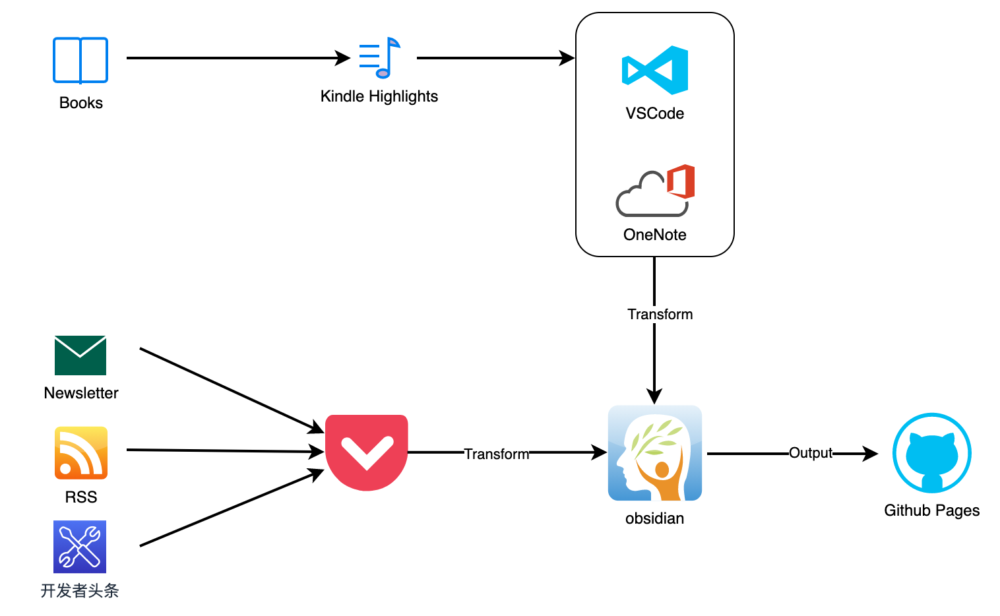

# 开发进阶笔记

- [开发进阶笔记](#开发进阶笔记)
  - [我的信息处理工作流](#我的信息处理工作流)
  - [目录](#目录)
    - [Coding Practices](#coding-practices)
    - [Leadership](#leadership)
    - [Refactoring](#refactoring)
    - [C++](#c)
    - [Python](#python)
    - [Java](#java)
    - [Linux](#linux)
    - [Network](#network)
    - [Database](#database)
    - [Vim](#vim)
    - [Elasticsearch](#elasticsearch)
    - [Spark](#spark)
    - [System Design](#system-design)

## 我的信息处理工作流

1. 输入源以书为主，网上的信息源为辅
2. 读书主要在 Kindle 上进行，遇到重点先高亮，然后使用 VS Code 或 OneNote 整理
3. 网上的碎片信息经过筛选后，全部放进 [Pocket](https://getpocket.com/) 阅读
4. 参照 [卡片盒笔记法](https://sspai.com/post/60802) 用自己的语言提取知识点，工具是 [obsidian](https://obsidian.md/) 
5. obsidian 中有值得分享的内容，放到 [Github Pages](https://hellokangning.github.io/) 上

## 目录

### Coding Practices

[程序员修炼之道](coding-practices/the-pragmatic-programmer/README.md)

[程序员的思维修炼](coding-practices/pragmatic-thinking-and-learning/README.md)

[程序员的职业素养](coding-practices/the-clean-coder/README.md)

[编写可读代码的艺术](coding-practices/the-art-of-readable-code/README.md)

### Leadership

[The Manager's Path](leadership/the-managers-path/README.md)

### Refactoring

[重构：改善既有代码的设计](refactoring/README.md)

[程序员的自我修养](perspective/self-load/README.md)

### C++

[C++ Primer](cpp/cpp-primer/README.md)

[C专家编程](cpp/expert-c-programming/README.md)

[C++语言的设计和演化](cpp/the-design-and-evolution-of-c++/README.md)

[C++语言99个常见编程错误](cpp/cpp-gotchas/README.md)

[C陷阱与缺陷](cpp/c-traps-and-pitfalls/README.md)

### Python

[Python参考手册](python/essential-reference/README.md)

### Java

[Java编程思想](java/thinking-in-java/README.md)

### Linux

[现代操作系统](linux/modern-operating-systems/README.md)

[Linux程序设计](linux/beginning-linux-programming/README.md)

[Linux内核设计与实现](linux/linux-kernel-development/README.md)

[UNIX编程艺术](linux/the-art-of-unix-programming/README.md)

### Network

[TCP/IP详解 卷1：协议](network/tcpip/README.md)

### Database

[MongoDB权威指南](database/mongo/the-definitive-guide/README.md)

[Redis设计与实现](database/redis/README.md)

[Apache HBase ™ Reference Guide](database/hbase/reference-guide/README.md)

[HBase权威指南](database/hbase/the-definitive-guide/README.md)

### Vim

[学习vi和Vim编辑器](vim/learning-the-vi-and-vim-editors/README.md)

[Vim实用技巧](vim/practical-vim/README.md)

### Elasticsearch

[深入理解Elasticsearch](es/mastering-es/README.md)

[Elasticsearch权威指南](es/the-definitive-guide/README.md)

[滥竽充数：我的博客](es/my-footprint/README.md)

### Spark

[Spark快速大数据分析](spark/learning-spark/README.md)

[Spark技术内幕](spark/spark-internals/README.md)

[High Performance Spark](spark/high-performance-spark/README.md)

### System Design

[Design Data Intensive Applications](system-design/designing-data-intensive-applications/README.md)

[性能之巅](system-design/systems-performance/README.md)
