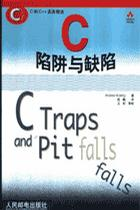

<!-- START doctoc generated TOC please keep comment here to allow auto update -->
<!-- DON'T EDIT THIS SECTION, INSTEAD RE-RUN doctoc TO UPDATE -->
**Table of Contents**  *generated with [DocToc](https://github.com/thlorenz/doctoc)*

- [目录](#%E7%9B%AE%E5%BD%95)

<!-- END doctoc generated TOC please keep comment here to allow auto update -->

[《C陷阱与缺陷》](https://book.douban.com/subject/1102097/)读书笔记。

# 目录

[词法陷阱](词法陷阱.md)

[语法陷阱](语法陷阱.md)

[语义陷阱](语义陷阱.md)

[连接](连接.md)

[库函数](库函数.md)

[预处理器](预处理器.md)

[可移植性缺陷](可移植性缺陷.md)
