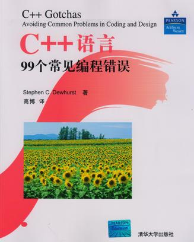

<!-- START doctoc generated TOC please keep comment here to allow auto update -->
<!-- DON'T EDIT THIS SECTION, INSTEAD RE-RUN doctoc TO UPDATE -->
**Table of Contents**  *generated with [DocToc](https://github.com/thlorenz/doctoc)*

- [目录](#%E7%9B%AE%E5%BD%95)

<!-- END doctoc generated TOC please keep comment here to allow auto update -->

[《C++语言99个常见编程错误》](https://book.douban.com/subject/3767699/)读书笔记。

# 目录

[1. 基础问题](基础问题.md)

[2. 语法问题](语法问题.md)

[3. 预处理器问题](预处理器问题.md)

[4. 类型转换问题](类型转换问题.md)

[5. 初始化问题](初始化问题.md)

[6. 内存和资源管理问题](内存和资源管理问题.md)

[7. 多态问题](多态问题.md)

[8. 类型设计问题](类型设计问题.md)

[9. 继承谱系设计问题](继承谱系设计问题.md)
