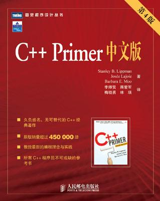

<!-- START doctoc generated TOC please keep comment here to allow auto update -->
<!-- DON'T EDIT THIS SECTION, INSTEAD RE-RUN doctoc TO UPDATE -->
**Table of Contents**  *generated with [DocToc](https://github.com/thlorenz/doctoc)*

- [目录](#%E7%9B%AE%E5%BD%95)

<!-- END doctoc generated TOC please keep comment here to allow auto update -->

[《C++ Primer》](https://book.douban.com/subject/1767741/)读书笔记

# 目录

[1. 快速入门](快速入门.md)

[2. 变量和基本类型](变量和基本类型.md)

[3. 标准库类型](标准库类型.md)

[4. 数组和指针](数组和指针.md)

[5. 表达式](表达式.md)

[6. 语句](语句.md)

[7. 函数](函数.md)

[8. 标准IO库](标准IO库.md)

[9. 顺序容器](顺序容器.md)

[10. 关联容器](关联容器.md)

[11. 泛型算法](泛型算法.md)

[12. 类](类.md)

[13. 复制控制](复制控制.md)

[14. 重载操作符与转换](重载操作符与转换.md)

[15. 面向对象编程](面向对象编程.md)

[16. 模版与泛型模版](模版与泛型模版.md)

[17. 用于大型程序的工具](用于大型程序的工具.md)

[18. 特殊工具与技术](特殊工具与技术.md)
