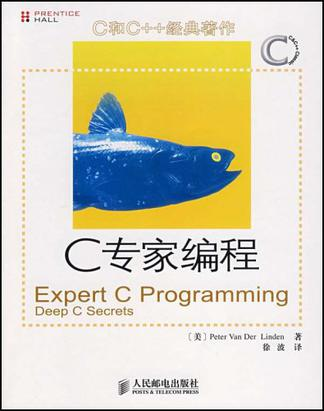

<!-- START doctoc generated TOC please keep comment here to allow auto update -->
<!-- DON'T EDIT THIS SECTION, INSTEAD RE-RUN doctoc TO UPDATE -->
**Table of Contents**  *generated with [DocToc](https://github.com/thlorenz/doctoc)*

- [目录](#%E7%9B%AE%E5%BD%95)

<!-- END doctoc generated TOC please keep comment here to allow auto update -->

[《C专家编程》](https://book.douban.com/subject/2377310/)读书笔记。

# 目录

[C：穿越时空的迷雾](C：穿越时空的迷雾.md)

[这不是bug，而是语特性](这不是bug，而是语言特性.md)

[分析C语言的声明](分析C语言的声明.md)

[数组和指针并不相同](数组和指针并不相同.md)

[对链接的思考](对链接的思考.md)

[运行时数据结构](运行时数据结构.md)

[对内存的思考](对内存的思考.md)

[为什么程序员无法区分万圣节和圣诞节](为什么程序员无法区分万圣节和圣诞节.md)

[再论数组](再论数组.md)

[再论指针](再论指针.md)

[你懂得C，所以C++不在话下](你懂得C，所以C++不在话下.md)

[面试的秘密](面试的秘密.md)