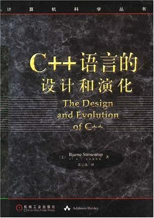

<!-- START doctoc generated TOC please keep comment here to allow auto update -->
<!-- DON'T EDIT THIS SECTION, INSTEAD RE-RUN doctoc TO UPDATE -->
**Table of Contents**  *generated with [DocToc](https://github.com/thlorenz/doctoc)*

- [目录](#%E7%9B%AE%E5%BD%95)

<!-- END doctoc generated TOC please keep comment here to allow auto update -->

[《C++语言的设计和演化》](https://book.douban.com/subject/1096216/)读书笔记。

# 目录

[带类的C](带类的C.md)

[C++的诞生](C++的诞生.md)

[C++语言的设计规则](C++语言的设计规则.md)

[存储管理](存储管理.md)

[重载](重载.md)

[多重继承](多重继承.md)

[类概念的精炼.md](类概念的精炼.md)
