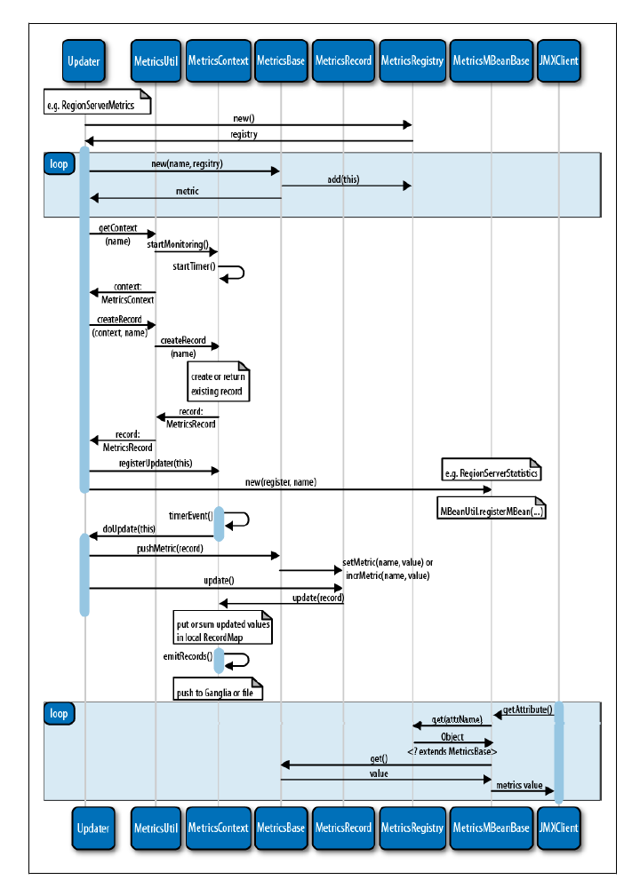

<!-- START doctoc generated TOC please keep comment here to allow auto update -->
<!-- DON'T EDIT THIS SECTION, INSTEAD RE-RUN doctoc TO UPDATE -->
**Table of Contents**  *generated with [DocToc](https://github.com/thlorenz/doctoc)*

- [10.1 介绍](#101-%E4%BB%8B%E7%BB%8D)
- [10.2 监控框架](#102-%E7%9B%91%E6%8E%A7%E6%A1%86%E6%9E%B6)
  - [10.2.1 上下文、记录和监控指标](#1021-%E4%B8%8A%E4%B8%8B%E6%96%87%E8%AE%B0%E5%BD%95%E5%92%8C%E7%9B%91%E6%8E%A7%E6%8C%87%E6%A0%87)
  - [10.2.2 master 监控指标](#1022-master-%E7%9B%91%E6%8E%A7%E6%8C%87%E6%A0%87)
  - [10.2.3 region server 监控指标](#1023-region-server-%E7%9B%91%E6%8E%A7%E6%8C%87%E6%A0%87)
    - [块缓存监控指标](#%E5%9D%97%E7%BC%93%E5%AD%98%E7%9B%91%E6%8E%A7%E6%8C%87%E6%A0%87)
    - [合并监控](#%E5%90%88%E5%B9%B6%E7%9B%91%E6%8E%A7)
    - [memstore 监控指标](#memstore-%E7%9B%91%E6%8E%A7%E6%8C%87%E6%A0%87)
    - [存储监控指标](#%E5%AD%98%E5%82%A8%E7%9B%91%E6%8E%A7%E6%8C%87%E6%A0%87)
    - [I/O 监控指标](#io-%E7%9B%91%E6%8E%A7%E6%8C%87%E6%A0%87)
    - [其他监控指标](#%E5%85%B6%E4%BB%96%E7%9B%91%E6%8E%A7%E6%8C%87%E6%A0%87)
  - [10.2.4 RPC 监控指标](#1024-rpc-%E7%9B%91%E6%8E%A7%E6%8C%87%E6%A0%87)
  - [10.2.5 JVM 监控指标](#1025-jvm-%E7%9B%91%E6%8E%A7%E6%8C%87%E6%A0%87)
    - [内存占用](#%E5%86%85%E5%AD%98%E5%8D%A0%E7%94%A8)
    - [垃圾回收](#%E5%9E%83%E5%9C%BE%E5%9B%9E%E6%94%B6)
    - [线程监控](#%E7%BA%BF%E7%A8%8B%E7%9B%91%E6%8E%A7)
    - [系统事件](#%E7%B3%BB%E7%BB%9F%E4%BA%8B%E4%BB%B6)
  - [10.2.6 info 监控指标](#1026-info-%E7%9B%91%E6%8E%A7%E6%8C%87%E6%A0%87)
- [10.3 Ganglia](#103-ganglia)
- [10.4 JMX](#104-jmx)
    - [JConsole](#jconsole)
- [10.5 Nagios](#105-nagios)
- [导航](#%E5%AF%BC%E8%88%AA)

<!-- END doctoc generated TOC please keep comment here to allow auto update -->

# 10.1 介绍

HBase 原生支持的可视化系统是 Ganglia。为了监控系统，用户需要一个能够处理 HBase 进程导出的、基于 JMX 监控指标 API 的系统，通常此类系统的例子是 Nagios。

# 10.2 监控框架

每个 HBase进程都会提供一系列的监控指标。这些指标随后可以被各种监控 API 和工具使用。

## 10.2.1 上下文、记录和监控指标

HBase 使用 Hadoop 的监控框架，并继承了其所有的类和特性。这个框架是基于 MetricsContext 接口来处理监控数据点的生成，并使用这些数据点监控和绘图。下面是可用的实现列表：

- GanliaContext：推送监控指标到 Ganglia。
- FileContext：将监控指标写入磁盘上一个文件中。
- TimeStampFileContext：同样将监控指标写入磁盘上一个文件中，但为每个指标都添加一个时间戳前缀，类似日志记录。
- CompositeContext：允许为监控指标生成不止一个上下文。
- NullContext：监控指标框架的关闭选项，使用这种上下文，不生成也不聚合监控指标。
- NullContextWithUpdateThread：不生成任何监控指标，但启动聚合统计线程。这种上下文在通过 JMX 检索监控指标时使用。

多重监控指标使用 MetricsRecord 分组，来描述一个具体的子系统。HBase 使用这些组来分别保存 master、region server 或其他服务器的统计信息。

上下文有内置的定时器来触发并将监控指标推送至目标 -- 可能是文件、Ganglia、或者其他解决方案。

在系统内部，监控指标是被基于 MetricsBase 的容器类追踪的，这些容器类包含各种当消息发生时需要调用的方法。反过来，框架跟踪每个监控指标消息的数量，将将其与上次追踪到现在所消耗的时间关联起来。

## 10.2.2 master 监控指标

因为 master 被设计为相对轻量级的系统进程，只负责一些集群范围的操作，因此它的监控指标比 region server 更有限一点：

| 监控指标             | 描述                             |
| ---------------- | ------------------------------ |
| cluster requests | 集群请求总数，累加所有 region server 统计的值 |
| split time       | 重启后拆分预写日志的时间                   |
| split size       | 拆分预写日志的大小                      |

## 10.2.3 region server 监控指标

### 块缓存监控指标

块缓存用啦保存底层 HFile 从 HDFS 读取的存储块。这样用户可以将一个块保存在内存中，知道空间不足时再清理出去。

`count`监控指标反应当前缓存中保存的块数目，`size`是占用的 Java 堆空间大小。`free`是堆空间为缓存保留的可用空间，`evicted`统计了当堆空间受限时被移除的块的数目。

`hit`和`miss`记录块缓存追踪缓存命中的数目，`hit ratio`是命中率，反映了命中缓存总数与请求缓存总数的关系。

### 合并监控

`compaction size`和`compaction time`代表需要合并的存储文件的总大小和操作花费时间。只有当合并完成后，这些值才被报告。

`compaction queue size`检测一个 server 中有多少文件正在排队等候合并。

### memstore 监控指标

更新数据通常保存在 region server 的 memstore 中，并将会在之后的刷写写到磁盘上。`memstore size MB`表示服务器上所有 memstore 占用的堆大小。

`flush queue size`指的是将要刷写的 region 的数目。`flush size`和`flush time`表示被刷写到磁盘上的 memstore 大小和本次刷写所用的时间。

### 存储监控指标

`store files`显示了所有存储文件的数目，涉及到当前机器管理的所有 region 的存储文件。

`stores`显示了服务器上所有 region 的存储文件的数目。

`store file index MB`是所有存储文件的块索引和元数据索引的大小。

### I/O 监控指标

`fs read latency`报告文件系统的读延迟，如从存储文件中装载块。

`fs write latency`报告写延迟，如写存储文件和预写日志。

`fs sync latency`统计了预写日志记录同步到文件系统的延迟。

### 其他监控指标

`read request count`和`write request count`分别表示总的读操作和写操作的数目。

`requests`是自上次轮询之后的每秒的请求数。

`regions`指的是目前 region 服务器在线的 region 数目。

## 10.2.4 RPC 监控指标

PRC 监控会自动监控每次不同客户端和服务器端之家的操作。

| 指标                    | 描述                                       |
| --------------------- | ---------------------------------------- |
| `RPC Processing Time` | 服务器端执行 RPC 请求消耗的时间，统计所有 RPC 调用的时间，并取平均值  |
| `RPC Queue Time`      | 因为 RPC 需要使用排队系统，可能操作操作达到时间和操作实际执行施加你的延迟，即排队时间。 |

剩下的监控指标来自 master 和 region server 的 RPC API，包括`regionServerStartup()`和`regionServerReport`，它们分别在 region server 初始化并向 master 节点报告时调用，以及常规报告状态时调用。

## 10.2.5 JVM 监控指标

### 内存占用

用户可以得到正在使用的内存和保证可以由 JVM 使用的内存的信息，包括堆和非堆内存。前者是 JVM 按用户行为管理内存，并定期垃圾回收。后者是 JVM 为内部需求占用的内存。

### 垃圾回收

`gc count`表示垃圾回收的次数，`gc time`表示上次轮询至今累计的垃圾回收占用时间。

### 线程监控

用户可以观察到线程状态相关的计数器、包括新建、运行和阻塞。

### 系统事件

它提供了各种日志级别的消息数目。

## 10.2.6 info 监控指标

info 指标包含了进程的固化信息，如：

- HBase 编译日期、版本
- 编译使用的源码库版本、URL 地址
- HDFS 编译日期、使用的源码库版本、编译者

# 10.3 Ganglia

HBase 从 Hadoop 继承了对 Ganglia 的原生支持，同时提供了一个可以直接推送家弄数据到 Ganglia 的客户端。

Ganglia 由三个部分组成：

- 监控守护进程（gmond）。它在每台需要监控的机器上运行，搜集本地数据，准备统计信息，然后被其他系统拉取。它积极地监控通过单一或组播网络消息传播的主机变化情况。
- 元数据守护进程（gmetad）。它安装在一个中心节点上，从多个监控守护进程拉取数据来获取整个集群的状态，然后使用 RRDtool 将这些信息存储在时间序列数据库中。
- PHP 前端展示网页。

# 10.4 JMX

Java Management Extensions 技术是 Java 应用程序导出当前状态的标准。

当服务器启动时，不仅会将监控指标注册到相应的上下文中，还会将它们导出为所谓的 JMX 属性。

JMX 使用 MBeans 的概念，用来提供特定的属性和操作集合。

### JConsole

Java 有个 JConcole 工具，用来连接本地或远程的 Java 进程。

# 10.5 Nagios

Nagios 是一个被广泛使用的、获取与集群状态香瓜你的定型数据的支持工具。它定期拉取监控数据并与阈值比较，一旦超过阈值，就会触发规避动作，包括发电子邮件、打电话、执行各种脚本。

用户可以使用 JMX 将 Nagios 和 HBase 集成到一起，可选的方法包括 JMXToolkit。

# 导航

[目录](README.md)

上一章：[9、高级用法](9、高级用法.md)

下一章：[11、性能优化](11、性能优化.md)
