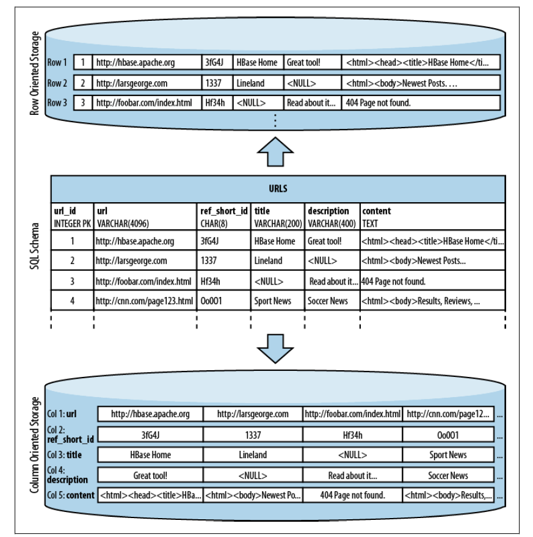
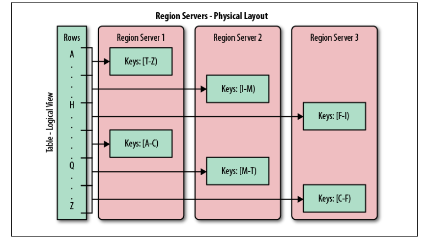
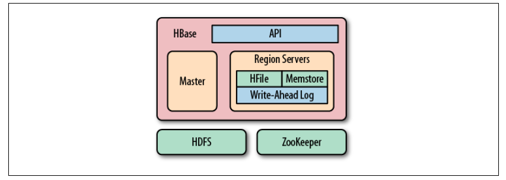

<!-- START doctoc generated TOC please keep comment here to allow auto update -->
<!-- DON'T EDIT THIS SECTION, INSTEAD RE-RUN doctoc TO UPDATE -->
**Table of Contents**  *generated with [DocToc](https://github.com/thlorenz/doctoc)*

- [1.1 海量数据的黎明](#11-%E6%B5%B7%E9%87%8F%E6%95%B0%E6%8D%AE%E7%9A%84%E9%BB%8E%E6%98%8E)
- [1.2 关系数据库系统的问题](#12-%E5%85%B3%E7%B3%BB%E6%95%B0%E6%8D%AE%E5%BA%93%E7%B3%BB%E7%BB%9F%E7%9A%84%E9%97%AE%E9%A2%98)
- [1.3 NoSQL](#13-nosql)
  - [1.3.1 维度](#131-%E7%BB%B4%E5%BA%A6)
  - [1.3.2 可扩展性](#132-%E5%8F%AF%E6%89%A9%E5%B1%95%E6%80%A7)
  - [1.3.3 数据库的范式化和反范式化](#133-%E6%95%B0%E6%8D%AE%E5%BA%93%E7%9A%84%E8%8C%83%E5%BC%8F%E5%8C%96%E5%92%8C%E5%8F%8D%E8%8C%83%E5%BC%8F%E5%8C%96)
- [1.4 结构](#14-%E7%BB%93%E6%9E%84)
  - [1.4.2 表](#142-%E8%A1%A8)
  - [1.4.3 自动分区](#143-%E8%87%AA%E5%8A%A8%E5%88%86%E5%8C%BA)
  - [1.4.4 存储API](#144-%E5%AD%98%E5%82%A8api)
  - [1.4.5 实现](#145-%E5%AE%9E%E7%8E%B0)
- [导航](#%E5%AF%BC%E8%88%AA)

<!-- END doctoc generated TOC please keep comment here to allow auto update -->

# 1.1 海量数据的黎明

数据的价值日益凸显。

Hadoop 擅长存储任意的、半结构化的数据，甚至是非结构化的数据。它几乎是现有数据库系统的一种补充，给用户提供了数据存储的无限空间。

大多数的 RDBMS 都遵守 Codd's 12 rules。列式存储数据库以列为单位聚合数据，然后将列值顺序地存入磁盘，而行式数据库则是连续地存储整行。列式存储的出现是基于这一假设：对于特定的查询，不是所有的值都是必须的。另外，列式存储对压缩更友好。

HBase 以列式存储的格式在磁盘上存储数据。传统的列式数据库适合实时存储数据的场景，而HBase适合键值对的数据存取，或者有序的数据存取。

# 1.2 关系数据库系统的问题

RDBMS 适合有限的数据量，但对于数据急剧增长的情况就力不从心了。减少压力的常见做法有：

1. 读写分离，即保留一个 master 只服务写请求。但写请求的压力无法缓解。

2. 增加缓存，如 Memcached。这种方案无法保证数据一致性。

   ​

# 1.3 NoSQL

在 NoSQL 范畴内，有很多维度可以区分系统的特定优势。

## 1.3.1 维度

- **数据模型**。键值对、半结构化的列式存储和文档结构存储？
- **存储模型**。内存还是持久化？
- **一致性模型**。严格一致性还是最终一致性？
- **物理模型**。分布式还是单机？
- **读写性能**。读多写少还是写多读少？
- **辅助索引**。支持用户按不同的字段和排序方式来访问表。
- **故障处理**。故障处理之后能否正常共工作？
- **压缩**。有可选择的压缩组件吗？
- **负载均衡**。能否随着负载自动均衡处理？
- **原子操作的读写**。RDBMS提供了这类操作，但在分布式系统中较难实现。
- **加锁、等待、死锁**。支持哪种锁模型，能否避免等待和死锁？

## 1.3.2 可扩展性

RDBMS 适合事务性操作，但不擅长超大规模的数据分析处理，因为查询需要大范围的扫描。更糟的是，RDBMS 出现死锁和等待的频率，会随着事务和并发而剧增。

## 1.3.3 数据库的范式化和反范式化

|        | 优点                                       | 缺点                           |
| ------ | ---------------------------------------- | ---------------------------- |
| 范式化模型  | 因为数据没有冗余，更新容易                            | 当查询设计很多关联模型（join）时，会导致查询性能低下 |
| 反范式化模型 | 数据冗余将带来很好的读取性能（因为不需要join很多表，而且通常反范式模型很少做更新操作） | 需要维护冗余数据（但磁盘并不贵，对吗？）         |

# 1.4 结构

## 1.4.2 表

最基本的单位是列。一列或多列形成一行，并由唯一的行键来确定存储。反过来，一个表有若干行，其中每列有多个版本，在每个单元格中存储了不同的值。

若干个列组成一个列族（family）。一个列族的所有列存储在同一个底层的存储文件中，即 `HFile`。列族需要在表创建时就定义好，且不能修改地太频繁，数量也不能太多，只限于几十个，列族名必须由可打印字符组成。

列（qualifier）数量没有限制，可以有几百万个，列值也没有类型和长度的限制。

每一列的值或单元格的值都有时间戳，由系统默认指定，也可由用户显示设置。根据不同的时间戳可以获得不同版本的值。用户可以指定每个值保存的最大版本数。

基于时间的行的组成部分：

行数据的存取操作是原子的，可以读写任意数目的列。HBase是有强一致性的。

## 1.4.3 自动分区

HBase 中扩展和负载均衡的基本单位是 region，region 是以行键排序的连续存储的区间。如果 region 太大，系统会将其动态拆分，相反的话就合并。

每个 region 只能由一台 region server 加载，一个 server 可以加载多个 region。

当一个服务器出现故障后，该服务器上的 region 可以快速恢复。如果某个 region server 不可用时，系统会转移该 region。

## 1.4.4 存储API

与RDBMS不同，HBase 没有特定领域语言，如 SQL。数据存取不以声明的方式完成，而是通过客户端API的命令完成的。

API 提供了建表、删表、增加列族、删除列族等操作，还可以修改表和列族元数据的功能。此外，它还提供了对给定的行键值进行增加、删除和查找的操作。

协处理器（coprocessor）支持服务器执行来自客户端的代码。

## 1.4.5 实现

数据存储在 `HFile` 中，`HFile` 中是经过排序的键值映射结构。文件内部由连续的块组成，块的索引信息存储在文件的尾部。每个块的默认大小是64KB。

每个`HFile`都有一个块索引，通过一次磁盘查找就可以实现查询。首先在内存的块索引中进行二分查找，确定可能包含给定键的块，然后读取磁盘块找到键。

每次更新数据时，会先将数据记录在提交日志（commit log）中，在 HBase 中叫做预写日志（write-ahead log），然后才会将数据写入内存中的 memstore 中。一旦内存保存的累计大小超过阈值，系统会将其写入磁盘。数据移出内存后，系统会丢弃对应的commit log。在数据移出 memstore 的过程中，不必阻塞系统的读写。即用空的新 memstore 获取更新数据，将满的旧 memstore 转换成一个文件。

因为存储文件不可变，所以无法移除某个键值对来删除值。要先做个删除标记，检索构成中，删除标记掩盖了实际值。

HBase 有个合并机制，避免越来越多的 HFile 文件。合并有两种类型：

- minor合并。将多个小文件重写成大文件。
- major合并。将一个 region 中一个列族的若干个 HFile 重写为一个新 HFile。它会过滤删除标记和超过版本号限制的数据。

HBase中有三个主要组件：客户端库，一台master，多台region server。master负责利用ZooKeeper为region server分配region。每台region server在ZooKeeper中注册一个自己的临时节点，master会用这些节点来发现可用服务器。在ZooKeeper中，每个临时节点都属于某个会话，这个会话是客户端连接上ZooKeeper后自动生成，客户端会不停地向ZooKeeper发送『心跳』，如果中断，客户端进程就会被ZooKeeper杀掉，并删除属于它的临时节点。

master 负责跨 region server 的负载均衡，它不存储数据，仅提供集群管理。master 还提供了元数据的管理操作。

region server 负责它们服务的 region 的读写请求，也提供了拆分 region 的接口。客户端直接与 region server 通信，处理所有数据相关的操作。

# 导航

[目录](README.md)

下一章：[2、安装](2、安装.md)

