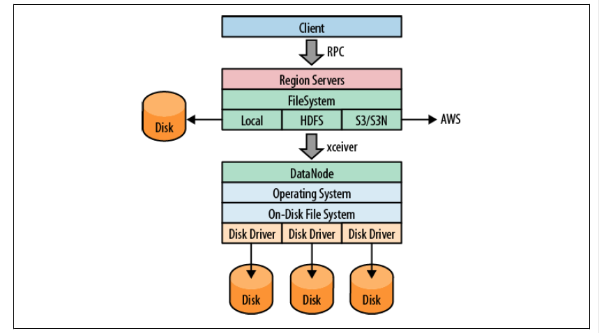

<!-- START doctoc generated TOC please keep comment here to allow auto update -->
<!-- DON'T EDIT THIS SECTION, INSTEAD RE-RUN doctoc TO UPDATE -->
**Table of Contents**  *generated with [DocToc](https://github.com/thlorenz/doctoc)*

- [2.1 快速启动指南](#21-%E5%BF%AB%E9%80%9F%E5%90%AF%E5%8A%A8%E6%8C%87%E5%8D%97)
- [2.2 必备条件](#22-%E5%BF%85%E5%A4%87%E6%9D%A1%E4%BB%B6)
  - [硬件](#%E7%A1%AC%E4%BB%B6)
  - [软件](#%E8%BD%AF%E4%BB%B6)
- [2.3 HBase使用的文件系统](#23-hbase%E4%BD%BF%E7%94%A8%E7%9A%84%E6%96%87%E4%BB%B6%E7%B3%BB%E7%BB%9F)
  - [本地模式](#%E6%9C%AC%E5%9C%B0%E6%A8%A1%E5%BC%8F)
  - [HDFS](#hdfs)
  - [S3](#s3)
  - [其他文件系统](#%E5%85%B6%E4%BB%96%E6%96%87%E4%BB%B6%E7%B3%BB%E7%BB%9F)
- [2.4 安装选项](#24-%E5%AE%89%E8%A3%85%E9%80%89%E9%A1%B9)
  - [2.4.1 Apache 二进制发布包](#241-apache-%E4%BA%8C%E8%BF%9B%E5%88%B6%E5%8F%91%E5%B8%83%E5%8C%85)
  - [2.4.2 编译源码](#242-%E7%BC%96%E8%AF%91%E6%BA%90%E7%A0%81)
- [2.5 运行模式](#25-%E8%BF%90%E8%A1%8C%E6%A8%A1%E5%BC%8F)
  - [单机模式](#%E5%8D%95%E6%9C%BA%E6%A8%A1%E5%BC%8F)
  - [分布式模式](#%E5%88%86%E5%B8%83%E5%BC%8F%E6%A8%A1%E5%BC%8F)
- [2.6 配置](#26-%E9%85%8D%E7%BD%AE)
  - [`hbase-site.xml`与`hbase-default.xml`](#hbase-sitexml%E4%B8%8Ehbase-defaultxml)
  - [`hbase-env.sh`](#hbase-envsh)
  - [regionserver](#regionserver)
  - [`log4j.properties`](#log4jproperties)
  - [客户端配置](#%E5%AE%A2%E6%88%B7%E7%AB%AF%E9%85%8D%E7%BD%AE)
- [2.7 部署](#27-%E9%83%A8%E7%BD%B2)
  - [基于脚本](#%E5%9F%BA%E4%BA%8E%E8%84%9A%E6%9C%AC)
  - [Apache Whirr](#apache-whirr)
  - [Puppet 与 Chef](#puppet-%E4%B8%8E-chef)
- [2.8 操作集群](#28-%E6%93%8D%E4%BD%9C%E9%9B%86%E7%BE%A4)
  - [确定安装运行](#%E7%A1%AE%E5%AE%9A%E5%AE%89%E8%A3%85%E8%BF%90%E8%A1%8C)
- [导航](#%E5%AF%BC%E8%88%AA)

<!-- END doctoc generated TOC please keep comment here to allow auto update -->

# 2.1 快速启动指南

`conf/hbase-site.xml` 配置文件中的 `base.root.dir`设置了数据路径。

```shell
bin/start-hbase.sh
bin/hbase shell
```

常用的 shell 命令：`create`、`list`、`put`、`get`、`scan`、`delete`、`drop`。

PS. 删除表之前，必须禁用它。


# 2.2 必备条件

HBase 大多是和Hadoop安装在一起的，这样可以减少网络I/O，同时加快处理速度。在同一台服务器上运行Hadoop和HBase时，至少会有3个Java进程：DataNode、TaskTracker、RegionServer。

## 硬件

- CPU

  采用多核处理器，四核以上。最好每个基本的Java进程都可以独立占有一个核。


- 内存

  使用Java时，不该为一个进程设置过多内存。内存在Java中成为堆。堆的碎片整理会stop-the-world。为region server设置超过16GB的堆是很危险的，一旦发生Full GC会造成很长时间的重写内存操作，master会判定进程已经死掉并将其移除。

- 磁盘

  用户应该保证每个磁盘上至少一个核。8核服务器增加6块磁盘是较优的。


 ## 软件

- 操作系统

  任何一个支持Java的OS上。

- 文件系统。

  比较常见的有ext3、ext4和XFS。

- Java

  1.6 以上才能很好地支持HBase。

- Hadoop

  HBase 只能依赖特定版本的 Hadoop，原因是两者之间的RPC协议是版本化的。

- SSH

  用户管理HBase进程需要安装ssh并运行sshd。HBase提供的shell脚本需要通过SSH将命令发送到集群中的每个服务器上执行。

- 域名服务

  HBase 使用本地域名汇报IP地址。正向与反向DNS均可以工作。

- 同步时间

  节点的时间必须是一致的，可以稍有偏差。

- 文件句柄和进程限制

  修改`ulimit -n` ，针在HBase用户下。

- DataNode处理线程数

  修改`conf/hdfs-site.xml`中的`dfs.datanode.max.xceivers`。

- 交换区

  给操作系统进程预留足够的内存，且JVM堆大小设置不要太大。一旦内存接近可用物理内存，操作系统就会使用交换区。

  修改`/etc/sysctl.conf`的`vm.swappiness=5`来减少交换空间的概率。

  ​


# 2.3 HBase使用的文件系统

HBase 使用的文件系统是一个可插拔的架构。其中HDFS是最受欢迎的，因为它包含了冗余、容错、可扩展性。

通过设置URI模式，就可以选择不同的文件系统。



## 本地模式

本地文件系统完全绕过了Hadoop，不使用HDFS或其他任何集群。用户设置以下参数就可以直接访问本地文件系统了：

```
file://<path>
```

## HDFS

HDFS 是默认的文件系统，HBase增加了随机存取层，是HDFS缺失的部分。

```
hdfs://<namenode>:<port>/<path>
```

## S3

S3 文件系统实现了Hadoop支持的两种不同模式：

1. 原生模式。

   ```
   s3n://<bucket-name>
   ```

   直接将数据写入S3，与本地文件系统类似。

2. 块模式

   ```
   S3://<bucket-name>
   ```

   克服了S3最大文件为5GB的限制。

## 其他文件系统

KFS（Kosmos filesystem），是一个用C++编写的、开源的、分布式的、高性能的文件系统，功能上与HDFS类似。

```
kfs:///<path>
```


# 2.4 安装选项

## 2.4.1 Apache 二进制发布包

```shell
tar -zxvf hbase-x.y.z.tar.gz
```

HBase的目录如下所示：

- bin。二进制文件，各种脚本，可以完成启动和停止。
- conf。配置文件。
- docs。工程网页的副本，以及工具、API和项目自身的文档信息。
- hbase-webapps。HBase提供了Java实现的Web接口。
- lib。Java程序依赖的类库。
- logs。日志文件。
- src。源文件。

## 2.4.2 编译源码

```shell
mvn assembly:assembly
```


# 2.5 运行模式

HBase 有两个运行模式，单机模式和分布式模式。

## 单机模式

单机模式中，HBase使用本地文件系统 -- ZooKeeper与HBase程序运行在同一个JVM中，ZooKeeper绑定到客户端的常用端口上，以便客户端可以与HBase通信。

## 分布式模式

分布式模式可以细分为：

- 伪分布模式 - 所有守护进程都运行在单个节点上。

  `conf/hbase-site.xml`配置中的`hbase.rootdir`属性用来指定HDFS实例。

- 完全分布模式 - 进程运行在物理服务器集群中。

  `conf/hbase-site.xml`中添加`hbase.cluster.distributed`属性为`true`。配置region服务器需要修改`conf/regionservers`文件。

  分布式的HBase依赖于ZooKeeper集群。HBase默认管理一个单点的ZooKeeper集群（ZooKeeper能够以一个单独的节点启动）。尽量使用`conf/hbase-site.xml`而不是`zoo.cfg`来修改ZooKeeper配置。

# 2.6 配置

配置文件在`conf`目录下。

`conf/hbase-env.sh`目录中包含了HBase使用到的环境变量，用于集群的启动和关闭。

`conf/hbase-site.xml`中的配置项会覆盖 HBase 的默认配置。

HBase不会自动复制`conf`目录到集群的其他节点，你可能需要`rsync`工具。

## `hbase-site.xml`与`hbase-default.xml`

进程启动后，服务器会先读取 `hbase-default.xml`，然后读取`hbase-site.xml`。后者会覆盖前者的内容。

修改`hbase-site.xml`后需要重启进程才能得到最新的配置。

> 修改 HDFS 的相关配置也需要重启HBase进程。HBase 配置文件的参数会覆盖 HDFS 文件的参数。

## `hbase-env.sh`

这个文件包含了JVM的启动参数等，也需要重启才能生效。

## regionserver

罗列了 region server 的主机名，纯文本文件，每一行都是主机名。

## `log4j.properties`

改变 HBase 的日志级别，改变后也需要重启才能生效。

## 客户端配置

HBase master能够在物理机器上移动，客户端启动时通过ZooKeeper来获取关键信息。因此客户端必须在`hbase-site.xml`中配置ZooKeeper的链接地址，同时将`hbase-site.xml`配置到自己的`CLASSPATH`中。

# 2.7 部署

## 基于脚本

`rsync`将master的配置分发下去。

## Apache Whirr

Whirr支持自爱动态环境中快速部署 HBase 集群。

## Puppet 与 Chef

两者相似的地方是，所有的配置文件都在中央配置服务器中，每台客户端服务器都与中央配置服务器连接，通过客户端软件监听配置的更新然后合并到本地。

# 2.8 操作集群

## 确定安装运行

1. 启动 HDFS。`bin/start-dfs.sh`
2. `get`文件来判断 HDFS 是否启动成功。
3. `bin/start-hbase.sh`


# 导航

[目录](README.md)

上一章：[1、简介](1、简介.md)

下一章：[3、客户端API：基础知识](3、客户端API：基础知识.md)
