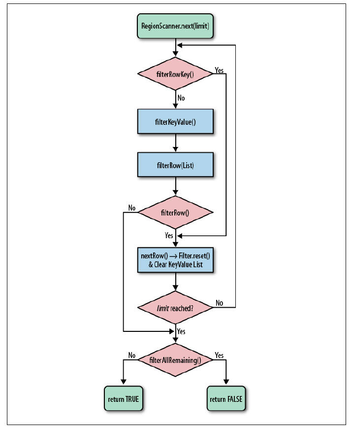

<!-- START doctoc generated TOC please keep comment here to allow auto update -->
<!-- DON'T EDIT THIS SECTION, INSTEAD RE-RUN doctoc TO UPDATE -->
**Table of Contents**  *generated with [DocToc](https://github.com/thlorenz/doctoc)*

- [4.1 过滤](#41-%E8%BF%87%E6%BB%A4)
  - [比较过滤器](#%E6%AF%94%E8%BE%83%E8%BF%87%E6%BB%A4%E5%99%A8)
  - [专用过滤器](#%E4%B8%93%E7%94%A8%E8%BF%87%E6%BB%A4%E5%99%A8)
  - [附加过滤器](#%E9%99%84%E5%8A%A0%E8%BF%87%E6%BB%A4%E5%99%A8)
  - [`FilterList`](#filterlist)
  - [自定义过滤器](#%E8%87%AA%E5%AE%9A%E4%B9%89%E8%BF%87%E6%BB%A4%E5%99%A8)
- [4.2 计数器](#42-%E8%AE%A1%E6%95%B0%E5%99%A8)
  - [单计数器](#%E5%8D%95%E8%AE%A1%E6%95%B0%E5%99%A8)
  - [多计数器](#%E5%A4%9A%E8%AE%A1%E6%95%B0%E5%99%A8)
- [4.3 协处理器](#43-%E5%8D%8F%E5%A4%84%E7%90%86%E5%99%A8)
  - [Coprocessor](#coprocessor)
  - [协处理器加载](#%E5%8D%8F%E5%A4%84%E7%90%86%E5%99%A8%E5%8A%A0%E8%BD%BD)
  - [`RegionObserver`类](#regionobserver%E7%B1%BB)
  - [`MasterObserver`类](#masterobserver%E7%B1%BB)
  - [endpoint](#endpoint)
  - [4.4 `HTablePool`](#44-htablepool)
- [4.5 连接管理](#45-%E8%BF%9E%E6%8E%A5%E7%AE%A1%E7%90%86)
- [导航](#%E5%AF%BC%E8%88%AA)

<!-- END doctoc generated TOC please keep comment here to allow auto update -->

# 4.1 过滤

用户可以使用 HBase 预定义的过滤器，也可以实现自己的过滤器。

`Get`和`Scan`两个类都支持过滤器，原因是这些对象提供的基本API不能对行键、列名、列值进行过滤。过滤器最基本的接口是`Filter`。用户可以继承`Filter`来实现自己的需求。

所有的过滤器都在服务端生效，叫做谓词下推（predicate push down）。

过滤器的最底层是`Filter`接口和`FilterBase`抽象类。将过滤器实例传递给`Get`和`Scan`实例：

```
set Filter(filter)
```

`CompareFilter`过滤器有一个`compare`方法，它需要使用传入参数定义比较操作的过程。`CompareFilter`的第二类类型是比较器（comparator）。比较器提供了多种方法来比较不同的键值。比较器都继承自`WritableByteArrayComparable`，后者实现了`Writable`和`Comparable`接口。

HBase 提供的过滤器有`BinaryComparator`、`BinaryPrefixComparator`、`NullComparator`、`BitComparator`、`RegrexStringComparator`、`RegrexStringComparator`、`SubstringComparator`。

## 比较过滤器

```java
CompareFilter(CompareOp valueCompareOp, WritableByteArrayComparable valueComparator)
```

- 行过滤器：`RowFilter`

- 列族过滤器：`FamilyFilter`

- 列名过滤器：`QualifierFilter`

- 值过滤器：`ValueFilter`

- 参考列过滤器：`DependentColumnFilter`。运行用户指定一个参考列，使用参考列控制其他列的过滤。

  ```java
  DependentColumnFilter(byte[] family, byte[] qualifier, boolean dropDependentColumn, CompareOp valueCompareOp, WritableByteArrayComparable valueComparator)
  ```

  ​

## 专用过滤器

专用过滤器用于特定的场景，直接继承自`FilterBase`。

- 单列值过滤器：`SingleColumnValueFilter`，由一列的值决定是否一行数据被过滤。

  ```java
  SingleColumnValueFilter(byte[] family, byte[] qualifier, CompareOp compareOp, WritableByteArrayComparable comparator)
  ```

- 单列排除过滤器：`SingleColumnValueExcludeFilter`，继承自单列值过滤器，但参考列不被包括到结果中。

- 前缀过滤器：`PrefixFilter`

  ```java
  public PrefixFilter(byte[] prefix)
  ```

- 分页过滤器：`PageFilter`，使用这个过滤器对结果按行分页。

- 行键过滤器：`KeyOnlyFilter`，可以只返回键。

- 首次行键过滤器：`FirstKeyOnlyFilter`

- 包含结束的过滤器：`InclusiveStopFilter`

- 时间戳过滤器：`TimetampsFilter`

  ```java
  TimetampsFilter(List<Long> timestamps)
  ```

  ​

- 列计数过滤器：`ColumnCountGetFilter`

  ```java
  ColumnCountGetFilter(int n)
  ```

  ​

- 列分页过滤器：`ColmnPaginationFilter`

  ```java
  ColumnPaginationFilter(int limit, int offset)
  ```

- 列前缀过滤器：`ColumnPrefixFilter`

  ```java
  ColumnPrefixFilter(byte[] prefix)
  ```

- 随机行过滤器：`RandomRowFilter`

  ```java
  RandomRowFilter(float chance)
  ```

  ​

## 附加过滤器

- 跳转过滤器（SkipFilter）：包装了一个用户提供的过滤器，当被包装的过滤器遇到一个需要过滤的`KeyValue`实例时，用户可以扩展并过滤整行数据。换句话说，当过滤器发现某一行的一列需要过滤时，那么整行数据都被过滤。
- 全匹配过滤器（WhileMatchFilter）：当一条数据被过滤掉时，它就会直接放弃这次扫描。

## `FilterList`

如果用户需要多个过滤器共同限制返回给客户端的结果，`FilterList`提供了这个功能。

```java
FilterList(List<Filter? rowFilter)
FilterList(Operator operator)
FilterList(Operator operator, List<Filter> rowFilters)
```

## 自定义过滤器

用户可以实现自己的过滤器，实现`Filter`接口或者直接继承`FilterBase`类。

过滤器处理一行数据的流程：




# 4.2 计数器

客户端API提供了专门的方法来读取并修改（read-and-modify）操作，并保证其原子性。

```shell
incr table row column [increment-value]
```

用户可以使用`get`请求访问计数器。

## 单计数器

第一种操作只能操作一个计数器：用户需要自己设定列，方法由`HTable`提供：

```java
long incrementColumnValue(byte[] row, byte[] family, byte[] qualifier, long amount, boolean writeToWAL)
```

## 多计数器

`HTable`的`increment()`：

```java
Result increment(Increment increment) throws IOException
```

`Increment`的构造函数：

```java
Increment (byte[] row, RowLock rowLock)
```

一旦用户使用行键创建了`Increment`实例，就要向其中加入实际的计数器，也就是说，用户需要增加列：

```java
Increment addColumn(byte[] family, byte[] qualifier, long amont)
```


# 4.3 协处理器

协处理器（coprocessor）让用户可以把一部分计算移动到数据的存放端，即region server。

协处理器框架提供了一些类， 用户可以继承这些类来扩展自己的功能：

- `observer`。与触发器（trigger）类似：回调函数。在一些特定时间发生时被执行。
  1. `RegionServer`：处理修改事件，与表的region紧密联系。
  2. `MasterObserver`：用作管理或DDL类型的操作，这些都是集群级事件
  3. `WALObserver`：控制WAL的钩子函数
- `endpoint`。通过添加一些远程过程调用来动态扩展RPC协议，可以理解为与RDBMS类似的存储过程。

协处理器可以动态加载，也可以链接起来使用。

## Coprocessor

所有协处理器的类都必须是实现这个接口。在协处理器的生命周期中，它们由框架管理。`Coprocessor`接口提供了两个方法：

```java
void start(CoprocessorEnvironment env) throws IOException
void stop(CoprocessorEnvironment env) throws IOException
```

`CoprocessorEnvironment`用来在协处理器生命周期中保持其状态。

`CoprocessorHost`类，负责维护所有协处理器实例和它们的专用环境。

## 协处理器加载

用户可以将协处理器配置为静态方式加载，也可以在集群运行时动态加载。

静态加载方式包括：

1. 从配置文件中加载。`hbase-site.xml`。
2. 从表描述符中加载。这个是针对特定表的，加载的协处理器只针对这个表的region，也只能被这些region的region server使用。

## `RegionObserver`类

当一个特定的 region 级别的操作发生时，它们的钩子函数被触发。这些操作可以分为两类：region 生命周期变化 和 客户端API调用。

1. 处理 region 生命周期事件

   这些 observer 可以与 pending open、open 和 pending close 状态通过钩子链接。每个钩子都被框架隐式调用。

2. 处理客户端 API 事件

   所有的客户端 API 都显式地从客户端应用中传输到 region server。用户可以在这些调用执行前或后拦截它们。

`RegionObserver`类的协处理环境的实例是基于`RegionCoprocessorEnvironment`类的，后者实现了`CoprocessorEnvironment`接口，并提供了面向 region 的方法。

`RegionObserver`提供的所有回调函数都需要一个特殊的上下文作为参数：`ObserverContext`，它提供了访问当前环境的入口，也可以通知协处理器框架在回调函数完成时做什么。

`BaseRegionObserver`是用户实现监听类型协处理器的基类，它实现了所有`RegionObserver`接口的空方法，所以用户必须重载他们感兴趣的方法来实现自己的功能。

## `MasterObserver`类

`MasterCoprocessorEnvironment`封装了一个 `MasterObserver`实例，它也提供了`getTable`之类的方法帮助用户在自己的实现中访问数据。

用户可以直接实现`MasterObserver`接口，或者扩展`BaseMasterObserver`类来实现自己的功能。

## endpoint

协处理器提供了以 endpoint 概念为代表的动态调用实现。

1. `CoprocessorProtocol`接口。通过这个接口可以定义协处理器希望暴露给用户的任意方法。`CoprocessorProtocol`实例和表中单个 region 联系在一起，所以客户端的 RPC 调用必须定义 region。

2. `BaseEndpointCoprocessor`类。

   ​

## 4.4 `HTablePool`

`HTable`实例的创建是一项非常耗时的工作，通常要几秒。`HTablePool`就解决了这个问题：

```java
HTablePool(Configuration, pool, int maxSize)
```

可以使用如下调用方式来使用表实例：

```java
HTableInterface getTable(String tableName)
void putTable(HTableInterface table)
```

关闭池中的特定表实例：

```java
void closeTablePool(String tableName)
```


# 4.5 连接管理

每个`HTable`实例都需要建立和远程主机的连接，这些连接在内部使用`HConnection`类表示。用户没有必要同时和这两个类打交道，只需要建立一个`Configuration`实例，然后利用客户端API来使用这些类。

HBase 内部使用键值对来存储连接，使用`Configuration`实例作为键值映射的键。

每个客户端都需要使用 ZooKeeper 来找到region server。所以 ZooKeeper 连接是共享的。

调用`HTable.close()`方法会释放所有资源，其中包括 ZooKeeper 连接，同时移除内部列表中的连接引用。


# 导航

[目录](README.md)

上一章：[3、客户端API：基础知识](3、客户端API：基础知识.md)

下一章：[5、客户端API：管理功能](5、客户端API：管理功能.md)
