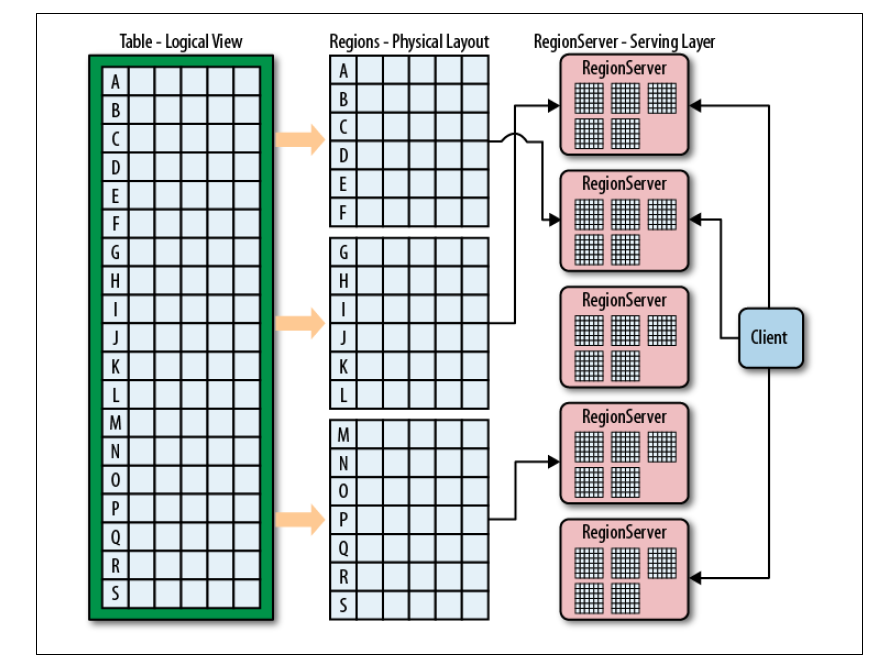
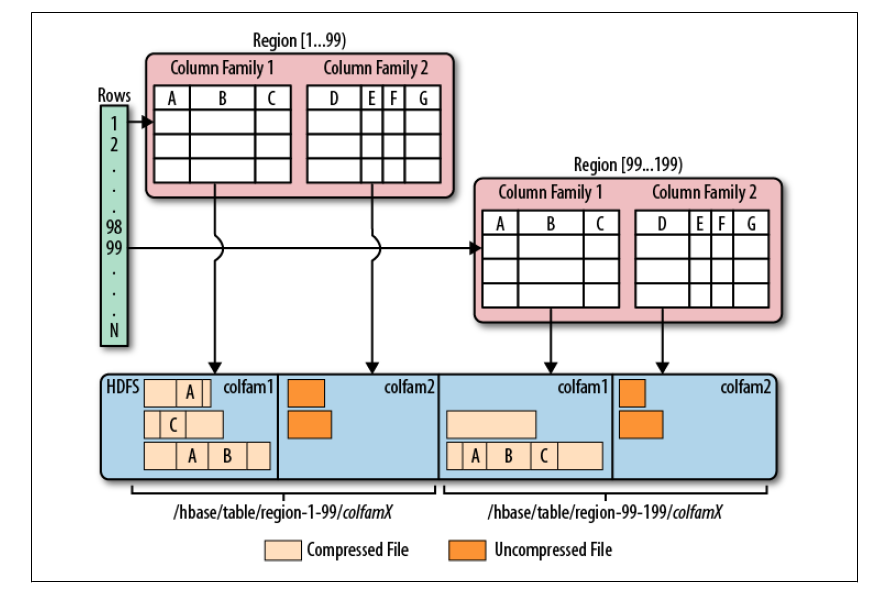

<!-- START doctoc generated TOC please keep comment here to allow auto update -->
<!-- DON'T EDIT THIS SECTION, INSTEAD RE-RUN doctoc TO UPDATE -->
**Table of Contents**  *generated with [DocToc](https://github.com/thlorenz/doctoc)*

- [5.1 模式定义](#51-%E6%A8%A1%E5%BC%8F%E5%AE%9A%E4%B9%89)
  - [5.1.1 表](#511-%E8%A1%A8)
  - [5.1.2 表属性](#512-%E8%A1%A8%E5%B1%9E%E6%80%A7)
  - [5.1.3 列族](#513-%E5%88%97%E6%97%8F)
- [5.2 `HBaseAdmin`](#52-hbaseadmin)
  - [5.2.1 基本操作](#521-%E5%9F%BA%E6%9C%AC%E6%93%8D%E4%BD%9C)
  - [5.2.2 表操作](#522-%E8%A1%A8%E6%93%8D%E4%BD%9C)
  - [5.2.3 模式操作](#523-%E6%A8%A1%E5%BC%8F%E6%93%8D%E4%BD%9C)
  - [5.2.4 集群管理](#524-%E9%9B%86%E7%BE%A4%E7%AE%A1%E7%90%86)
  - [5.2.5 集群状态信息](#525-%E9%9B%86%E7%BE%A4%E7%8A%B6%E6%80%81%E4%BF%A1%E6%81%AF)
- [导航](#%E5%AF%BC%E8%88%AA)

<!-- END doctoc generated TOC please keep comment here to allow auto update -->

# 5.1 模式定义

## 5.1.1 表

表描述符的构造函数：

```java
HTableDescriptor(String name)
```

region 中行的逻辑与物理视图：



## 5.1.2 表属性

- 名

  ```java
  byte[] getName();
  void setName(byte[] name);
  ```

- 列族

  ```java
  void addFamily(HColumnDescriptor family);
  boolean hasFamily(byte[] c);
  HColumnDescriptor getColumnFamilies();
  HColumnDescriptor removeFamily(byte[] column)
  ```

- 文件大小限制。限制表中 region 的大小，达到限制使会拆分region。

  ```java
  long getMaxFileSize();
  void setMaxFileSize(long maxFileSize);
  ```

- 只读。默认所有的表都可写。

  ```java
  void setReadOnly(boolean readOnly);
  ```

- memstore 刷写大小

  ```java
  long getMemStoreFlushSize();
  ```

- 延时日志刷写

  ```java
  synchronized boolean isDeferredLogFlush();
  ```

- 其它选项

  ```java
  byte[] getValue(byte[] key);
  void remove(byte[] key);
  ```

## 5.1.3 列族

列族的名字必须是可见字符，由任意二进制字符组成。



`HColumnDescriptor`实例支持以下方法：

```java
byte[] getName(); // 除了调用构造函数，没有其他重命名列族的途径
int getMaxVersions();
Compression.Algorithm getCompression(); // 一般压缩
Compression.Algorithm getCompactionCompression(); // 合并压缩
synchronized int getBlocksize;
boolean isBlockCacheEnabled();
int getTimeToLive(); // 版本数据的保存时间
boolean isInMemory();
StoreFile.BloomType getBloomFilterType(); // 行或列是否使用过滤器
int geScope(); // 复制范围，提供了跨集群同步的功能。
```


# 5.2 `HBaseAdmin`

`HBaseAdmin` 提供了建表、创建列族、检查表是否存在、修改表结构和列族结构和删除表等功能。

## 5.2.1 基本操作

实例化`HBaseAdmin`：

```java
HBaseAdmin(Configuration conf) throws MasterNotRunningException, ZooKeeperConnectionException;
```

这个类实现了`Abortable`接口，但发生致命错误时会隐式调用`abort()`方法。

`HBaseAdmin`内置了 master 所有的RPC 接口代理的封装，另外还提供了以下基本接口：

```java
boolean isMasterRunning();
HConnection getConnection();
Configuration getConfiguration();
close();
```

## 5.2.2 表操作

```java
void createTable(HTableDescriptor desc, byte[] startKey, byte[] endKey, int numRegions);
boolean tableExists(String tableName);
HTableDescriptor[] listTables();
HTableDescriptor getTableDescriptor(byte[] tableName);
void deleteTable(byte[] tableName);
void disableTable(byte[] tableName); // 用户调用时，region server会刷写数据。
void enableTable(byte[] tableName);
void modifyTable(byte[] tableName, HTableDescriptor htd);
```

## 5.2.3 模式操作

与列有关的操作：

```java
void addColumn(byte[] tableName, HColumnDescriptor column);
void deleteColumn(byte[] tableName, byte[] columnName);
void modifyColumn(byte[] tableName, HColumnDescriptor column);
```

## 5.2.4 集群管理

```java
static void checckHBaseAvailable(Configuration conf);
ClusterStatus getClusterStatus();
void closeRegion(byte[] regionName, String hostAndPort);
void flush(byte[] tableNameOrRegionName);
void compact(byte[] tableNameOrRegionName);
void majorCompact(byte[] tableNameOrRegionName);
void split(byte[] tableNameOrRegionName, byte[] splitPoint);
void assign(byte[] regionName, boolean force); // 控制 region 的上线
void move(byet[] encodedRegionName, byte[] dstServerName);
void balanceSwitch(boolean b);
```

## 5.2.5 集群状态信息

调用`getClusterStatus`可以查询到`ClusterStatus`实例，它包括了查询和管理集群状态的各种方法。


# 导航

[目录](README.md)

上一章：[4、客户端API：高级特性](4、客户端API：高级特性.md)

下一章：[6、可用客户端](6、可用客户端.md)
