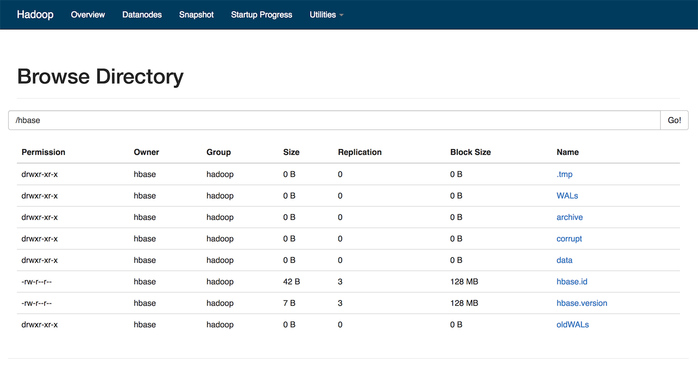
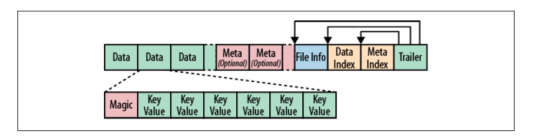
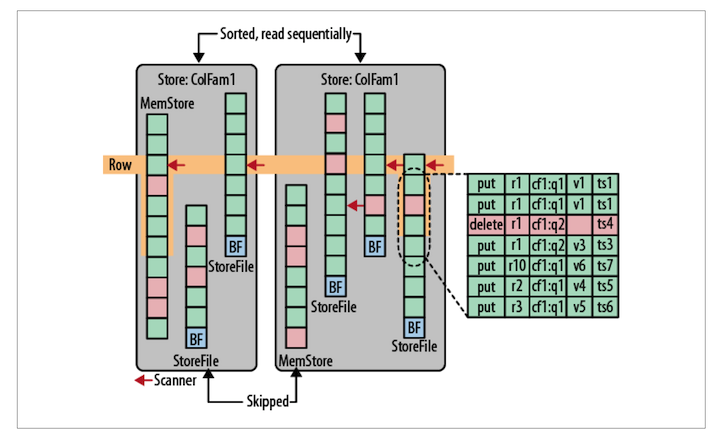
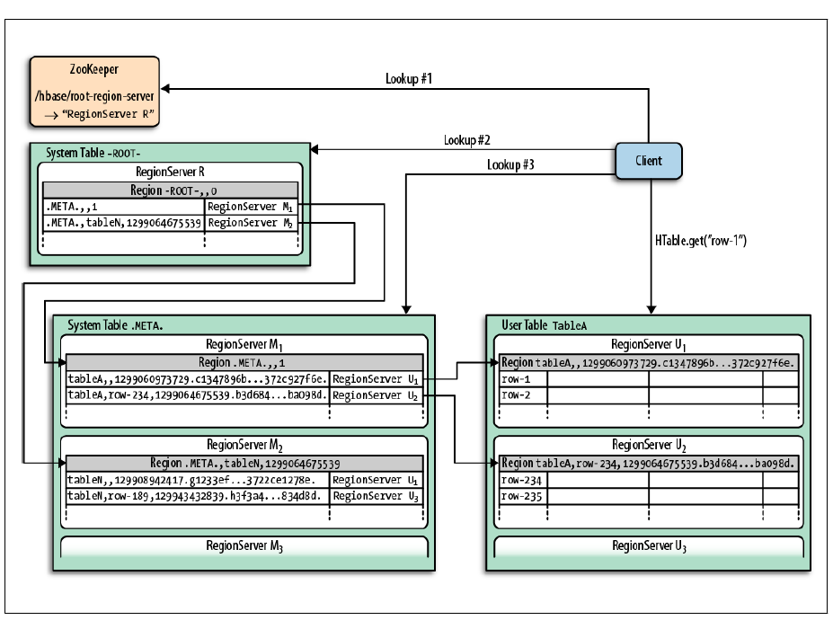
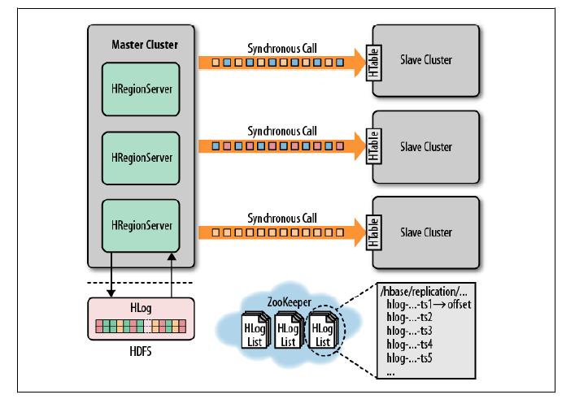

<!-- START doctoc generated TOC please keep comment here to allow auto update -->
<!-- DON'T EDIT THIS SECTION, INSTEAD RE-RUN doctoc TO UPDATE -->
**Table of Contents**  *generated with [DocToc](https://github.com/thlorenz/doctoc)*

- [8.1 数据查找和传输](#81-%E6%95%B0%E6%8D%AE%E6%9F%A5%E6%89%BE%E5%92%8C%E4%BC%A0%E8%BE%93)
- [8.1.1 B+树](#811-b%E6%A0%91)
  - [8.1.2 LSM树](#812-lsm%E6%A0%91)
- [8.2 存储](#82-%E5%AD%98%E5%82%A8)
  - [8.2.1 概览](#821-%E6%A6%82%E8%A7%88)
  - [8.2.2 写路径](#822-%E5%86%99%E8%B7%AF%E5%BE%84)
  - [8.2.3 文件](#823-%E6%96%87%E4%BB%B6)
    - [合并](#%E5%90%88%E5%B9%B6)
  - [8.2.4 HFile 格式](#824-hfile-%E6%A0%BC%E5%BC%8F)
  - [8.2.5 KeyValue 格式](#825-keyvalue-%E6%A0%BC%E5%BC%8F)
- [8.3 WAL](#83-wal)
  - [8.3.2 `HLog` 类](#832-hlog-%E7%B1%BB)
  - [8.3.3 `HLogKey`类](#833-hlogkey%E7%B1%BB)
  - [8.3.4 `WALEdit`类](#834-waledit%E7%B1%BB)
  - [8.3.5 `LogSyncer`类](#835-logsyncer%E7%B1%BB)
  - [8.3.6 `LogRoller`类](#836-logroller%E7%B1%BB)
  - [8.3.7 回放](#837-%E5%9B%9E%E6%94%BE)
    - [1. 单日志](#1-%E5%8D%95%E6%97%A5%E5%BF%97)
    - [2. 日志拆分](#2-%E6%97%A5%E5%BF%97%E6%8B%86%E5%88%86)
    - [3. 数据恢复](#3-%E6%95%B0%E6%8D%AE%E6%81%A2%E5%A4%8D)
  - [8.3.8 持久性](#838-%E6%8C%81%E4%B9%85%E6%80%A7)
- [8.4 读路径](#84-%E8%AF%BB%E8%B7%AF%E5%BE%84)
- [8.5 region 查找](#85-region-%E6%9F%A5%E6%89%BE)
- [8.6 region 生命周期](#86-region-%E7%94%9F%E5%91%BD%E5%91%A8%E6%9C%9F)
- [8.7 ZooKeeper](#87-zookeeper)
- [8.8 复制](#88-%E5%A4%8D%E5%88%B6)
  - [8.8.1 Log Edit 的生命周期](#881-log-edit-%E7%9A%84%E7%94%9F%E5%91%BD%E5%91%A8%E6%9C%9F)
  - [8.8.2 内部机制](#882-%E5%86%85%E9%83%A8%E6%9C%BA%E5%88%B6)
- [导航](#%E5%AF%BC%E8%88%AA)

<!-- END doctoc generated TOC please keep comment here to allow auto update -->

# 8.1 数据查找和传输

B 树和 B+ 树，被广泛用于关系型存储引擎，同时还有 LSM 树（Log-Structured Merged Tree)，它在某种程度上构成了 BigTable 的底层存储架构。

# 8.1.1 B+树

B+ 树能够通过主键对记录进行高效插入、查找和删除。它表示一个动态、多层、有上下界的索引。

B+ 树能够提供高效的范围扫描功能，这得益于它的叶节点相互连接且按主键有序，避免了耗时的遍历树操作。

## 8.1.2 LSM树

LSM 树，输入数据首先被存储在日志文件，这些文件内的数据完全有序。当有日志文件被修改时，对应的更新会被先保存在内存来加速查询。

当系统经历过很多次数据修改，且内存空间被逐渐占满，LSM 树会把有序的键值对写到磁盘中，同时创建一个新的数据存储文件。此时，内存中保存的最近更新就可以丢弃了。

存储文件的组织与 B+ 树类似，不过其为磁盘顺序读取做了优化，所有节点都是满的并按页存储。修改数据文件的操作，通过滚动合并完成。也就是说，系统将现有的页与内存刷写数据混合在一起进行管理，直到数据块达到它的容量。

下图展示了多个块存储归并到磁盘的过程，这是后台线程自动完成的：


查询时，先查找内存中的存储，然后再查找磁盘上的文件。

删除是一种特殊的更改，当删除标记被存储后，查找会跳过这些键。当页眉重写时，有删除标记的键会被丢弃。

B 树和 LSM 树的最主要区别在于如何利用硬件，特别是磁盘。

# 8.2 存储

## 8.2.1 概览


从上图中可以看出，HBase 主要处理两种文件：

- 预写日志（Write-Ahead Log，WAL）
- 数据文件

两种文件主要由 HRegionServer 管理。

一个基本的流程是：

1. 客户端首先联系 ZooKeeper 子集群（quorum，一个由 ZooKeeper 节点组成的单独集群）查找行键。ZooKeeper 通过`.META`表来获取含有`-ROOT-`的 region server。
2. HBase 缓存此次查询的信息，同时直接联系实际管理数据的 `HRegionServer`。
3. `HRegionServer` 负责打开 region，并创建对应的 `HRegion` 实例。HRegion 打开后，`HRegionServer` 会为每个表的 `HColumnFamily` 创建一个 `Store` 实例。每个 `Store` 实例包含了一个或多个 `StoreFile`，它们是实际数据存储文件 `HFile` 的轻量级封装。每个 `Store` 还有个与之对应的 `MemStore`。

## 8.2.2 写路径

当用户向`HRegionServer`发起`HTable.put(Put)`请求时，会被交给对应的 `HRegion`实例处理：

1. 决定数据是否需要写到由 `HLog`类实现的 WAL 中。WAL 时标准的 Hadoop SequenceFile，并存储了`HLogKey`实例。
2. 数据被写入到 WAL 后，再被写入`MemStore`中。同时检查`MemStore`是否已满，满了就写到磁盘。刷写请求时由另外一个`HRegionServer`线程处理，它会把数据写成`HFile`。同时也会保存最后写入的序号，系统就知道哪些数据被持久化了。

## 8.2.3 文件

HBase 在 HDFS 中的目录默认为"/hbase"。`hdfs dfs -lsr /hbase`可以查看目录结构。



- WAL 文件。每个`HRegionServer`，都有一个对应的子目录，该子目录下有多个`HLog`文件。一个 region server的所有 region 共享同一组`HLog`文件。当日志文件包含的修改被持久化到存储文件后，他们会被移到`oldWALS`文件夹。
- `hbase.id`和`hbase.versoin`包含了集群的唯一 ID 和文件格式版本信息。
- `corrupt`文件夹把偶存了损坏的日志。
- 表级的数据都在`data`目录下。每张表目录都包括一个`.tableinfo`的顶层文件，该文件存储了对应序列化后的`HTableDescriptor`。`.tmp`包括了一些临时数据。
- region 级文件。每张表的目录里，每个列族都有一个单独的目录，目录的名字是 region 名字的 MD5。region 目录也有一个`.regioninfo`文件，这个文件包含了 region 的`HRegionInfo`实例序列化后的信息。

在 WAL 回放时，任何未提交的修改都会被写入每个 region 的一个单独目录中。如果日志拆分过程已经完成，这些文件被自动移动到临时的`recovered.edits`目录中。当 region 被打开时，region server会看到需要恢复的文件，并回放其中相应的条目。

一旦region 超过了配置的阈值，region 就会被拆分。其间会创建一个对应的`splits`目录。拆分成功后，它们会移动到表目录中，并形成了两个新的 region。

### 合并

合并（compaction）过程将它们合并成数量更少、体积更大的文件。这个过程持续到这些文件中最大的文件超过配置的最大存储文件大小，此时会触发一个 region 拆分。

压缩有两种：

- minor。负责重写最后生成的几个文件到一个更大的文件。文件数量受`hbase.hstore.compaction.min`控制。
- major。负责将所有文件压缩成一个单独的文件。

在执行压缩检查时，系统自动决定运行哪种合并。在`memstore`被刷写到磁盘后触发检查，或在 Shell 命令`compact`、`major_compact`之后触发，或者是调用相应 API 之后触发。

除非用户使用`major_compact`将强制运行 major 合并，否则服务器会首先检查上次运行到现在是否达到`hbase.hregion.majorcompaction`设置的时限。如果还没有达到 major 合并的执行周期，系统会选择 minor 合并执行。

当 minor 合并包括所有的存储文件，且所有文件均未达到设置的每次压缩的最大文件数时，minor 合并可能被提升为 major 合并。

## 8.2.4 HFile 格式

HFile 基于 Hadoop 的`TFile`类。



文件长度是可变的，唯一固定的块是`File Info`和`Trailer`块。

- `Trailer`块有指向其他块的指针，它是持久化数据到文件结束时写入的，写入后确定其为不可比那的数据存储文件。
- `Data`和`Meta`块都是可选的。
- `Index`记录了`Data`和`Meta`的偏移量。

块大小由`HColumnDescriptor`配置的，默认是 64KB。建议将块的带澳设置为8KB ~ 1MB。如果主要涉及顺序访问，较大的块更合适，这会降低随机读写性能。较小的块更有利于随机访问，不过同时需要更多的内存来存储块索引，且可能创建过程也会变慢。

HDFS 中，文件的默认快大小是 64MB，是 HFile 默认块大小的1024倍。这两者没有相关性。HBase 并不知道 HBase 存储的是什么，只能看到二进制文件。


绕过 HBase 直接访问一个 HFile 的方法：

```shell
bin/hbase org.apache.hadoop.hbase.io.hfile.HFile
```

## 8.2.5 KeyValue 格式

HFile 中的每个 KeyValue 都是一个低级的字节数组。

 

开头的两个定长数字分别表示键长度、值长度。有了这个信息，用户可以在数据上跳跃。

键包含了行键、列族、列限定符。

# 8.3 WAL

WAL 存了对数据的所有更改，如果服务器崩溃，它可以有效地回放日志，恢复数据。

所有的修改先保存到 WAL，再传递给 memstore：


1. 客户端启动一个操作来修改数据，每个修改都被封装到一个 KeyValue 对象中，并通过 RPC 发送出去。
2. KeyValue 会被送到管理相应行的`HRegion`实例，数据被写入到 WAL，然后被放入实际拥有记录的存储文件的 memstore。
3. 当 memstore 达到一定大小或经历特定时间，数据就会异步地连续写入到文件系统中。

## 8.3.2 `HLog` 类

实现了 WAL 的类叫做`HLog`。当`HRegion`被实例化时，`HLog`实例会被当做一个参数传递到`HRegion`构造函数中。当 region 接收到一个更新操作时，它可以直接将数据保存到一个共享的 WAL 实例中。

`HLog`的核心功能是`append`方法。

`HLog`的另一个特性是追踪修改，这个特性使用序列号来实现。


## 8.3.3 `HLogKey`类

WAL 使用的是 Hadoop SequenceFile。这种文件按照键/值集合的方式存储记录。对于 WAL 来说，Key 是`HLogKey`实例，值是客户端发送的修改请求。

`HLogKey`存储了 region 、表名、序列号、表的写入时间，KeyValue 仅仅代表行键、列族、列限定符、时间戳、类型以及值。

## 8.3.4 `WALEdit`类

客户端发送的每一个修改被封装到`WALEdit`实例。它通过日志级别来管理原子性。

## 8.3.5 `LogSyncer`类

表的描述符允许用户设置一个`延迟日志刷写`标识。它意味着每一次编辑被发送到服务器时，服务器都会调用写日志的`sync()`方法，这个强迫写入日志的更新都会被文件系统确认。

用户将该标识设置为`true`会导致修改被魂村在 region serverongoing，然后在服务器上`LogSyncer`类会作为一个线程运行，负责在非常短的间隔内`sync()`。

## 8.3.6 `LogRoller`类

日志的写入是有大小限制的，`LogRoller`类作为一个后台线程运行，在特定的时间间隔内滚动日志，默认1小时。

`HLog.cleanOldLogs()`会检查写入到存储文件中的最大序列号是多少，然后将日志文件的序列号小于这个数字的移动到 `oldWALs`文件夹。

## 8.3.7 回放

### 1. 单日志

一台 region server 共享一个`HLog`实例，而不是每个 region 将日志写到单独的文件，原因在于：同时写入太多的文件，且需要保留滚动的日志会影响系统的扩展性。这种设计是由底层文件系统决定的。

### 2. 日志拆分

日志拆分是将每个 region 对应的日志放到单独的文件中。0.92.0引入了分布式日志拆分，切分日志的实际工作从 master 转移到了 region server：

1. ZooKeeper 将每一个被丢弃的日志文件分发给一个 region server
2. region server 通过检测 ZooKeeper 发现需要执行的工作
3. 一旦 master 指出某个日志是可以处理的，region server 会竞争这个任务。
4. 获胜的 region server在一个县城中读取并拆分这个日志文件

一旦日志被拆分，每个 region 对应的文件就会被移动到实际的 region 目录，然后 region 就可以使用它来恢复数据了。

### 3. 数据恢复

region 打开时，会检查`recovered.edits`目录是否存在。如果存在，region server 就开始读取文件所包含的数据更该记录。

任何序列 ID 小于或等于保存在硬盘中存储文件序列 ID 的更改记录都会被忽略。其他数据跟新都会被添加到对应 region 的 memstore 中。

## 8.3.8 持久性

HBase 会检查当前的 Hadoop 库是否支持`syncFs()`或`hflush()`。如果在写入日志的时候出发`sync()`，则 HBase 会调用上述两种方法之一。


# 8.4 读路径

HBase 的每个列族使用多个存储文件来进行数据存储，这些文件包含着实际的数据单元或 KeyValue 实例。当 memstore 中存储的对 HBase 的修改信息最后作为存储文件被刷写到硬盘中，这些文件就被创建了。后台合并进程通过将小文件合并到大文件中来减少文件的数目。major 合并最后将文件集合中的文件合并到一个文件，此后刷写又会不断创建小文件。

所有的存储文件都是不可变的，从其中删除一个特定的值是不可能的，通过重写存储文件已经被删除的单元格也是毫无意义的。墓碑标记就是用与标记『已删除』信息，它可以标记一个单元格、多个单元格、一整行。

`QueryMatcher`可以精确匹配用户要取出的列，`ColumnTracker`需要包含所有的列。

在读取所有存储文件来查找匹配的条目之前，需要有一个快速的排除检查阶段：使用时间戳以及可选的布隆过滤器。然后扫描剩下的存储文件及 `memstore`来寻找匹配的键。

扫描是`RegionScanner`实现的，它为每个`Store`实例获取了一个`StoreScanner`，每个`Store`实例代表一个列族。

`StoreScanner`合并了`Store`实例包含的存储文件和`memstore`。

`StoreScanner` 也包含了 `QueryMatcher`，它会记录到底哪个 KeyValue 需要被包含在最终的结果中。

`RegionScanner`在内部使用 KeyValueHeap 类，并按时间戳排序来处理存储扫描器。`StoreScanner`也使用同样的方法，这样就保证了用户可以按照正确的顺序来读取 KeyValue。



当存储扫描器打开的时候，它们会直接定位到所要求的行键上，或者在调用`get()`的情况下定位到下一个不匹配的行键。然后扫描器就准备读取数据了。


# 8.5 region 查找

region 查找需要用到 HBase 两张特殊的目录表 `-ROOT` 和 `.META.`。

`-ROOT` 用来查找所有的 `.META.`表中 region 的位置。HBase的设计中只有一个 root region，从不进行拆分。这就保证了类似 B+ 树的三层查找机构：

- 第一层是 ZooKeeper 中包含 root region 位置信息的节点
- 第二层是从 `-ROOT-` 表查找对应的 meta region 的位置
- 第三层是从`.META.`表中查找用户对应 region 的位置


当然，客户端也是缓存 region 地址的。



# 8.6 region 生命周期

region 的各种状态均有 master 触发，并使用`AssignmentManager`类进行管理。

region 状态的改变可能由 master 发起，也可能由 region 发起。

由于时间是分布式的，服务器使用 Zookeeper 跟踪一个特定 znode 的状态。

# 8.7 ZooKeeper

ZooKeeper 为 HBase 提供跟踪 region server、保存 root region 地址、传递心跳信息等任务。

# 8.8 复制

HBase 复制中最基本的架构模式是"主推送"（master-push），因为每个 region server 都有自己的 WAL，很容易保存现在正在复制的位置。

复制是异步进行的，主集群的修改不能立马在集群上同步。



HLog 是 HBase 复制的基础。

## 8.8.1 Log Edit 的生命周期

客户端使用 HBase API 发送一个请求到 region server，这些请求包含的键值对被region server 转化为 WALEdit，同时 WALEdit 会被复制程序检查，并以列族为单元复制数据。修改被添加到 WAL 中，并将实际数据添加到 memstore。

region server 收到修改请求后，会顺序读取这些修改信息，并将它们分成不同的缓冲区，每张表一个缓冲区。一旦所有的修改都被读取后，每个缓冲使用 HBase 客户端来把缓冲区中的修改写入表中。这样可以达到并行写入的效果（MultiPut）。

## 8.8.2 内部机制

1. 挑选要复制的目标服务器

当主集群 region server 初始化复制源到从集群时，它会先连接从集群的 ZooKeeper 群组。然后扫描`/hbase/rs`目录来发现所有可用的汇聚并随机挑选一部分 server 来复制数据。

2. 跟踪日志中被复制到的位置

每个主集群的 region server 在 znode 目录中都有与之对应的 znode，且每个从集群都有与制度应的 znode。每个 znode 都包含一个需要处理的 HLog 队列。每个队列都会跟踪 region server 创建的 HLog。

当源初始化好之后，它便包含当前 region server 要写入的 HLog。当日志滚动时，新的文件在可用之前被添加到每个从集群的 znode 队列中，这样保证所有资源都知道有新的 HLog 可以复制到自己的集群中。

3. 读取、过滤、发送数据修改

默认情况下，一个源尝试读取日志文件，并尽快其它们传送到集群的接收服务器上。这件事收到两个限制：

- 日志过滤的限制。只有被分为 `GLOBAL`类且不属于目录表日志项的 KeyValue 才会保留。
- 每个从集群同步总大小，默认为 64MB。

一旦达到缓冲修改信息的最大值，或读到了日志文件的末尾，源线程会停止读取并随机挑选一个可接收数据的从集群服务器来同步数据。如果当前文件已经读完，则源从队列中删除这个 `znode`。如果没有读完，则在日志的 `znode`中注册一个新的位移。

4. 清理日志


如果没有启用同步复制，master 的日志清理线程会按照配置的 TTL 删除旧的日志。

5. region server 异常

主集群的 region 服务器会为其他服务器保留一个监听器（watcher），以便当其他服务器崩溃时收到通知（master 也是这样做的）。当有其他服务器崩溃时，它们会争着为宕机服务器的`znode`创建一个叫`lock`的`znode`。创建成功的服务器会把队列添加到自己的`znode`中去。这个过程完成后，它会删除旧的队列。

一旦这些完成，主集群 region server 会为每个复制后的队列创建一个新的源线程，且每个线程都会按照读取-过滤-传输的模式工作。不同的是，队列不会有新的数据，因为它不属于新的 region server。当读进程读到日志的结尾时，队列的`znode`会被删除，且主集群的 region server 也会关闭这个复制源。


# 导航

[目录](README.md)

上一章：[7、与MapReduce集成](7、与MapReduce集成.md)

下一章：[9、高级用法](9、高级用法.md)
