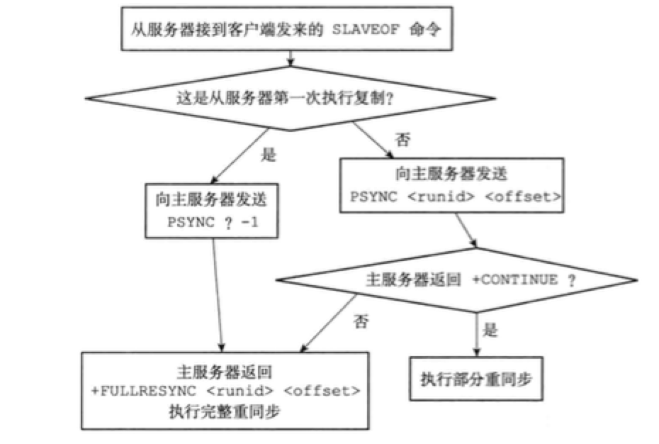
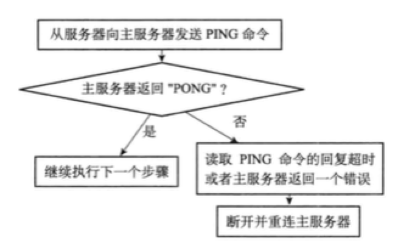
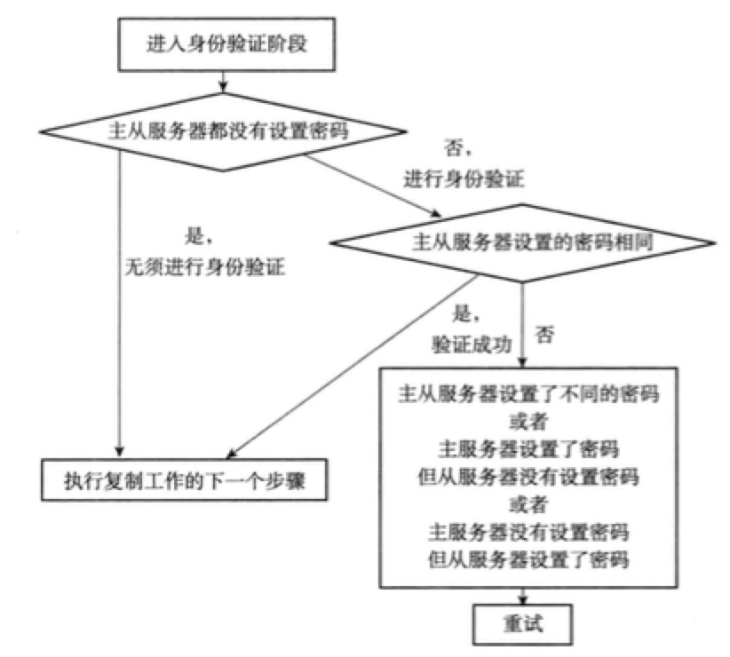

<!-- START doctoc generated TOC please keep comment here to allow auto update -->
<!-- DON'T EDIT THIS SECTION, INSTEAD RE-RUN doctoc TO UPDATE -->
**Table of Contents**  *generated with [DocToc](https://github.com/thlorenz/doctoc)*

  - [15.1 旧版复制功能的实现](#151-%E6%97%A7%E7%89%88%E5%A4%8D%E5%88%B6%E5%8A%9F%E8%83%BD%E7%9A%84%E5%AE%9E%E7%8E%B0)
  - [同步](#%E5%90%8C%E6%AD%A5)
  - [命令传播](#%E5%91%BD%E4%BB%A4%E4%BC%A0%E6%92%AD)
- [15.2 旧版复制功能的缺陷](#152-%E6%97%A7%E7%89%88%E5%A4%8D%E5%88%B6%E5%8A%9F%E8%83%BD%E7%9A%84%E7%BC%BA%E9%99%B7)
- [15.3 新版复制功能的实现](#153-%E6%96%B0%E7%89%88%E5%A4%8D%E5%88%B6%E5%8A%9F%E8%83%BD%E7%9A%84%E5%AE%9E%E7%8E%B0)
- [15.4 部分重同步的实现](#154-%E9%83%A8%E5%88%86%E9%87%8D%E5%90%8C%E6%AD%A5%E7%9A%84%E5%AE%9E%E7%8E%B0)
  - [复制偏移量](#%E5%A4%8D%E5%88%B6%E5%81%8F%E7%A7%BB%E9%87%8F)
  - [复制积压缓冲区](#%E5%A4%8D%E5%88%B6%E7%A7%AF%E5%8E%8B%E7%BC%93%E5%86%B2%E5%8C%BA)
  - [服务器运行ID](#%E6%9C%8D%E5%8A%A1%E5%99%A8%E8%BF%90%E8%A1%8Cid)
- [15.5 PSYNC命令的实现](#155-psync%E5%91%BD%E4%BB%A4%E7%9A%84%E5%AE%9E%E7%8E%B0)
- [15.6 复制的实现](#156-%E5%A4%8D%E5%88%B6%E7%9A%84%E5%AE%9E%E7%8E%B0)
  - [步骤1：设置master的地址和端口](#%E6%AD%A5%E9%AA%A41%E8%AE%BE%E7%BD%AEmaster%E7%9A%84%E5%9C%B0%E5%9D%80%E5%92%8C%E7%AB%AF%E5%8F%A3)
  - [步骤2：建立套接字连接](#%E6%AD%A5%E9%AA%A42%E5%BB%BA%E7%AB%8B%E5%A5%97%E6%8E%A5%E5%AD%97%E8%BF%9E%E6%8E%A5)
  - [步骤3：发送PING命令](#%E6%AD%A5%E9%AA%A43%E5%8F%91%E9%80%81ping%E5%91%BD%E4%BB%A4)
  - [步骤4：身份验证](#%E6%AD%A5%E9%AA%A44%E8%BA%AB%E4%BB%BD%E9%AA%8C%E8%AF%81)
  - [步骤5：发送端口信息](#%E6%AD%A5%E9%AA%A45%E5%8F%91%E9%80%81%E7%AB%AF%E5%8F%A3%E4%BF%A1%E6%81%AF)
  - [步骤6：同步](#%E6%AD%A5%E9%AA%A46%E5%90%8C%E6%AD%A5)
  - [步骤7：命令传播](#%E6%AD%A5%E9%AA%A47%E5%91%BD%E4%BB%A4%E4%BC%A0%E6%92%AD)
- [15.7 心跳检测](#157-%E5%BF%83%E8%B7%B3%E6%A3%80%E6%B5%8B)
- [导航](#%E5%AF%BC%E8%88%AA)

<!-- END doctoc generated TOC please keep comment here to allow auto update -->

Redis中，用户可以执行`SAVEOF`命令或设置`saveof`选项，让一个服务器去复制（replicate）另一个服务器。被复制的服务器叫做master，对master进行复制的服务器叫做slave。

进行复制中的master和slave应该保存相同的数据，这称作“数据库状态一致”。

## 15.1 旧版复制功能的实现

Redis的复制功能分为同步（sync）和命令传播（command propagate）两个操作：

- 同步用于将slave的数据库状态更新至master当前所处的数据库状态。
- 命令传播用于master的数据块状态被修改，导致和lsave的数据库状态不一致时，让两者的数据库重回一致状态。

## 同步

复制开始时，slave会先执行同步操作，步骤如下：

- slave对master发送`SYNC`命令
- master收到`SYNC`执行`BGSAVE`，在后台生成一个RDB文件，并使用一个缓冲区记录从现在开始执行的所有写命令。
- master的`BGSAVE`执行完毕后，将生成的RDB文件发送给slave，slave接收并载入这个RDB，更新自己的数据库状态
- master将记录在缓冲区中的所有写命令发送给slave，后者执行这些操作，再次更新自己的数据库状态

## 命令传播

同步完成后，主从服务器的一致状态仍有可能改变，每当master执行写命令时，主从服务器的状态就会不一致。为此，master执行写命令，并将其发送给slave一并执行。

# 15.2 旧版复制功能的缺陷

Redis的复制可以分为两种情况：

- 初次复制：slave没有复制过，或者slave要复制的master和上一次复制的master不同。
- 断线后重复制：处于命令传播阶段的master和slave中断了复制，但重连后，slave继续复制master。

对于初次复制，旧版复制功能可以很好完成。但是断线后复制，效率却很低，因为重连后会浪费一次`SYNC`操作。

# 15.3 新版复制功能的实现

为了解决旧版复制功能在断线后的低效问题，Redis从2.8之后，使用`PSYNC`代替`SYNC`执行复制时的同步操作。`PSYNC`具有完整重同步（full resynchronization)和部分重同步（partial resynchronization）两种模式：

- 完整重同步用于处理初次复制，执行步骤和`SYNC`命令基本一样。
- 部分重同步用于处理断线后重复制，重连后，如果条件允许，master可以将断开期间的谢明令发送给slave执行。

# 15.4 部分重同步的实现

部分重同步功能有三个部分组成：

- master和slave的复制偏移量（replication offset）
- master的复制积压缓冲区（replication backlog）
- 服务器的运行ID（run ID）

## 复制偏移量

master和slave分别维护一个复制偏移量：

- master每次向slave传播N个字节的数据时，就将自己的复制偏移量+N。
- slave每次收到master的N个字节数据时，就将自己的复制偏移量+N。

对比两者的复制偏移量，就知道它们是否处于一致状态。

## 复制积压缓冲区

复制积压缓冲区是master维护的一个固定长度的FIFO队列，默认大小为1MB。当服务器进行命令传播时，不仅会将命令发送给所有slave，还会入队到积压缓冲区。因此，积压缓冲区保存了最近被传播的写命令，且为队列中的每个字节记录相应的复制偏移量。

slave重连上master时，slave通过`PSYNC`将自己的复制偏移量offset发送给master，master会根据这个offset决定slave执行何种同步操作：

- 如果offset之后的数据仍在复制积压缓冲区中，执行部分重同步操作。
- 否则，执行完整重同步操作。

## 服务器运行ID

部分重同步还要用到服务器运行ID，主从服务器都有自己的ID。初次复制时，master将自己的ID传给slave，后者将其保存。

断线重连后，slave向当前连接的master发送之前保存的ID：

- master发现接收的ID和自己的相同，那么说明断线之前复制的就是自己，继续执行部分重同步。
- 如果不同，完整重同步啦！

# 15.5 PSYNC命令的实现

`PSYNC`的调用方式有两种：

- slave没有复制过任何master，则在开始一个新的复制时向master发送`PSYNC ? -1`命令，请求完整重同步。
- slave复制过某个master，则发送`PSYNC <runid> <offset>`命令，接收到这个命令的master会根据`runid`和`offset`来判断执行哪种同步。



# 15.6 复制的实现

通过向slave发送`SLAVEOF`命令，可以让slave复制master

## 步骤1：设置master的地址和端口

命令`slave 127.0.0.1 6379`会设置服务器状态的以下两个属性：

```c
struct redisServer {
  char *masterhost;
  int masterport;
};
```

## 步骤2：建立套接字连接

如果slave的套接字能成功连接到master，那么slave会为这个套接字关联一个专门用于处理复制工作的文件事件处理器，它将负责处理后续的复制工作。

master接收到客户端的套接字连接之后，为其创建相应的客户端状态，这时slave同时有server和client两个身份。

## 步骤3：发送PING命令

slave成为master的客户端之后，紧接着就向其发送`PING`命令，那么：



## 步骤4：身份验证

收到master的“PONG”回复后，slave要检查自己的`masterauth`选项决定是否进行身份验证。如果需要验证，slave会向master发送一条`AUTH`命令，参数为`masterauth`选项的值，接下来：


## 步骤5：发送端口信息

身份验证之后，slave将执行`REPLCONF listening-port <port-number>`，向master发送slave的监听端口号。master收到后，会将端口号放到客户端状态的`slave_listening_por`t属性中该属性的唯一作用就是master执行`INFO replication`命令时打印slave的端口号。

```c
typdef struct redisClient {
  int slave_listening_port;
} redisClient;
```

## 步骤6：同步

这一步，slave发送`PSYNC`，执行同步操作。执行同步之后，master也成了slave的客户端，master发送写命令来改变slave的数据库状态。

## 步骤7：命令传播

完成同步之后，主从服务器就进入命令传播阶段，master将自己执行写命令发送给slave，slave接到后就执行，这样两者的状态就一直保持一致了。

# 15.7 心跳检测

命令传播阶段，slave默认每秒给master发送一次命令：`REPLCONF ACK <replication_offset>`，其中replication_offset对应当前slave的复制偏移量。该命令有三个作用：

- 检测网络连接状态

- 辅助实现min-slaves选项

  该选项防止master在不安全的情况下执行写命令，比如slave数量小于3的时候。

- 检测命令丢失

  这个根据复制偏移量来判断，如果两者不一致，master就会把复制积压缓冲区的命令重新发送。

# 导航

[目录](README.md)

上一章：[14、服务器](14、服务器.md)

下一章：[16、Sentinel](16、Sentinel.md)
