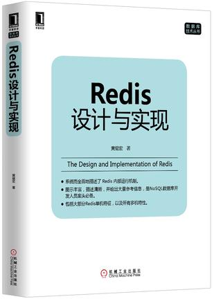

<!-- START doctoc generated TOC please keep comment here to allow auto update -->
<!-- DON'T EDIT THIS SECTION, INSTEAD RE-RUN doctoc TO UPDATE -->
**Table of Contents**  *generated with [DocToc](https://github.com/thlorenz/doctoc)*

- [目录](#%E7%9B%AE%E5%BD%95)
  - [第一部分：数据结构和对象](#%E7%AC%AC%E4%B8%80%E9%83%A8%E5%88%86%E6%95%B0%E6%8D%AE%E7%BB%93%E6%9E%84%E5%92%8C%E5%AF%B9%E8%B1%A1)
  - [第二部分：单机数据库的实现](#%E7%AC%AC%E4%BA%8C%E9%83%A8%E5%88%86%E5%8D%95%E6%9C%BA%E6%95%B0%E6%8D%AE%E5%BA%93%E7%9A%84%E5%AE%9E%E7%8E%B0)
  - [第三部分：多机数据库的实现](#%E7%AC%AC%E4%B8%89%E9%83%A8%E5%88%86%E5%A4%9A%E6%9C%BA%E6%95%B0%E6%8D%AE%E5%BA%93%E7%9A%84%E5%AE%9E%E7%8E%B0)
  - [第四部分：独立功能的实现](#%E7%AC%AC%E5%9B%9B%E9%83%A8%E5%88%86%E7%8B%AC%E7%AB%8B%E5%8A%9F%E8%83%BD%E7%9A%84%E5%AE%9E%E7%8E%B0)

<!-- END doctoc generated TOC please keep comment here to allow auto update -->

[《Redis设计与实现》](http://redisbook.com/)的读书笔记

# 目录

## 第一部分：数据结构和对象 

[2、简单动态字符串](2、简单动态字符串.md)

[3、链表](3、链表.md)

[4、字典](4、字典.md)

[5、跳跃表](5、跳跃表.md)

[6、整数集合](6、整数集合.md)

[7、压缩列表](7、压缩列表.md)

[8、对象](8、对象.md)

## 第二部分：单机数据库的实现

[9、数据库](9、数据库.md)

[10、RDB持久化](10、RDB持久化.md)

[11、AOF持久化](11、AOF持久化.md)

[12、事件](12、事件.md)

[13、客户端](13、客户端.md)

[14、服务器](14、服务器.md)

## 第三部分：多机数据库的实现

[15、复制](15、复制.md)

[16、Sentinel](16、Sentinel.md)

[17、集群](17、集群.md)

## 第四部分：独立功能的实现

[18、发布与订阅](18、发布与订阅.md)

[19、事务](19、事务.md)

[20、Lua脚本](20、Lua脚本.md)

[21、排序](21、排序.md)

[22、二进制位数组](22、二进制位数组.md)

[23、慢查询日志](23、慢查询日志.md)

[24、监视器](24、监视器.md)
