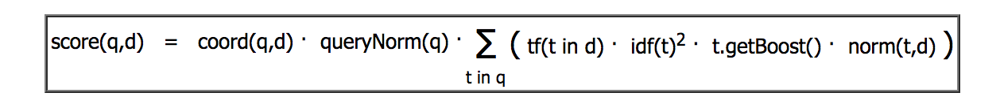

<!-- START doctoc generated TOC please keep comment here to allow auto update -->
<!-- DON'T EDIT THIS SECTION, INSTEAD RE-RUN doctoc TO UPDATE -->
**Table of Contents**  *generated with [DocToc](https://github.com/thlorenz/doctoc)*

- [2.1 Apache Lucene 默认评分公式](#21-apache-lucene-%E9%BB%98%E8%AE%A4%E8%AF%84%E5%88%86%E5%85%AC%E5%BC%8F)
  - [2.2.1 何时文档被匹配上](#221-%E4%BD%95%E6%97%B6%E6%96%87%E6%A1%A3%E8%A2%AB%E5%8C%B9%E9%85%8D%E4%B8%8A)
  - [2.1.2 TF/IDF 评分公式](#212-tfidf-%E8%AF%84%E5%88%86%E5%85%AC%E5%BC%8F)
  - [2.1.3 Elasticsearch 如何看评分](#213-elasticsearch-%E5%A6%82%E4%BD%95%E7%9C%8B%E8%AF%84%E5%88%86)
- [2.2 查询改写](#22-%E6%9F%A5%E8%AF%A2%E6%94%B9%E5%86%99)
- [2.3 二次评分](#23-%E4%BA%8C%E6%AC%A1%E8%AF%84%E5%88%86)
- [2.4 批量操作](#24-%E6%89%B9%E9%87%8F%E6%93%8D%E4%BD%9C)
- [2.4.1 批量取](#241-%E6%89%B9%E9%87%8F%E5%8F%96)
  - [2.4.2 批量查询](#242-%E6%89%B9%E9%87%8F%E6%9F%A5%E8%AF%A2)
- [导航](#%E5%AF%BC%E8%88%AA)

<!-- END doctoc generated TOC please keep comment here to allow auto update -->

# 2.1 Apache Lucene 默认评分公式

文档得分是刻画文档与查询匹配程度的参数。

## 2.2.1 何时文档被匹配上

同一个文档在不同查询中的得分不具比较性。

为了计算文档得分，要考虑一下因素：

- 文档权重（document boost）：索引期赋予某个文档的权重值。
- 字段权重（field boost）：查询期赋予某个字段的权重值。
- 协调因子（coord）：基于文档中词项命中个数的协调因子，一个文档命中了查询中的词项越多，得分越高。
- 逆文档频率（inverse document frequency）：一个基于词项的因子，告诉评分公示该词项多么罕见。评分公示利用该因子为包含罕见词项的文档加权。
- 长度范数（length norm）：每个字段的基于词项个数的归一化因子。一个字段包含的词项数越多，该因子的权重越低。这意味着Lucene评分公示更喜欢包含较少词项的字段。
- 词频（term frequency）：表示一个词项在某个文档中出现了多少次。词频越高，文档得分越高。
- 查询范数（query norm）：基于查询的归一化因子，等于查询中词项的权重平方和。查询范数使得不同查询的得分能相互比较，尽管这种比较通常是困难且不可行的。

## 2.1.2 TF/IDF 评分公式

Lucene 实际使用的评分公式：



求和公式中的每个加数是以下因子的连乘：词频、逆文档频率、词项权重、长度范数。

## 2.1.3 Elasticsearch 如何看评分

Elasticsearch使用了Lucene的评分公式，但不限于Lucene的评分功能。用户可以使用不同的查询类型来控制文档评分的计算，还可以使用脚本来改变文档得分，还可以使用二次评分功能。


# 2.2 查询改写

```shell
curl -XGET 'localhost:9200/clients/_search?pretty' -d '{
  "query": {
    "prefix": {
    	"name": "j",
    	"rewrite": "constant_score_boolean"
    }
  }
}'
```

前缀查询会被改写为*常数得分查询*（constant score query），该查询由一个布尔查询构成。Lucene所做的就是：枚举索引中的词项，然后利用词项的信息来构建新的查询。

使用`rewrite`参数可以控制查询改写：

- `scoring_boolean`。将每个生成的词项转化为布尔查询中的一个或从句（should clause）。从句越多，查询性能越差。
- `constant_score_boolean`。与`scoring_boolean`类似，但该过程中不计算每个从句的得分，而是每个从句得到一个与查询权重相同的常数得分，默认为1。
- `constant_score_filter`。通过顺序遍历每个词项来创建一个私有的过滤器，标记跟每个词项相关的所有文档。
- `top_terms-N`。将每个生成的词项转换为布尔查询的一个或从句，并保存计算出来的查询得分。与`scoring_boolean`不同的是，该方法只保留最佳的前N个词项。
- `top_terms_boost_N`。与`top_terms-N`类似，不同在于该选项产生的从句类型为常量得分查询，得分为从句的权重。


# 2.3 二次评分

二次评分是指重新计算查询返回文档中指定个数文档的得分。

二次评分查询范例：

```json
{
  "field": ["title", "available"],
  "query": {
    "match_all": {}
  },
  "rescore": {
    "query": {
      "rescore_query": {
        "custom_score": {
          "query": {
            "match_all": {}
          },
          "script": "doc['year'].value"
        }
      }
    }
  }
}
```

在`rescore`对象的查询对象中，必须配置下面这些参数：

- `window_size`: 指定了每个分片上参与二次评分的文档个数。
- `query_weight`：原始查询的得分与二次评分的得分相加之前将乘以该值。
- `restore_query_weight`：二次评分查询的得分在于原始查询得分相加之前，将乘以该值。
- `restore_mode`：默认为`total`。它定义了二次评分中文档得分的计算方式，可用的选项有 `total`、`max`、`min`、`avg`、`multiply`。`total`表示文档得分为原始查询得分与二次评分得分之和。`max`表示文档得分为原始查询得分与二次评分得分的最大值。`min`表示文档得分为两次查询得分的最小是。

如果`restore_mode`为`total`，那么 文档得分：

`original_query_score * query_weight + restore_query_score * restore_query_weight`

二次评分与排序不能一起使用。因为排序发生在前，没有考虑后续计算出的文档得分。

# 2.4 批量操作

# 2.4.1 批量取

批量取（MultiGet）通过`_mget`操作，它允许一个请求多个文档。

```
GET /website/blog/_mget
{
   "ids" : [ "2", "1" ]
}
```

## 2.4.2 批量查询

```
GET twitter/_msearch
{}
{"query" : {"match_all" : {}}, "from" : 0, "size" : 10}
{}
{"query" : {"match_all" : {}}}
{"index" : "twitter2"}
{"query" : {"match_all" : {}}}
```


# 导航

[目录](README.md)

上一章: [1. Elasticsearch简介](1. Elasticsearch简介.md)

下一章: [3. 底层索引控制](3. 底层索引控制.md)
