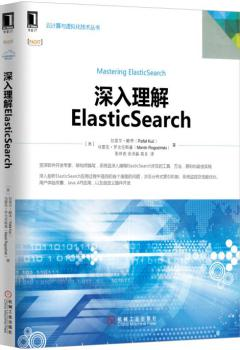

<!-- START doctoc generated TOC please keep comment here to allow auto update -->
<!-- DON'T EDIT THIS SECTION, INSTEAD RE-RUN doctoc TO UPDATE -->
**Table of Contents**  *generated with [DocToc](https://github.com/thlorenz/doctoc)*

- [目录](#%E7%9B%AE%E5%BD%95)

<!-- END doctoc generated TOC please keep comment here to allow auto update -->

[《深入理解Elasticsearch》](https://book.douban.com/subject/26733541)读书笔记

# 目录

[1、Elasticsearch简介](1、Elasticsearch简介.md)

[2、查询DSL进阶](3、查询DSL进阶.md)

[3、底层索引控制](3、底层索引控制.md)

[4、分布式索引架构](4、分布式索引架构.md)
