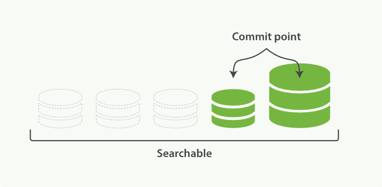

<!-- START doctoc generated TOC please keep comment here to allow auto update -->
<!-- DON'T EDIT THIS SECTION, INSTEAD RE-RUN doctoc TO UPDATE -->
**Table of Contents**  *generated with [DocToc](https://github.com/thlorenz/doctoc)*

- [使文本可搜索](#%E4%BD%BF%E6%96%87%E6%9C%AC%E5%8F%AF%E6%90%9C%E7%B4%A2)
  - [不变性](#%E4%B8%8D%E5%8F%98%E6%80%A7)
- [动态更新索引](#%E5%8A%A8%E6%80%81%E6%9B%B4%E6%96%B0%E7%B4%A2%E5%BC%95)
  - [删除和更新](#%E5%88%A0%E9%99%A4%E5%92%8C%E6%9B%B4%E6%96%B0)
- [近实时搜索](#%E8%BF%91%E5%AE%9E%E6%97%B6%E6%90%9C%E7%B4%A2)
  - [refresh API](#refresh-api)
- [持久化变更](#%E6%8C%81%E4%B9%85%E5%8C%96%E5%8F%98%E6%9B%B4)
  - [flush API](#flush-api)
- [段合并](#%E6%AE%B5%E5%90%88%E5%B9%B6)
  - [optimize API](#optimize-api)
- [导航](#%E5%AF%BC%E8%88%AA)

<!-- END doctoc generated TOC please keep comment here to allow auto update -->

# 使文本可搜索

 倒排索引包含一个有序列表，列表包含所有文档出现过的不重复个体，或称为 *词项* ，对于每一个词项，包含了它所有曾出现过文档的列表。

```
Term  | Doc 1 | Doc 2 | Doc 3 | ...
------------------------------------
brown |   X   |       |  X    | ...
fox   |   X   |   X   |  X    | ...
quick |   X   |   X   |       | ...
the   |   X   |       |  X    | ...
```

Elasticsearch的倒排索引相比特定词项出现过的文档列表，会包含更多其它信息。它会保存每一个词项出现过的文档总数， 在对应的文档中一个具体词项出现的总次数，词项在文档中的顺序，每个文档的长度，所有文档的平均长度，等等。这些统计信息允许 Elasticsearch 决定哪些词比其它词更重要，哪些文档比其它文档更重要。

## 不变性

倒排索引被写入磁盘后是 *不可改变* 的:它永远不会修改。 不变性有重要的价值：

- 不需要锁。如果你从来不更新索引，你就不需要担心多进程同时修改数据的问题。
- 一旦索引被读入内核的文件系统缓存，便会留在哪里，由于其不变性。只要文件系统缓存中还有足够的空间，那么大部分读请求会直接请求内存，而不会命中磁盘。这提供了很大的性能提升。
- 其它缓存（像filter缓存），在索引的生命周期内始终有效。它们不需要在每次数据改变时被重建，因为数据不会变化。
- 写入单个大的倒排索引允许数据被压缩，减少磁盘 I/O 和 需要被缓存到内存的索引的使用量。

# 动态更新索引

下一个需要被解决的问题是怎样在保留不变性的前提下实现倒排索引的更新？ 答案是: 用更多的索引。

通过增加新的补充索引来反映新近的修改，而不是直接重写整个倒排索引。每一个倒排索引都会被轮流查询到--从最早的开始--查询完后再对结果进行合并。

Elasticsearch 基于 Lucene, 这个 java 库引入了 *按段搜索* 的概念。 每一 *段* 本身都是一个倒排索引， 但 *索引* 在 Lucene 中除表示所有 *段* 的集合外， 还增加了 *提交点* 的概念 — 一个列出了所有已知段的文件。


> 一个 *Lucene 索引* 我们在 Elasticsearch 称作 *分片* 。 一个 Elasticsearch *索引*是分片的集合。 当 Elasticsearch 在索引中搜索的时候， 他发送查询到每一个属于索引的分片(Lucene 索引)，合并每个分片的结果到一个全局的结果集。

逐段搜索会以如下流程进行工作：

1. 新文档被收集到内存索引缓存。
2. 不时地, 缓存被 *提交* ：
   - 一个新的段--一个追加的倒排索引--被写入磁盘。
   - 一个新的包含新段名字的 *提交点* 被写入磁盘。
   - 磁盘进行 *同步* — 所有在文件系统缓存中等待的写入都刷新到磁盘，以确保它们被写入物理文件。
3. 新的段被开启，让它包含的文档可见以被搜索。
4. 内存缓存被清空，等待接收新的文档。

**一个在内存缓存中包含新文档的 Lucene 索引：**


**在一次提交后，一个新的段被添加到提交点而且缓存被清空: **


## 删除和更新

段是不可改变的，所以既不能从把文档从旧的段中移除，也不能修改旧的段来进行反映文档的更新。 取而代之的是，每个提交点会包含一个 `.del` 文件，文件中会列出这些被删除文档的段信息。

当一个文档被 “删除” 时，它实际上只是在 `.del` 文件中被 *标记* 删除。一个被标记删除的文档仍然可以被查询匹配到， 但它会在最终结果被返回前从结果集中移除。

文档更新也是类似的操作方式：当一个文档被更新时，旧版本文档被标记删除，文档的新版本被索引到一个新的段中。 可能两个版本的文档都会被一个查询匹配到，但被删除的那个旧版本文档在结果集返回前就已经被移除。


# 近实时搜索

在Elasticsearch和磁盘之间是文件系统缓存。在内存索引缓冲区中的文档会被写入到一个新的段中。 但是这里新段会被先写入到文件系统缓存 -- 这一步代价会比较低，稍后再被刷新到磁盘 -- 这一步代价比较高。不过只要文件已经在缓存中，就可以像其它文件一样被打开和读取了。

**在内存缓冲区中包含了新文档的 Lucene 索引：**


**缓冲区的内容已经被写入一个可被搜索的段中，但还没有进行提交: **


## refresh API

在 Elasticsearch 中，写入和打开一个新段的轻量的过程叫做 *refresh* 。 默认情况下每个分片会每秒自动刷新一次。

通过设置 `refresh_interval` ， 降低每个索引的刷新频率：

```
PUT /my_logs
{
  "settings": {
    "refresh_interval": "30s" 
  }
}
```

这些行为可能会对新用户造成困惑: 他们索引了一个文档然后尝试搜索它，但却没有搜到。这个问题的解决办法是用 `refresh` API 执行一次手动刷新:

```
POST /_refresh 
POST /blogs/_refresh 
```

# 持久化变更

一次完整的提交会将段刷到磁盘，并写入一个包含所有段列表的提交点。Elasticsearch 在启动或重新打开一个索引的过程中使用这个提交点来判断哪些段隶属于当前分片。

两次提交之间发生变化的文档也可能丢失，这怎么办？

Elasticsearch 增加了一个 *translog* ，或者叫事务日志，在每一次对 Elasticsearch 进行操作时均进行了日志记录。通过 translog ，整个流程是下面这样：

1. 一个文档被索引之后，就会被添加到内存缓冲区，*并且* 追加到了 translog 。

   

2. 刷新（refresh）完成后, 缓存被清空但是事务日志不会，分片每秒被刷新（refresh）一次：

   - 这些在内存缓冲区的文档被写入到一个新的段中，且没有进行 `fsync` 操作。   这个段被打开，使其可被搜索。
   - 内存缓冲区被清空。

   

3. 这个进程继续工作，更多的文档被添加到内存缓冲区和追加到事务日志。

   

4. 每隔一段时间--例如 translog 变得越来越大--索引被刷新（flush）；一个新的 translog 被创建，并且一个全量提交被执行：

   - 所有在内存缓冲区的文档都被写入一个新的段。
   - 缓冲区被清空。
   - 一个提交点被写入硬盘。
   - 文件系统缓存通过 `fsync` 被刷新（flush）。
   - 老的 translog 被删除。

   

translog 提供所有还没有被刷到磁盘的操作的一个持久化纪录。当 Elasticsearch 启动的时候， 它会从磁盘中使用最后一个提交点去恢复已知的段，并且会重放 translog 中所有在最后一次提交后发生的变更操作。

translog 也被用来提供实时 CRUD 。当你试着通过ID查询、更新、删除一个文档，它会在尝试从相应的段中检索之前， 首先检查 translog 任何最近的变更。这意味着它总是能够实时地获取到文档的最新版本。

## flush API

这个执行一个提交并且截断 translog 的行为在 Elasticsearch 被称作一次 *flush* 。 分片每30分钟被自动刷新（flush），或者在 translog 太大的时候也会刷新。请查看 [`translog` 文档](https://www.elastic.co/guide/en/elasticsearch/reference/master/index-modules-translog.html#_translog_settings) 来设置，它可以用来 控制这些阈值：

[`flush` API](https://www.elastic.co/guide/en/elasticsearch/reference/master/indices-flush.html) 可以 被用来执行一个手工的刷新（flush）:

```
POST /blogs/_flush 

POST /_flush?wait_for_ongoing 
```

> Translog 有多安全?
>
> 在文件被`fsync`+到磁盘前，被写入的文件在重启之后就会丢失。默认 translog 是每 5 秒被 +`fsync`' 刷新到硬盘， *并且* 是在写请求完成之后(e.g. index, delete, update, bulk)。这个过程在主分片和复制分片都会发生。最终， 基本上，这意味着在整个请求被+fsync+到主分片和复制分片的translog之前，你的客户端不会得到一个 200 OK 响应。


# 段合并

自动刷新流程每秒会创建一个新的段 ，这样会导致短时间内的段数量暴增。而段数目太多会带来较大的麻烦。 每一个段都会消耗文件句柄、内存和cpu运行周期。更重要的是，每个搜索请求都必须轮流检查每个段；所以段越多，搜索也就越慢。

Elasticsearch通过在后台进行段合并来解决这个问题。小的段被合并到大的段，然后这些大的段再被合并到更大的段：

1、 当索引的时候，刷新（refresh）操作会创建新的段并将段打开以供搜索使用。

2、 合并进程选择一小部分大小相似的段，并且在后台将它们合并到更大的段中。这并不会中断索引和搜索。


3、一旦合并结束，

- 新的段被刷新（flush）到了磁盘。   ** 写入一个包含新段且排除旧的和较小的段的新提交点。
- 新的段被打开用来搜索。
- 老的段被删除。



> 合并大的段需要消耗大量的I/O和CPU资源，如果任其发展会影响搜索性能。Elasticsearch在默认情况下会对合并流程进行资源限制，所以搜索仍然 有足够的资源很好地执行。

## optimize API

`optimize` API大可看做是 *强制合并* API 。它会将一个分片强制合并到 `max_num_segments` 参数指定大小的段数目。 这样做的意图是减少段的数量（通常减少到一个），来提升搜索性能。

`optimize` API *不应该* 被用在一个动态索引————一个正在被活跃更新的索引。后台合并流程已经可以很好地完成工作。 

```
POST /logstash-2014-10/_optimize?max_num_segments=1
```


# 导航

[目录](README.md)

上一章：[10、索引管理](10、索引管理.md)

下一章：[12、结构化搜索](12、结构化搜索.md)
