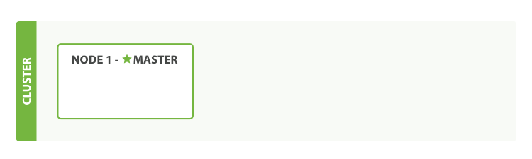

<!-- START doctoc generated TOC please keep comment here to allow auto update -->
<!-- DON'T EDIT THIS SECTION, INSTEAD RE-RUN doctoc TO UPDATE -->
**Table of Contents**  *generated with [DocToc](https://github.com/thlorenz/doctoc)*

- [空集群](#%E7%A9%BA%E9%9B%86%E7%BE%A4)
- [集群健康](#%E9%9B%86%E7%BE%A4%E5%81%A5%E5%BA%B7)
- [添加索引](#%E6%B7%BB%E5%8A%A0%E7%B4%A2%E5%BC%95)
- [添加故障转移](#%E6%B7%BB%E5%8A%A0%E6%95%85%E9%9A%9C%E8%BD%AC%E7%A7%BB)
- [水平扩容](#%E6%B0%B4%E5%B9%B3%E6%89%A9%E5%AE%B9)
- [应对故障](#%E5%BA%94%E5%AF%B9%E6%95%85%E9%9A%9C)
- [导航](#%E5%AF%BC%E8%88%AA)

<!-- END doctoc generated TOC please keep comment here to allow auto update -->

ElasticSearch 的主旨是随时可用和按需扩容。 而扩容可以通过购买性能更强大（ 垂直扩容 ，或 纵向扩容 ） 或者数量更多的服务器（ 水平扩容 ，或 横向扩容 ）来实现。

虽然 Elasticsearch 可以获益于更强大的硬件设备，但是垂直扩容是有极限的。 真正的扩容能力是来自于水平扩容--为集群添加更多的节点，并且将负载压力和稳定性分散到这些节点中。

# 空集群

如果我们启动了一个单独的节点，里面不包含任何的数据和 索引，那么集群看起来就如下图：



一个运行中的 Elasticsearch 实例称为一个 节点，而集群是由一个或者多个拥有相同 cluster.name 配置的节点组成， 它们共同承担数据和负载的压力。当有节点加入集群中或者从集群中移除节点时，集群将会重新平均分布所有的数据。

当一个节点被选举成为 **主** 节点时， 它将负责管理集群范围内的所有变更，例如增加、删除索引，或者增加、删除节点等。 而主节点并不需要涉及到文档级别的变更和搜索等操作，所以当集群只拥有一个主节点的情况下，即使流量的增加它也不会成为瓶颈。 任何节点都可以成为主节点。我们的示例集群就只有一个节点，所以它同时也成为了主节点。

作为用户，我们可以将请求发送到 **集群中的任何节点** ，包括主节点。 每个节点都知道任意文档所处的位置，并且能够将我们的请求直接转发到存储我们所需文档的节点。 无论我们将请求发送到哪个节点，它都能负责从各个包含我们所需文档的节点收集回数据，并将最终结果返回給客户端。 Elasticsearch 对这一切的管理都是透明的。

#  集群健康

```
GET /_cluster/health
```

`status` 字段指示着当前集群在总体上是否工作正常。它的三种颜色含义如下：

- `green`

  所有的主分片和副本分片都正常运行。

- `yellow`

  所有的主分片都正常运行，但不是所有的副本分片都正常运行。

- `red`

  有主分片没能正常运行。

# 添加索引

 索引实际上是指向一个或者多个物理 *分片* 的 *逻辑命名空间* 。

一个 *分片* 是一个底层的 *工作单元* ，它仅保存了 全部数据中的一部分。而现在我们只需知道一个分片是一个 Lucene 的实例，以及它本身就是一个完整的搜索引擎。 我们的文档被存储和索引到分片内，但是应用程序是直接与索引而不是与分片进行交互。

Elasticsearch 是利用分片将数据分发到集群内各处的。分片是数据的容器，文档保存在分片内，分片又被分配到集群内的各个节点里。 当你的集群规模扩大或者缩小时， Elasticsearch 会自动的在各节点中迁移分片，使得数据仍然均匀分布在集群里。

一个分片可以是 *主* 分片或者 *副本* 分片。 索引内任意一个文档都归属于一个主分片，所以主分片的数目决定着索引能够保存的最大数据量。

> 技术上来说，一个主分片最大能够存储 Integer.MAX_VALUE - 128 个文档，但是实际最大值还需要参考你的使用场景：包括你使用的硬件， 文档的大小和复杂程度，索引和查询文档的方式以及你期望的响应时长。

一个副本分片只是一个主分片的拷贝。 副本分片作为硬件故障时保护数据不丢失的冗余备份，并为搜索和返回文档等读操作提供服务。

在索引建立的时候就已经确定了主分片数，但是副本分片数可以随时修改。

只有一个索引的单节点集群。所有3个主分片都被分配在 `Node 1` ，集群 `status` 值为 `yellow` 。


# 添加故障转移

拥有两个节点的集群——所有主分片和副本分片都已被分配：


当第二个节点加入到集群后，3个 *副本分片* 将会分配到这个节点上——每个主分片对应一个副本分片。 这意味着当集群内任何一个节点出现问题时，我们的数据都完好无损。

`cluster-health` 现在展示的状态为 `green` ，这表示所有6个分片（包括3个主分片和3个副本分片）都在正常运行。

# 水平扩容

拥有三个节点的集群——为了分散负载而对分片进行重新分配：


`Node 1` 和 `Node 2` 上各有一个分片被迁移到了新的 `Node 3` 节点，现在每个节点上都拥有2个分片，而不是之前的3个。 这表示每个节点的硬件资源（CPU, RAM, I/O）将被更少的分片所共享，每个分片的性能将会得到提升。

分片是一个功能完整的搜索引擎，它拥有使用一个节点上的所有资源的能力。 我们这个拥有6个分片（3个主分片和3个副本分片）的索引可以最大扩容到6个节点，每个节点上存在一个分片，并且每个分片拥有所在节点的全部资源。

主分片的数目在索引创建时 就已经确定了下来。实际上，这个数目定义了这个索引能够 *存储* 的最大数据量。（实际大小取决于你的数据、硬件和使用场景。） 但是，读操作——搜索和返回数据——可以同时被主分片 *或* 副本分片所处理，所以当你拥有越多的副本分片时，也将拥有越高的吞吐量。

在运行中的集群上是可以动态调整副本分片数目的 ，我们可以按需伸缩集群。让我们把副本数从默认的 `1`增加到 `2` ：

```
PUT /blogs/_settings
{
   "number_of_replicas" : 2
}
```


# 应对故障

如果我们关闭第一个节点，


我们关闭的节点是一个主节点。而集群必须拥有一个主节点来保证正常工作，所以发生的第一件事情就是选举一个新的主节点： `Node 2` 。

在我们关闭 `Node 1` 的同时也失去了主分片 `1` 和 `2` ，并且在缺失主分片的时候索引也不能正常工作。 如果此时来检查集群的状况，我们看到的状态将会为 `red` ：不是所有主分片都在正常工作。

幸运的是，在其它节点上存在着这两个主分片的完整副本， 所以新的主节点立即将这些分片在 `Node 2` 和 `Node 3` 上对应的副本分片提升为主分片， 此时集群的状态将会为 `yellow` 。 这个提升主分片的过程是瞬间发生的。

为什么我们集群状态是 `yellow` 而不是 `green` 呢？ 虽然我们拥有所有的三个主分片，但是同时设置了每个主分片需要对应2份副本分片，而此时只存在一份副本分片。 所以集群不能为 `green` 的状态。


# 导航

[目录](README.md)

上一章：[1、你知道的，为了搜索](1、你知道的，为了搜索.md)

下一章：[3、数据输入和输出](3、数据输入和输出.md)
