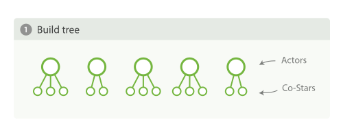
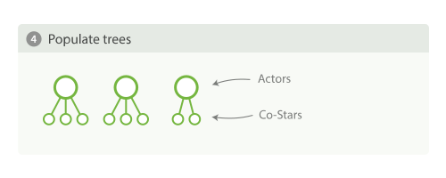

<!-- START doctoc generated TOC please keep comment here to allow auto update -->
<!-- DON'T EDIT THIS SECTION, INSTEAD RE-RUN doctoc TO UPDATE -->
**Table of Contents**  *generated with [DocToc](https://github.com/thlorenz/doctoc)*

- [Doc Values](#doc-values)
- [深入文档值](#%E6%B7%B1%E5%85%A5%E6%96%87%E6%A1%A3%E5%80%BC)
  - [列式存储的压缩](#%E5%88%97%E5%BC%8F%E5%AD%98%E5%82%A8%E7%9A%84%E5%8E%8B%E7%BC%A9)
  - [禁用文档值](#%E7%A6%81%E7%94%A8%E6%96%87%E6%A1%A3%E5%80%BC)
- [聚合与分析](#%E8%81%9A%E5%90%88%E4%B8%8E%E5%88%86%E6%9E%90)
  - [分析字符串和 Fielddata（Analyzed strings and Fielddata）](#%E5%88%86%E6%9E%90%E5%AD%97%E7%AC%A6%E4%B8%B2%E5%92%8C-fielddataanalyzed-strings-and-fielddata)
  - [高基数内存的影响（High-Cardinality Memory Implications）](#%E9%AB%98%E5%9F%BA%E6%95%B0%E5%86%85%E5%AD%98%E7%9A%84%E5%BD%B1%E5%93%8Dhigh-cardinality-memory-implications)
- [限制内存使用](#%E9%99%90%E5%88%B6%E5%86%85%E5%AD%98%E4%BD%BF%E7%94%A8)
  - [Fielddata的大小](#fielddata%E7%9A%84%E5%A4%A7%E5%B0%8F)
  - [监控 fielddata](#%E7%9B%91%E6%8E%A7-fielddata)
  - [断路器](#%E6%96%AD%E8%B7%AF%E5%99%A8)
- [Fielddata 的过滤](#fielddata-%E7%9A%84%E8%BF%87%E6%BB%A4)
- [预加载 fielddata](#%E9%A2%84%E5%8A%A0%E8%BD%BD-fielddata)
  - [预加载 fielddata（Eagerly Loading Fielddata）](#%E9%A2%84%E5%8A%A0%E8%BD%BD-fielddataeagerly-loading-fielddata)
  - [全局序号（Global Oridinals）](#%E5%85%A8%E5%B1%80%E5%BA%8F%E5%8F%B7global-oridinals)
    - [构建全局序号（Building global ordinals）](#%E6%9E%84%E5%BB%BA%E5%85%A8%E5%B1%80%E5%BA%8F%E5%8F%B7building-global-ordinals)
  - [索引预热器（Index Warmers）](#%E7%B4%A2%E5%BC%95%E9%A2%84%E7%83%AD%E5%99%A8index-warmers)
- [优化聚合查询](#%E4%BC%98%E5%8C%96%E8%81%9A%E5%90%88%E6%9F%A5%E8%AF%A2)
- [深度优先](#%E6%B7%B1%E5%BA%A6%E4%BC%98%E5%85%88)
  - [广度优先](#%E5%B9%BF%E5%BA%A6%E4%BC%98%E5%85%88)
- [总结](#%E6%80%BB%E7%BB%93)
- [导航](#%E5%AF%BC%E8%88%AA)

<!-- END doctoc generated TOC please keep comment here to allow auto update -->

# Doc Values

聚合使用一个叫 doc values 的数据结构。

Doc values 的存在是因为倒排索引只对某些操作是高效的。 倒排索引的优势 在于查找包含某个项的文档，而对于从另外一个方向的相反操作并不高效，即：确定哪些项是否存在单个文档里，聚合需要这种次级的访问模式。

对于以下倒排索引：

```
Term      Doc_1   Doc_2   Doc_3
------------------------------------
brown   |   X   |   X   |
dog     |   X   |       |   X
dogs    |       |   X   |   X
fox     |   X   |       |   X
foxes   |       |   X   |
in      |       |   X   |
jumped  |   X   |       |   X
lazy    |   X   |   X   |
leap    |       |   X   |
over    |   X   |   X   |   X
quick   |   X   |   X   |   X
summer  |       |   X   |
the     |   X   |       |   X
------------------------------------
```

如果我们想要获得所有包含 `brown` 的文档的词的完整列表，我们会创建如下查询：

```
GET /my_index/_search
{
  "query" : {
    "match" : {
      "body" : "brown"
    }
  },
  "aggs" : {
    "popular_terms": {
      "terms" : {
        "field" : "body"
      }
    }
  }
}
```

查询部分简单又高效。倒排索引是根据项来排序的，所以我们首先在词项列表中找到 `brown` ，然后扫描所有列，找到包含 `brown` 的文档。我们可以快速看到 `Doc_1` 和 `Doc_2` 包含 `brown` 这个 token。

然后，对于聚合部分，我们需要找到 `Doc_1` 和 `Doc_2` 里所有唯一的词项。 用倒排索引做这件事情代价很高： 我们会迭代索引里的每个词项并收集 `Doc_1` 和 `Doc_2` 列里面 token。这很慢而且难以扩展：随着词项和文档的数量增加，执行时间也会增加。

Doc values 通过转置两者间的关系来解决这个问题。倒排索引将词项映射到包含它们的文档，doc values 将文档映射到它们包含的词项：

```
Doc      Terms
-----------------------------------------------------------------
Doc_1 | brown, dog, fox, jumped, lazy, over, quick, the
Doc_2 | brown, dogs, foxes, in, lazy, leap, over, quick, summer
Doc_3 | dog, dogs, fox, jumped, over, quick, the
-----------------------------------------------------------------
```

当数据被转置之后，想要收集到 `Doc_1` 和 `Doc_2` 的唯一 token 会非常容易。获得每个文档行，获取所有的词项，然后求两个集合的并集。

因此，搜索和聚合是相互紧密缠绕的。搜索使用倒排索引查找文档，聚合操作收集和聚合 doc values 里的数据。

# 深入文档值

文档值是在索引时与倒排索引同时产生的。也就是说文档值是按段来产生的并且是不可变的，文档值也序列化到磁盘。

通过序列化一个持久化的数据结构到磁盘，我们可以依赖于操作系统的缓存来管理内存，而不是在 JVM 堆栈里驻留数据。

当 “工作集（working set）” 数据要小于系统可用内存的情况下，操作系统会自然的将文档值驻留在内存，这将会带来和直接使用 JVM 堆栈数据结构相同的性能。不过，如果你的工作集远大于可用内存，操作系统会开始根据需要对文档值进行分页开/关。

## 列式存储的压缩

从广义来说，文档值本质上是一个序列化的 *列式存储* 。

要了解它如何帮助压缩数据，来看一组数字类型的文档值：

```
Doc      Terms
-----------------------------------------------------------------
Doc_1 | 100
Doc_2 | 1000
Doc_3 | 1500
Doc_4 | 1200
Doc_5 | 300
Doc_6 | 1900
Doc_7 | 4200
-----------------------------------------------------------------
```

按列布局意味着我们有一个连续的数据块： `[100,1000,1500,1200,300,1900,4200]` 。因为我们已经知道他们都是数字（而不是像文档或行中看到的异构集合），所以我们可以使用统一的偏移来将他们紧紧排列。

而且，针对这样的数字有很多种压缩技巧。 你会注意到这里每个数字都是  100 的倍数，文档值会检测一个段里面的所有数值，并使用一个 *最大公约数* ，方便做进一步的数据压缩。

## 禁用文档值

禁用文档值，在字段的映射（mapping）设置 `doc_values: false` 即可。例如，这里我们创建了一个新的索引，字段 `"session_id"` 禁用了文档值：

```
PUT my_index
{
  "mappings": {
    "my_type": {
      "properties": {
        "session_id": {
          "type":       "string",
          "index":      "not_analyzed",
          "doc_values": false 
        }
      }
    }
  }
}
```

反过来也是可以进行配置的：让一个字段可以被聚合，通过禁用倒排索引，使它不能被正常搜索，例如：

```
PUT my_index
{
  "mappings": {
    "my_type": {
      "properties": {
        "customer_token": {
          "type":       "string",
          "index":      "not_analyzed",
          "doc_values": true, 
          "index": "no" 
        }
      }
    }
  }
}
```

# 聚合与分析

分析是怎么影响聚合的呢？

答案是影响“很多”，有两个原因：分析影响聚合中使用的 tokens ，并且 doc values *不能使用于* 分析字符串。

分析 tokens 的产生如何影响聚合。首先索引一些代表美国各个州的文档：

```
POST /agg_analysis/data/_bulk
{ "index": {}}
{ "state" : "New York" }
{ "index": {}}
{ "state" : "New Jersey" }
{ "index": {}}
{ "state" : "New Mexico" }
```

我们希望创建一个数据集里各个州的唯一列表，并且计数。 简单，让我们使用 `terms` 桶：

```
GET /agg_analysis/data/_search
{
    "size" : 0,
    "aggs" : {
        "states" : {
            "terms" : {
                "field" : "state"
            }
        }
    }
}
```

得到结果：

```
{
...
   "aggregations": {
      "states": {
         "buckets": [
            {
               "key": "new",
               "doc_count": 5
            },
            {
               "key": "york",
               "doc_count": 3
            },
            {
               "key": "jersey",
               "doc_count": 1
            },
            {
               "key": "mexico",
               "doc_count": 1
            }
         ]
      }
   }
}
```

这完全不是我们想要的！没有对州名计数，聚合计算了每个词的数目。背后的原因很简单：聚合是基于倒排索引创建的，倒排索引是 后置分析（ *post-analysis* ）的。

当我们把这些文档加入到 Elasticsearch 中时，字符串 `"New York"` 被分析/分析成 `["new", "york"]` 。这些单独的 tokens ，都被用来填充聚合计数，所以我们最终看到 `new` 的数量而不是 `New York` 。

我们需要为 `state` 定义 multifield 并且设置成 `not_analyzed` 。这样可以防止 `New York` 被分析。

## 分析字符串和 Fielddata（Analyzed strings and Fielddata）

Doc values 不支持 `analyzed` 字符串字段，因为它们不能很有效的表示多值字符串。 Doc values 最有效的是，当每个文档都有一个或几个 tokens 时， 但不是无数的，分析字符串（想象一个 PDF ，可能有几兆字节并有数以千计的独特 tokens）。

出于这个原因，doc values 不生成分析的字符串，然而，这些字段仍然可以使用聚合，那怎么可能呢？

答案是一种被称为 *fielddata* 的数据结构。与 doc values 不同，fielddata 构建和管理 100% 在内存中，常驻于 JVM 内存堆。这意味着它本质上是不可扩展的，有很多边缘情况下要提防。

## 高基数内存的影响（High-Cardinality Memory Implications）

避免分析字段的另外一个原因就是：高基数字段在加载到 fielddata 时会消耗大量内存。 分析的过程会经常生成大量的 token，这些 token 大多都是唯一的。 这会增加字段的整体基数并且带来更大的内存压力。

有些类型的分析对于内存来说 *极度* 不友好，想想 n-gram 的分析过程， `New York` 会被 n-gram 分析成以下 token：

- `ne`
- `ew`
- `w `
- ` y`
- `yo`
- `or`
- `rk`

可以想象 n-gram 的过程是如何生成大量唯一 token 的，特别是在分析成段文本的时候。当这些数据加载到内存中，会轻而易举的将我们堆空间消耗殆尽。

因此，在聚合字符串字段之前，请评估情况：

- 这是一个 `not_analyzed` 字段吗？如果是，可以通过 doc values 节省内存 。
- 否则，这是一个 `analyzed` 字段，它将使用 fielddata 并加载到内存中。这个字段因为 ngrams 有一个非常大的基数？如果是，这对于内存来说极度不友好。

# 限制内存使用

一旦分析字符串被加载到 fielddata ，他们会一直在那里，直到被驱逐（或者节点崩溃）。

Fielddata 是 *延迟* 加载。如果你从来没有聚合一个分析字符串，就不会加载 fielddata 到内存中。此外，fielddata 是基于字段加载的， 这意味着只有很活跃地使用字段才会增加 fielddata 的负担。

fielddata 会加载索引中（针对该特定字段的） **所有的** 文档，而不管查询的特异性。逻辑是这样：如果查询会访问文档 X、Y 和 Z，那很有可能会在下一个查询中访问其他文档。

JVM 堆 是有限资源的，应该被合理利用。 限制 fielddata 对堆使用的影响有多套机制，这些限制方式非常重要，因为堆栈的乱用会导致节点不稳定。

> 在设置 Elasticsearch 堆大小时需要通过 `$ES_HEAP_SIZE` 环境变量应用两个规则：
>
> - 不要超过可用 RAM 的 50%
>
>   Lucene 能很好利用文件系统的缓存，它是通过系统内核管理的。如果没有足够的文件系统缓存空间，性能会收到影响。 此外，专用于堆的内存越多意味着其他所有使用 doc values 的字段内存越少。
>
> - 不要超过 32 GB
>
>   如果堆大小小于 32 GB，JVM 可以利用指针压缩，这可以大大降低内存的使用：每个指针 4 字节而不是 8 字节。

## Fielddata的大小

`indices.fielddata.cache.size` 控制为 fielddata 分配的堆空间大小。 当你发起一个查询，分析字符串的聚合将会被加载到 fielddata，如果这些字符串之前没有被加载过。如果结果中 fielddata 大小超过了指定 `大小` ，其他的值将会被回收从而获得空间。

默认情况下，设置都是 *unbounded* ，Elasticsearch 永远都不会从 fielddata 中回收数据。有了这个设置，最久未使用（LRU）的 fielddata 会被回收为新数据腾出空间。

## 监控 fielddata

Fielddata 的使用可以被监控：

- 按索引使用 [`indices-stats` API](http://www.elastic.co/guide/en/elasticsearch/reference/current/indices-stats.html) ：

  ```
  GET /_stats/fielddata?fields=*
  ```

- 按节点使用 [`nodes-stats` API](https://www.elastic.co/guide/en/elasticsearch/reference/master/cluster-nodes-stats.html) ：

  ```
  GET /_nodes/stats/indices/fielddata?fields=*
  ```

- 按索引节点：

  ```
  GET /_nodes/stats/indices/fielddata?level=indices&fields=*
  ```

## 断路器

fielddata 大小是在数据加载 *之后* 检查的。 如果一个查询试图加载比可用内存更多的信息到 fielddata 中会发生什么？答案是OutOfMemoryException 。

Elasticsearch 包括一个 *fielddata 断熔器* ，这个设计就是为了处理上述情况。 断熔器通过内部检查（字段的类型、基数、大小等等）来估算一个查询需要的内存。它然后检查要求加载的 fielddata 是否会导致 fielddata 的总量超过堆的配置比例。

如果估算查询的大小超出限制，就会 *触发* 断路器，查询会被中止并返回异常。这都发生在数据加载 *之前* ，也就意味着不会引起 OutOfMemoryException 。

**可用的断路器（Available Circuit Breakers）：**

- `indices.breaker.fielddata.limit`

  `fielddata` 断路器默认设置堆的 60% 作为 fielddata 大小的上限。

- `indices.breaker.request.limit`

  `request` 断路器估算需要完成其他请求部分的结构大小，例如创建一个聚合桶，默认限制是堆内存的 40%。

- `indices.breaker.total.limit`

  `total` 揉合 `request` 和 `fielddata` 断路器保证两者组合起来不会使用超过堆内存的 70%。

断路器的限制可以在文件 `config/elasticsearch.yml` 中指定，可以动态更新一个正在运行的集群：

```
PUT /_cluster/settings
{
  "persistent" : {
    "indices.breaker.fielddata.limit" : "40%" 
  }
}
```

断路器是根据总堆内存大小估算查询大小的，而 *非* 根据实际堆内存的使用情况。 

# Fielddata 的过滤

```
PUT /music/_mapping/song
{
  "properties": {
    "tag": {
      "type": "string",
      "fielddata": { 
        "filter": {
          "frequency": { 
            "min":              0.01, 
            "min_segment_size": 500  
          }
        }
      }
    }
  }
}
```

只有那些至少在 *本段* 文档中出现超过 1% 的项才会被加载到内存中。我们也可以指定一个 `最大` 词频，它可以被用来排除 *常用* 项，比如停用词。

词频是按照段来计算的。这是实现的一个限制：fielddata 是按段来加载的，所以可见的词频只是该段内的频率。但是，这个限制也有些有趣的特性：它可以让受欢迎的新项迅速提升到顶部。

`min_segment_size` 参数要求 Elasticsearch 忽略某个大小以下的段。 如果一个段内只有少量文档，它的词频会非常粗略没有任何意义。 小的分段会很快被合并到更大的分段中，某一刻超过这个限制，将会被纳入计算。

# 预加载 fielddata

Elasticsearch 加载内存 fielddata 的默认行为是 *延迟* 加载 。 当 Elasticsearch 第一次查询某个字段时，它将会完整加载这个字段所有 Segment 中的倒排索引到内存中，以便于以后的查询能够获取更好的性能。

如果索引段太大，也希望加入 fielddata 中，会导致延迟高峰。有3种方法解决：

- 预加载 fielddata
- 预加载全局序号
- 缓存预热

## 预加载 fielddata（Eagerly Loading Fielddata）

随着新分段的创建（通过刷新、写入或合并等方式）， 启动字段预加载可以使那些对搜索不可见的分段里的 fielddata *提前* 加载。

这就意味着首次命中分段的查询不需要促发 fielddata 的加载，因为 fielddata 已经被载入到内存。避免了用户遇到搜索卡顿的情形。

预加载是按字段启用的，所以我们可以控制具体哪个字段可以预先加载：

```
PUT /music/_mapping/_song
{
  "tags": {
    "type": "string",
    "fielddata": {
      "loading" : "eager" 
    }
  }
}
```

## 全局序号（Global Oridinals）

设想我们有十亿文档，每个文档都有自己的 `status` 状态字段，状态总共有三种： `status_pending` 、 `status_published` 、 `status_deleted` 。如果我们为每个文档都保留其状态的完整字符串形式，那么每个文档就需要使用 14 到 16 字节，或总共 15 GB。

取而代之的是我们可以指定三个不同的字符串，对其排序、编号：0，1，2。

```
Ordinal | Term
-------------------
0       | status_deleted
1       | status_pending
2       | status_published
```

序号字符串在序号列表中只存储一次，每个文档只要使用数值编号的序号来替代它原始的值。

```
Doc     | Ordinal
-------------------------
0       | 1  # pending
1       | 1  # pending
2       | 2  # published
3       | 0  # deleted
```

但这里有个问题，记得 fielddata 是按分 *段* 来缓存的。如果一个分段只包含两个状态（ `status_deleted`和 `status_published` ）。那么结果中的序号（0 和 1）就会与包含所有三个状态的分段不一样。

如果我们尝试对 `status` 字段运行 `terms` 聚合，我们需要对实际字符串的值进行聚合，也就是说我们需要识别所有分段中相同的值。一个简单粗暴的方式就是对每个分段执行聚合操作，返回每个分段的字符串值，再将它们归纳得出完整的结果。 尽管这样做可行，但会很慢而且大量消耗 CPU。

取而代之的是使用一个被称为 *全局序号* 的结构。 全局序号是一个构建在 fielddata 之上的数据结构，它只占用少量内存。唯一值是 *跨所有分段* 识别的，然后将它们存入一个序号列表中，正如我们描述过的那样。

现在， `terms` 聚合可以对全局序号进行聚合操作，将序号转换成真实字符串值的过程只会在聚合结束时发生一次。这会将聚合（和排序）的性能提高三到四倍。

### 构建全局序号（Building global ordinals）

全局序号分布在索引的所有段中，所以如果新增或删除一个分段时，需要对全局序号进行重建。 重建需要读取每个分段的每个唯一项，基数越高（即存在更多的唯一项）这个过程会越长。

全局序号是构建在内存 fielddata 和 doc values 之上的。实际上，它们正是 doc values 性能表现不错的一个主要原因。

和 fielddata 加载一样，全局序号默认也是延迟构建的。首个需要访问索引内 fielddata 的请求会促发全局序号的构建。由于字段的基数不同，这会导致给用户带来显著延迟这一糟糕结果。一旦全局序号发生重建，仍会使用旧的全局序号，直到索引中的分段产生变化：在刷新、写入或合并之后。

```
PUT /music/_mapping/_song
{
  "song_title": {
    "type": "string",
    "fielddata": {
      "loading" : "eager_global_ordinals" 
    }
  }
}
```

> 与 fielddata 预加载不一样，预建全局序号会对数据的 *实时性* 产生影响，构建一个高基数的全局序号会使一个刷新延时数秒。 选择在于是每次刷新时付出代价，还是在刷新后的第一次查询时。如果经常索引而查询较少，那么在查询时付出代价要比每次刷新时要好。如果写大于读，那么在选择在查询时重建全局序号将会是一个更好的选择。

## 索引预热器（Index Warmers）

一个索引预热器允许我们指定一个查询和聚合须要在新分片对于搜索可见之前执行。

预热器最重要的用法是确保 fielddata 被预先加载，因为这通常是最耗时的一步。现在可以通过前面讨论的那些技术来更好的控制它，但是预热器还是可以用来预建过滤器缓存，当然我们也还是能选择用它来预加载 fielddata。

```
PUT /music/_warmer/warmer_1 
{
  "query" : {
    "bool" : {
      "filter" : {
        "bool": {
          "should": [ 
            { "term": { "tag": "rock"        }},
            { "term": { "tag": "hiphop"      }},
            { "term": { "tag": "electronics" }}
          ]
        }
      }
    }
  },
  "aggs" : {
    "price" : {
      "histogram" : {
        "field" : "price", 
        "interval" : 10
      }
    }
  }
}
```

预热器是根据具体索引注册的， 每个预热器都有唯一的 ID ，因为每个索引可能有多个预热器。

# 优化聚合查询

# 深度优先

Elasticsearch默认的聚合策略是 *深度优先* ，它先构建完整的树，然后修剪无用节点。

假设我们现在有一些关于电影的数据集，每条数据里面会有一个数组类型的字段存储表演该电影的所有演员的名字。

```
{
  "actors" : [
    "Fred Jones",
    "Mary Jane",
    "Elizabeth Worthing"
  ]
}
```

如果我们想要查询出演影片最多的十个演员以及与他们合作最多的演员，使用聚合是非常简单的：

```
{
  "aggs" : {
    "actors" : {
      "terms" : {
         "field" : "actors",
         "size" :  10
      },
      "aggs" : {
        "costars" : {
          "terms" : {
            "field" : "actors",
            "size" :  5
          }
        }
      }
    }
  }
}
```

这个看上去简单的查询可以轻而易举地消耗大量内存，我们可以通过在内存中构建一个树来查看这个 `terms` 聚合。 `actors` 聚合会构建树的第一层，每个演员都有一个桶。然后，内套在第一层的每个节点之下， `costar` 聚合会构建第二层，每个联合出演一个桶。这意味着每部影片会生成 n^2 个桶！




## 广度优先

另一种集合策略叫做 *广度优先* 。这种策略的工作方式有些不同，它先执行第一层聚合， *再* 继续下一层聚合之前会先做修剪。




```
{
  "aggs" : {
    "actors" : {
      "terms" : {
         "field" :        "actors",
         "size" :         10,
         "collect_mode" : "breadth_first" 
      },
      "aggs" : {
        "costars" : {
          "terms" : {
            "field" : "actors",
            "size" :  5
          }
        }
      }
    }
  }
}
```

广度优先仅仅适用于每个组的聚合数量远远小于当前总组数的情况下，因为广度优先会在内存中缓存裁剪后的仅仅需要缓存的每个组的所有数据，以便于它的子聚合分组查询可以复用上级聚合的数据。

# 总结

内存的管理形式可以有多种形式，这取决于我们特定的应用场景：

- 在规划时，组织好数据，使聚合运行在 `not_analyzed` 字符串而不是 `analyzed` 字符串，这样可以有效的利用 doc values 。
- 在测试时，验证分析链不会在之后的聚合计算中创建高基数字段。
- 在搜索时，合理利用近似聚合和数据过滤。
- 在节点层，设置硬内存大小以及动态的断熔限制。
- 在应用层，通过监控集群内存的使用情况和 Full GC 的发生频率，来调整是否需要给集群资源添加更多的机器节点。


# 导航

[目录](README.md)

上一章：[33、通过聚合发现异常指标](33、通过聚合发现异常指标.md)

下一章：
