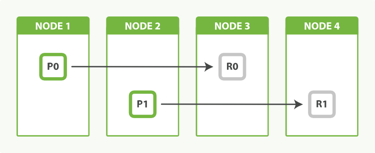

<!-- START doctoc generated TOC please keep comment here to allow auto update -->
<!-- DON'T EDIT THIS SECTION, INSTEAD RE-RUN doctoc TO UPDATE -->
**Table of Contents**  *generated with [DocToc](https://github.com/thlorenz/doctoc)*

- [扩容的单元](#%E6%89%A9%E5%AE%B9%E7%9A%84%E5%8D%95%E5%85%83)
- [分片预分配](#%E5%88%86%E7%89%87%E9%A2%84%E5%88%86%E9%85%8D)
- [海量分片](#%E6%B5%B7%E9%87%8F%E5%88%86%E7%89%87)
- [容量规划](#%E5%AE%B9%E9%87%8F%E8%A7%84%E5%88%92)
- [副本分片](#%E5%89%AF%E6%9C%AC%E5%88%86%E7%89%87)
  - [通过副本进行负载均衡](#%E9%80%9A%E8%BF%87%E5%89%AF%E6%9C%AC%E8%BF%9B%E8%A1%8C%E8%B4%9F%E8%BD%BD%E5%9D%87%E8%A1%A1)
- [多索引](#%E5%A4%9A%E7%B4%A2%E5%BC%95)
- [基于时间的数据](#%E5%9F%BA%E4%BA%8E%E6%97%B6%E9%97%B4%E7%9A%84%E6%95%B0%E6%8D%AE)
  - [按时间范围索引](#%E6%8C%89%E6%97%B6%E9%97%B4%E8%8C%83%E5%9B%B4%E7%B4%A2%E5%BC%95)
- [索引模板](#%E7%B4%A2%E5%BC%95%E6%A8%A1%E6%9D%BF)
- [数据过期](#%E6%95%B0%E6%8D%AE%E8%BF%87%E6%9C%9F)
  - [迁移旧数据](#%E8%BF%81%E7%A7%BB%E6%97%A7%E6%95%B0%E6%8D%AE)
  - [索引优化](#%E7%B4%A2%E5%BC%95%E4%BC%98%E5%8C%96)
  - [关闭旧索引](#%E5%85%B3%E9%97%AD%E6%97%A7%E7%B4%A2%E5%BC%95)
    - [归档旧索引](#%E5%BD%92%E6%A1%A3%E6%97%A7%E7%B4%A2%E5%BC%95)
- [基于用户的数据](#%E5%9F%BA%E4%BA%8E%E7%94%A8%E6%88%B7%E7%9A%84%E6%95%B0%E6%8D%AE)
- [利用别名实现一个用户一个索引](#%E5%88%A9%E7%94%A8%E5%88%AB%E5%90%8D%E5%AE%9E%E7%8E%B0%E4%B8%80%E4%B8%AA%E7%94%A8%E6%88%B7%E4%B8%80%E4%B8%AA%E7%B4%A2%E5%BC%95)
- [一个大的用户](#%E4%B8%80%E4%B8%AA%E5%A4%A7%E7%9A%84%E7%94%A8%E6%88%B7)
- [扩容不是无限的](#%E6%89%A9%E5%AE%B9%E4%B8%8D%E6%98%AF%E6%97%A0%E9%99%90%E7%9A%84)
- [导航](#%E5%AF%BC%E8%88%AA)

<!-- END doctoc generated TOC please keep comment here to allow auto update -->

# 扩容的单元

一个分片即一个 *Lucene 索引* ，一个 Elasticsearch 索引即一系列分片的集合。 你的应用程序与索引进行交互，Elasticsearch 帮助你将请求路由至相应的分片。

一个分片即为 *扩容的单元* 。 一个最小的索引拥有一个分片。 这可能已经完全满足你的需求了 — 单个分片即可存储大量的数据 — 但这限制了你的可扩展性。

```
PUT /my_index
{
  "settings": {
    "number_of_shards":   1, 
    "number_of_replicas": 0
  }
}
```


我们当前的选择只有一个就是将数据重新索引至一个拥有更多分片的一个更大的索引，但这样做将消耗的时间是我们无法提供的。 通过事先规划，我们可以使用 *预分配* 的方式来完全避免这个问题

# 分片预分配

一个分片存在于单个节点， 但一个节点可以持有多个分片。想象一下我们创建拥有两个主分片的索引而不是一个：

```
PUT /my_index
{
  "settings": {
    "number_of_shards":   2, 
    "number_of_replicas": 0
  }
}
```


在 Elasticsearch 中新添加的索引默认被指定了五个主分片。 这意味着我们最多可以将那个索引分散到五个节点上，每个节点一个分片。 它具有很高的处理能力，还未等你去思考这一切就已经做到了！

>  Elasticsearch 不支持 *分片分裂（shard-splitting）*— 将每个分片分裂为两个或更多部分的能力。 原因就是分片分裂是一个糟糕的想法：
>
> - 分裂一个分片几乎等于重新索引你的数据。它是一个比仅仅将分片从一个节点复制到另一个节点更重量级的操作。
> - 分裂是指数的。起初你你有一个分片，然后分裂为两个，然后四个，八个，十六个，等等。分裂并不会刚好地把你的处理能力提升 50%。
> - 分片分裂需要你拥有足够的能力支撑另一份索引的拷贝。通常来说，当你意识到你需要横向扩展时，你已经没有足够的剩余空间来做分裂了。
>
> Elasticsearch 通过另一种方式来支持分片分裂。你总是可以把你的数据重新索引至一个拥有适当分片个数的新索引（参阅 [重新索引你的数据](http://elasticsearch.cn/book/elasticsearch_definitive_guide_2.x/reindex.html)）。 和移动分片比起来这依然是一个更加密集的操作，依然需要足够的剩余空间来完成，但至少你可以控制新索引的分片个数了。

# 海量分片

一个分片并不是没有代价的。记住：

- 一个分片的底层即为一个 Lucene 索引，会消耗一定文件句柄、内存、以及 CPU 运转。
- 每一个搜索请求都需要命中索引中的每一个分片，如果每一个分片都处于不同的节点还好， 但如果多个分片都需要在同一个节点上竞争使用相同的资源就有些糟糕了。
- 用于计算相关度的词项统计信息是基于分片的。如果有许多分片，每一个都只有很少的数据会导致很低的相关度。

# 容量规划

如果一个分片太少而 1000 个又太多，那么我怎么知道我需要多少分片呢？ 一般情况下这是一个无法回答的问题。因为实在有太多相关的因素了：你使用的硬件、文档的大小和复杂度、文档的索引分析方式、运行的查询类型、执行的聚合以及你的数据模型等等。

在特定场景下这是一个容易回答的问题，尤其是你自己的场景：

1. 基于你准备用于生产环境的硬件创建一个拥有单个节点的集群。
2. 创建一个和你准备用于生产环境相同配置和分析器的索引，但让它只有一个主分片无副本分片。
3. 索引实际的文档（或者尽可能接近实际）。
4. 运行实际的查询和聚合（或者尽可能接近实际）。

基本来说，你需要复制真实环境的使用方式并将它们全部压缩到单个分片上直到它『挂掉』。 实际上 *挂掉* 的定义也取决于你：一些用户需要所有响应在 50 毫秒内返回；另一些则乐于等上 5 秒钟。

一旦你定义好了单个分片的容量，很容易就可以推算出整个索引的分片数。 用你需要索引的数据总数加上一部分预期的增长，除以单个分片的容量，结果就是你需要的主分片个数。

# 副本分片

副本分片的主要目的就是为了故障转移，如果持有主分片的节点挂掉了，一个副本分片就会晋升为主分片的角色。

在索引写入时，副本分片做着与主分片相同的工作。新文档首先被索引进主分片然后再同步到其它所有的副本分片。增加副本数并不会增加索引容量。

无论如何，副本分片可以服务于读请求，如果你的索引也如常见的那样是偏向查询使用的，那你可以通过增加副本的数目来提升查询性能，但也要为此 _增加额外的硬件资源_。

```
PUT /my_index/_settings
{
  "number_of_replicas": 1
}
```



## 通过副本进行负载均衡

搜索性能取决于最慢的节点的响应时间，所以尝试均衡所有节点的负载是一个好想法。

# 多索引

 当我们发起一个搜索请求时，它被转发至索引中每个分片的一份拷贝（一个主分片或一个副本分片），如果我们向多个索引发出同样的请求，会发生完全相同的事情——只不过会涉及更多的分片。

> 搜索 1 个有着 50 个分片的索引与搜索 50 个每个都有 1 个分片的索引完全等价：搜索请求均命中 50 个分片。

通过一点预先计划，添加一个新索引可以通过一种完全透明的方式完成：**别名切换**。

```
PUT /tweets_1/_alias/tweets_search 
PUT /tweets_1/_alias/tweets_index
```

当我们需要额外容量时，我们可以创建一个名为 `tweets_2` 的索引，并且像这样更新别名：

```
POST /_aliases
{
  "actions": [
    { "add":    { "index": "tweets_2", "alias": "tweets_search" }}, 
    { "remove": { "index": "tweets_1", "alias": "tweets_index"  }}, 
    { "add":    { "index": "tweets_2", "alias": "tweets_index"  }}  
  ]
}
```

# 基于时间的数据

## 按时间范围索引

使用 [`scroll`](http://elasticsearch.cn/book/elasticsearch_definitive_guide_2.x/scroll.html) 查询和批量删除来删除旧的事件。但这种方法 *非常低效* 。当你删除一个文档，它只会被 *标记* 为被删除（参见 [删除和更新](http://elasticsearch.cn/book/elasticsearch_definitive_guide_2.x/dynamic-indices.html#deletes-and-updates)）。 在包含它的段被合并之前不会被物理删除。

替代方案是，我们使用一个 *时间范围索引* 。一个按年的索引 (`logs_2014`) 或按月的索引 (`logs_2014-10`) 。 也许当你的网页变得十分繁忙时，你需要切换到一个按天的索引 (`logs_2014-10-24`) 。删除旧数据十分简单：只需要删除旧的索引。

别名可以帮助我们更加透明地在索引间切换。 当创建索引时，你可以将 `logs_current` 指向当前索引来接收新的日志事件， 当检索时，更新 `last_3_months` 来指向所有最近三个月的索引：

```
POST /_aliases
{
  "actions": [
    { "add":    { "alias": "logs_current",  "index": "logs_2014-10" }}, 
    { "remove": { "alias": "logs_current",  "index": "logs_2014-09" }}, 
    { "add":    { "alias": "last_3_months", "index": "logs_2014-10" }}, 
    { "remove": { "alias": "last_3_months", "index": "logs_2014-07" }}  
  ]
}
```

# 索引模板

Elasticsearch 不要求你在使用一个索引前创建它。 对于日志记录类应用，依赖于自动创建索引比手动创建要更加方便。

索引模板可以用于控制何种设置（settings）应当被应用于新创建的索引：

```
PUT /_template/my_logs 
{
  "template": "logstash-*", 
  "order":    1, 
  "settings": {
    "number_of_shards": 1 
  },
  "mappings": {
    "_default_": { 
      "_all": {
        "enabled": false
      }
    }
  },
  "aliases": {
    "last_3_months": {} 
  }
}
```

这个模板指定了所有名字以 `logstash-` 为起始的索引的默认设置，不论它是手动还是自动创建的。

# 数据过期

按时间范围索引带来的一个好处是可以方便地删除旧数据：只需要删除那些变得不重要的索引就可以了。

```
DELETE /logs_2013*
```

删除整个索引比删除单个文档要更加高效：Elasticsearch 只需要删除整个文件夹。

## 迁移旧数据

Elasticsearch 是如何得知哪台是你最好的服务器呢？你可以通过给每台服务器指定任意的标签来告诉它。 例如，你可以像这样启动一个节点：

```
./bin/elasticsearch --node.box_type strong
```

`box_type` 参数是完全随意的——你可以将它随意命名只要你喜欢——但你可以用这些任意的值来告诉 Elasticsearch 将一个索引分配至何处。

我们可以通过按以下配置创建今日的索引来确保它被分配到我们最好的服务器上：

```
PUT /logs_2014-10-01
{
  "settings": {
    "index.routing.allocation.include.box_type" : "strong"
  }
}
```

## 索引优化

昨日的索引不大可能会改变。 日志事件是静态的：已经发生的过往不会再改变了。如果我们将每个分片合并至一个段（Segment），它会占用更少的资源更快地响应查询。

对还分配在 `strong` 主机上的索引进行优化（Optimize）操作将会是一个糟糕的想法， 因为优化操作将消耗节点上大量 I/O 并对索引今日日志造成冲击。但是 `medium` 的节点没有做太多类似的工作，我们可以安全地在上面进行优化。

昨日的索引有可能拥有副本分片。 如果我们下发一个优化（Optimize）请求， 它会优化主分片和副本分片，这有些浪费。然而，我们可以临时移除副本分片，进行优化，然后再恢复副本分片：

```
POST /logs_2014-09-30/_settings
{ "number_of_replicas": 0 }

POST /logs_2014-09-30/_optimize?max_num_segments=1

POST /logs_2014-09-30/_settings
{ "number_of_replicas": 1 }
```

当然，没有副本我们将面临磁盘故障而导致丢失数据的风险。你可能想要先通过[`snapshot-restore` API](https://www.elastic.co/guide/en/elasticsearch/reference/master/modules-snapshots.html)备份数据。

## 关闭旧索引

这些索引可以被关闭。它们还会存在于集群中，但它们不会消耗磁盘空间以外的资源。重新打开一个索引要比从备份中恢复快得多。

在关闭之前，值得我们去刷写索引来确保没有事务残留在事务日志中。一个空白的事务日志会使得索引在重新打开时恢复得更快：

```
POST /logs_2014-01-*/_flush 
POST /logs_2014-01-*/_close 
POST /logs_2014-01-*/_open
```

### 归档旧索引

最后，非常旧的索引 可以通过[`snapshot-restore` API](https://www.elastic.co/guide/en/elasticsearch/reference/master/modules-snapshots.html)归档至长期存储例如共享磁盘或者 Amazon S3，以防日后你可能需要访问它们。 当存在备份时我们就可以将索引从集群中删除了。

# 基于用户的数据

Elasticsearch 支持[多租户](http://en.wikipedia.org/wiki/Multitenancy)所以每个用户可以在相同的集群中拥有自己的索引。 

为每一个查询或者索引请求指定 `routing` 和 `terms`，可以实现共享索引。

# 利用别名实现一个用户一个索引

索引别名可以帮你做到这些。当你将一个别名与一个索引关联起来，你可以指定一个过滤器和一个路由值：

```
PUT /forums/_alias/baking
{
  "routing": "baking",
  "filter": {
    "term": {
      "forum_id": "baking"
    }
  }
}
```

现在我们可以将 `baking` 别名视为一个单独的索引。索引至 `baking` 别名的文档会自动地应用我们自定义的路由值：

```
PUT /baking/post/1 
{
  "forum_id": "baking", 
  "title":    "Easy recipe for ginger nuts",
  ...
}
```

# 一个大的用户

一个用户一个索引的索引别名给了我们一个简洁的迁移论坛方式。

第一步就是为那个论坛创建一个新的索引，并为其分配合理的分片数，可以满足一定预期的数据增长：

```
PUT /baking_v1
{
  "settings": {
    "number_of_shards": 3
  }
}
```

第二步就是将共享的索引中的数据迁移到专用的索引中，可以通过[`scroll`](http://elasticsearch.cn/book/elasticsearch_definitive_guide_2.x/scroll.html)查询和[`bulk` API](http://elasticsearch.cn/book/elasticsearch_definitive_guide_2.x/bulk.html)来实现。 当迁移完成时，可以更新索引别名指向那个新的索引：

```
POST /_aliases
{
  "actions": [
    { "remove": { "alias": "baking", "index": "forums"    }},
    { "add":    { "alias": "baking", "index": "baking_v1" }}
  ]
}
```

更新索引别名的操作是原子性的。你的应用程序还是在与 `baking` API 交互并且对于它已经指向一个专用的索引毫无感知。

专用的索引不再需要过滤器或者自定义的路由值了。我们可以依赖于 Elasticsearch 默认使用的 `_id` 字段来做分区。

最后一步是从共享的索引中删除旧的文档，可以通过搜索之前的路由值以及论坛 ID 然后进行批量删除操作来实现。

一个用户一个索引模型的优雅之处在于它允许你减少资源消耗，保持快速的响应时间，同时拥有在需要时零宕机时间扩容的能力。

# 扩容不是无限的

*集群状态* 是一种数据结构，贮存下列集群级别的信息：

- 集群级别的设置
- 集群中的节点
- 索引以及它们的设置、映射、分析器、预热器（Warmers）和别名
- 与每个索引关联的分片以及它们分配到的节点

你可以通过如下请求查看当前的集群状态：

```
GET /_cluster/state
```

集群状态存在于集群中的每个节点， 包括客户端节点。 这就是为什么任何一个节点都可以将请求直接转发至被请求数据的节点——每个节点都知道每个文档应该在哪里。

只有主节点被允许更新集群状态。

相同的数据结构需要在每个节点的内存中保存，并且当它发生更改时必须发布到每一个节点。 集群状态的数据量越大，这个操作就会越久。

最常见的集群状态问题就是引入了太多的字段，更好的方式是使用 [nested objects](http://elasticsearch.cn/book/elasticsearch_definitive_guide_2.x/nested-objects.html)。


# 导航

[目录](README.md)

上一章：[42、父子关系文档](42、父子关系文档.md)

下一章：[44、监控](44、监控.md)
