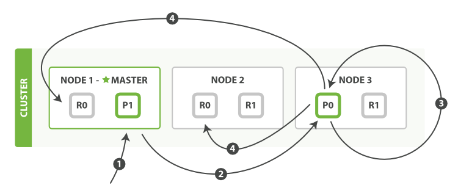
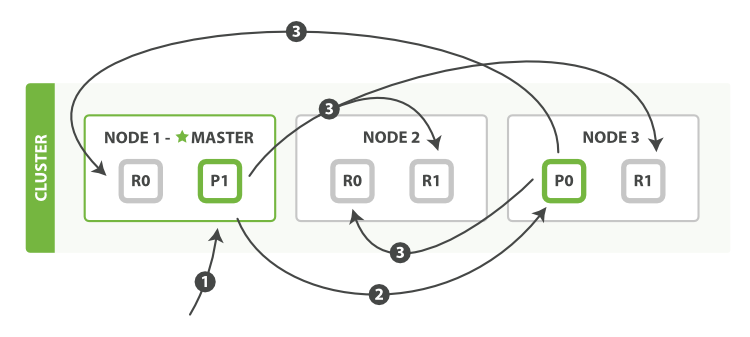

<!-- START doctoc generated TOC please keep comment here to allow auto update -->
<!-- DON'T EDIT THIS SECTION, INSTEAD RE-RUN doctoc TO UPDATE -->
**Table of Contents**  *generated with [DocToc](https://github.com/thlorenz/doctoc)*

- [路由一个文档到一个分片中](#%E8%B7%AF%E7%94%B1%E4%B8%80%E4%B8%AA%E6%96%87%E6%A1%A3%E5%88%B0%E4%B8%80%E4%B8%AA%E5%88%86%E7%89%87%E4%B8%AD)
- [主分片和副本分片如何交互](#%E4%B8%BB%E5%88%86%E7%89%87%E5%92%8C%E5%89%AF%E6%9C%AC%E5%88%86%E7%89%87%E5%A6%82%E4%BD%95%E4%BA%A4%E4%BA%92)
- [新建、索引和删除文档](#%E6%96%B0%E5%BB%BA%E7%B4%A2%E5%BC%95%E5%92%8C%E5%88%A0%E9%99%A4%E6%96%87%E6%A1%A3)
- [取回一个文档](#%E5%8F%96%E5%9B%9E%E4%B8%80%E4%B8%AA%E6%96%87%E6%A1%A3)
- [局部更新文档](#%E5%B1%80%E9%83%A8%E6%9B%B4%E6%96%B0%E6%96%87%E6%A1%A3)
- [多文档模式](#%E5%A4%9A%E6%96%87%E6%A1%A3%E6%A8%A1%E5%BC%8F)
- [导航](#%E5%AF%BC%E8%88%AA)

<!-- END doctoc generated TOC please keep comment here to allow auto update -->

# 路由一个文档到一个分片中

当索引一个文档的时候，文档会被存储到一个主分片中。 Elasticsearch 如何知道一个文档应该存放到哪个分片中呢？这个过程是根据下面这个公式决定的：

```
shard = hash(routing) % number_of_primary_shards
```

`routing` 是一个可变值，默认是文档的 `_id` ，也可以设置成一个自定义的值。

这就解释了为什么我们要在创建索引的时候就确定好主分片的数量 并且永远不会改变这个数量：因为如果数量变化了，那么所有之前路由的值都会无效，文档也再也找不到了。

所有的文档 API（ `get` 、 `index` 、 `delete` 、 `bulk` 、 `update` 以及 `mget` ）都接受一个叫做 `routing`的路由参数 ，通过这个参数我们可以自定义文档到分片的映射。一个自定义的路由参数可以用来确保所有相关的文档——例如所有属于同一个用户的文档——都被存储到同一个分片中。

# 主分片和副本分片如何交互

有三个节点和一个索引的集群：


我们可以发送请求到集群中的任一节点。 每个节点都有能力处理任意请求。 每个节点都知道集群中任一文档位置，所以可以直接将请求转发到需要的节点上。 

# 新建、索引和删除文档

新建、索引和删除 请求都是 *写* 操作， 必须在主分片上面完成之后才能被复制到相关的副本分片：

1. 客户端向 `Node 1` 发送新建、索引或者删除请求。
2. 节点使用文档的 `_id` 确定文档属于分片 `0`。请求会被转发到 `Node 3`，因为分片 0 的主分片目前被分配在 `Node 3` 上。
3. `Node 3` 在主分片上面执行请求。如果成功了，它将请求并行转发到 `Node 1` 和 `Node 2` 的副本分片上。一旦所有的副本分片都报告成功, `Node 3` 将向协调节点报告成功，协调节点向客户端报告成功。


有一些可选的请求参数允许您影响这个过程，可能以数据安全为代价提升性能。

- 一致性。

  默认情况下，主分片 需要 *规定数量(quorum)*,或大多数的分片 (其中分片副本可以是主分片或者副本分片)在写入操作时可用。这是为了防止将数据写入到网络分区的“背面”。规定的数量定义公式如下：

  ```
  int( (primary + number_of_replicas) / 2 ) + 1
  ```

  允许的 `一致性` 值是 `一个` （只是主分片）或者 `所有`（主分片和副本分片）, 或者默认的规定数量或者大多数的副本分片。

- 超时。

  如果没有足够的副本分片，Elasticsearch会等待，希望更多的分片出现。默认情况下，它最多等待1分钟。 如果你需要，你可以使用 `timeout` 参数 使它更早终止

> 新索引默认有 `1` 个副本分片，这意味着为满足 `规定数量` *应该* 需要两个活动的分片副本。 但是，这些默认的设置会阻止我们在单一节点上做任何事情。为了避免这个问题，要求只有当 `number_of_replicas` 大于1的时候，规定数量才会执行

# 取回一个文档

可以从主分片或者从其它任意副本分片检索检索文档 ，

1. 客户端向 `Node 1` 发送获取请求。
2. 节点使用文档的 `_id` 来确定文档属于分片 `0` 。分片 `0` 的副本分片存在于所有的三个节点上。 在这种情况下，它将请求转发到 `Node 2` 。
3. `Node 2` 将文档返回给 `Node 1` ，然后将文档返回给客户端。


为了读取请求，协调节点在每次请求的时候将选择不同的副本分片来达到负载均衡；通过轮询所有的副本分片。

# 局部更新文档



以下是部分更新一个文档的步骤：

1. 客户端向 `Node 1` 发送更新请求。
2. 它将请求转发到主分片所在的 `Node 3` 。
3. `Node 3` 从主分片检索文档，修改 `_source` 字段中的 JSON ，并且尝试重新索引主分片的文档。 如果文档已经被另一个进程修改，它会重试步骤 3 ，超过 `retry_on_conflict` 次后放弃。
4. 如果 `Node 3` 成功地更新文档，它将新版本的文档并行转发到 `Node 1` 和 `Node 2` 上的副本分片，重新建立索引。 一旦所有副本分片都返回成功， `Node 3` 向协调节点也返回成功，协调节点向客户端返回成功。

`update` API 还接受 `routing` 、 `replication` 、 `consistency`和 `timeout` 参数。

> 当主分片把更改转发到副本分片时， 它不会转发更新请求。 相反，它转发完整文档的新版本。请记住，这些更改将会异步转发到副本分片，并且不能保证它们以发送它们相同的顺序到达。 如果Elasticsearch仅转发更改请求，则可能以错误的顺序应用更改，导致得到损坏的文档。

# 多文档模式

`mget` 和 `bulk` API 的 模式类似于单文档模式。区别在于协调节点知道每个文档存在于哪个分片中。 它将整个多文档请求分解成 *每个分片* 的多文档请求，并且将这些请求并行转发到每个参与节点。

协调节点一旦收到来自每个节点的应答，就将每个节点的响应收集整理成单个响应，返回给客户端，如使用 `mget` 取回多个文档：

1. 客户端向 `Node 1` 发送 `mget` 请求。
2. `Node 1` 为每个分片构建多文档获取请求，然后并行转发这些请求到托管在每个所需的主分片或者副本分片的节点上。一旦收到所有答复， `Node 1` 构建响应并将其返回给客户端。


bulk API，允许在单个批量请求中执行多个创建、索引、删除和更新请求：

1. 客户端向 `Node 1` 发送 `bulk` 请求。
2. `Node 1` 为每个节点创建一个批量请求，并将这些请求并行转发到每个包含主分片的节点主机。
3. 主分片一个接一个按顺序执行每个操作。当每个操作成功时，主分片并行转发新文档（或删除）到副本分片，然后执行下一个操作。 一旦所有的副本分片报告所有操作成功，该节点将向协调节点报告成功，协调节点将这些响应收集整理并返回给客户端。




# 导航

[目录](README.md)

上一章：[3、数据输入和输出](3、数据输入和输出.md)

下一章：[5、搜索--最基本的工具](5、搜索--最基本的工具.md)
