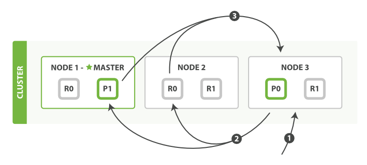

<!-- START doctoc generated TOC please keep comment here to allow auto update -->
<!-- DON'T EDIT THIS SECTION, INSTEAD RE-RUN doctoc TO UPDATE -->
**Table of Contents**  *generated with [DocToc](https://github.com/thlorenz/doctoc)*

- [查询阶段](#%E6%9F%A5%E8%AF%A2%E9%98%B6%E6%AE%B5)
- [取回阶段](#%E5%8F%96%E5%9B%9E%E9%98%B6%E6%AE%B5)
- [搜索选项](#%E6%90%9C%E7%B4%A2%E9%80%89%E9%A1%B9)
  - [偏好](#%E5%81%8F%E5%A5%BD)
  - [超时问题](#%E8%B6%85%E6%97%B6%E9%97%AE%E9%A2%98)
  - [路由](#%E8%B7%AF%E7%94%B1)
  - [搜索类型](#%E6%90%9C%E7%B4%A2%E7%B1%BB%E5%9E%8B)
- [游标查询](#%E6%B8%B8%E6%A0%87%E6%9F%A5%E8%AF%A2)
- [导航](#%E5%AF%BC%E8%88%AA)

<!-- END doctoc generated TOC please keep comment here to allow auto update -->

一个 CRUD 操作只对单个文档进行处理，文档的唯一性由 `_index`, `_type`, 和 [`routing` values](http://elasticsearch.cn/book/elasticsearch_definitive_guide_2.x/routing-value.html) （通常默认是该文档的 `_id` ）的组合来确定。 这表示我们确切的知道集群中哪个分片含有此文档。

搜索需要一种更加复杂的执行模型因为我们不知道查询会命中哪些文档: 这些文档有可能在集群的任何分片上。 一个搜索请求必须询问我们关注的索引（index or indices）的所有分片的某个副本来确定它们是否含有任何匹配的文档。

但是找到所有的匹配文档仅仅完成事情的一半。 在 `search` 接口返回一个 ``page`` 结果之前，多分片中的结果必须组合成单个排序列表。 为此，搜索被执行成一个两阶段过程，我们称之为 *query then fetch* 。


# 查询阶段

在初始 *查询阶段* 时， 查询会广播到索引中每一个分片拷贝（主分片或者副本分片）。 每个分片在本地执行搜索并构建一个匹配文档的 _优先队列_。

> 一个 *优先队列* 仅仅是一个存有 *top-n* 匹配文档的有序列表。优先队列的大小取决于分页参数 `from` 和 `size` 



查询阶段包含以下三个步骤:

1. 客户端发送一个 `search` 请求到 `Node 3` ， `Node 3` 会创建一个大小为 `from + size` 的空优先队列。
2. `Node 3` 将查询请求转发到索引的每个主分片或副本分片中。每个分片在本地执行查询并添加结果到大小为 `from + size` 的本地有序优先队列中。
3. 每个分片返回各自优先队列中所有文档的 ID 和排序值给协调节点，也就是 `Node 3` ，它合并这些值到自己的优先队列中来产生一个全局排序后的结果列表。

当一个搜索请求被发送到某个节点时，这个节点就变成了协调节点。 这个节点的任务是广播查询请求到所有相关分片并将它们的响应整合成全局排序后的结果集合，这个结果集合会返回给客户端。


# 取回阶段


分布式取回阶段由以下步骤构成：

1. 协调节点辨别出哪些文档需要被取回并向相关的分片提交多个 `GET` 请求。
2. 每个分片加载并 *丰富* 文档，如果有需要的话，接着返回文档给协调节点。
3. 一旦所有的文档都被取回了，协调节点返回结果给客户端。

协调节点给持有相关文档的每个分片创建一个 [multi-get request](http://elasticsearch.cn/book/elasticsearch_definitive_guide_2.x/distrib-multi-doc.html) ，并发送请求给同样处理查询阶段的分片副本。

分片加载文档体-- `_source` 字段--如果有需要，用元数据和 [search snippet highlighting](http://elasticsearch.cn/book/elasticsearch_definitive_guide_2.x/highlighting-intro.html) 丰富结果文档。 一旦协调节点接收到所有的结果文档，它就组装这些结果为单个响应返回给客户端。


# 搜索选项

几个 查询参数可以影响搜索过程。

## 偏好

偏好这个参数 `preference` 允许 用来控制由哪些分片或节点来处理搜索请求。 它接受像 `_primary`,`_primary_first`, `_local`, `_only_node:xyz`, `_prefer_node:xyz`, 和 `_shards:2,3` 这样的值。

但是最有用的值是某些随机字符串，它可以避免 *bouncing results* 问题。

> **Bouncing Results**
>
> 想象一下有两个文档有同样值的时间戳字段，搜索结果用 `timestamp` 字段来排序。 由于搜索请求是在所有有效的分片副本间轮询的，那就有可能发生主分片处理请求时，这两个文档是一种顺序， 而副本分片处理请求时又是另一种顺序。
>
> 这就是所谓的 *bouncing results* 问题: 每次用户刷新页面，搜索结果表现是不同的顺序。 让同一个用户始终使用同一个分片，这样可以避免这种问题， 可以设置 `preference` 参数为一个特定的任意值比如用户会话ID来解决。

## 超时问题

通常分片处理完它所有的数据后再把结果返回给协同节点，协同节点把收到的所有结果合并为最终结果。

这意味着花费的时间是最慢分片的处理时间加结果合并的时间。如果有一个节点有问题，就会导致所有的响应缓慢。

参数 `timeout` 告诉 分片允许处理数据的最大时间。如果没有足够的时间处理所有数据，这个分片的结果可以是部分的，甚至是空数据。

搜索的返回结果会用属性 `timed_out` 标明分片是否返回的是部分结果。

超时仍然是一个最有效的操作，知道这一点很重要； 很可能查询会超过设定的超时时间。这种行为有两个原因：

1. 超时检查是基于每文档做的。 但是某些查询类型有大量的工作在文档评估之前需要完成。 这种 "setup" 阶段并不考虑超时设置，所以太长的建立时间会导致超过超时时间的整体延迟。
2. 因为时间检查是基于每个文档的，一次长时间查询在单个文档上执行并且在下个文档被评估之前不会超时。 这也意味着差的脚本（比如带无限循环的脚本）将会永远执行下去。

## 路由

 在搜索的时候，不用搜索索引的所有分片，而是通过指定几个 `routing` 值来限定只搜索几个相关的分片：

```
GET /_search?routing=user_1,user2
```

这个技术在设计大规模搜索系统时就会派上用场。

## 搜索类型

缺省的搜索类型是 `query_then_fetch` 。 在某些情况下，你可能想明确设置 `search_type` 为 `dfs_query_then_fetch` 来改善相关性精确度：

```
GET /_search?search_type=dfs_query_then_fetch
```

搜索类型 `dfs_query_then_fetch` 有预查询阶段，这个阶段可以从所有相关分片获取词频来计算全局词频。 


# 游标查询

`scroll` 查询 可以用来对 Elasticsearch 有效地执行大批量的文档查询，而又不用付出深度分页那种代价。

游标查询允许我们 先做查询初始化，然后再批量地拉取结果。 这有点儿像传统数据库中的 *cursor* 。

游标查询会取某个时间点的快照数据。 查询初始化之后索引上的任何变化会被它忽略。 它通过保存旧的数据文件来实现这个特性，结果就像保留初始化时的索引 *视图* 一样。

深度分页的代价根源是结果集全局排序，如果去掉全局排序的特性的话查询结果的成本就会很低。 游标查询用字段 `_doc` 来排序。 这个指令让 Elasticsearch 仅仅从还有结果的分片返回下一批结果。

启用游标查询可以通过在查询的时候设置参数 `scroll` 的值为我们期望的游标查询的过期时间。 游标查询的过期时间会在每次做查询的时候刷新，所以这个时间只需要足够处理当前批的结果就可以了，而不是处理查询结果的所有文档的所需时间。 这个过期时间的参数很重要，因为保持这个游标查询窗口需要消耗资源，所以我们期望如果不再需要维护这种资源就该早点儿释放掉。 设置这个超时能够让 Elasticsearch 在稍后空闲的时候自动释放这部分资源。

```
GET /old_index/_search?scroll=1m 
{
    "query": { "match_all": {}},
    "sort" : ["_doc"], 
    "size":  1000
}
```

这个查询的返回结果包括一个字段 `_scroll_id`， 它是一个base64编码的长字符串 ((("scroll_id"))) 。 现在我们能传递字段 `_scroll_id` 到 `_search/scroll` 查询接口获取下一批结果：

```
GET /_search/scroll
{
    "scroll": "1m", 
    "scroll_id" : "cXVlcnlUaGVuRmV0Y2g7NTsxMDk5NDpkUmpiR2FjOFNhNnlCM1ZDMWpWYnRROzEwOTk1OmRSamJHYWM4U2E2eUIzVkMxalZidFE7MTA5OTM6ZFJqYkdhYzhTYTZ5QjNWQzFqVmJ0UTsxMTE5MDpBVUtwN2lxc1FLZV8yRGVjWlI2QUVBOzEwOTk2OmRSamJHYWM4U2E2eUIzVkMxalZidFE7MDs="
}
```

# 导航

[目录](README.md)

上一章：[8、排序与相关性](8、排序与相关性.md)

下一章：[10、索引管理](10、索引管理.md)
