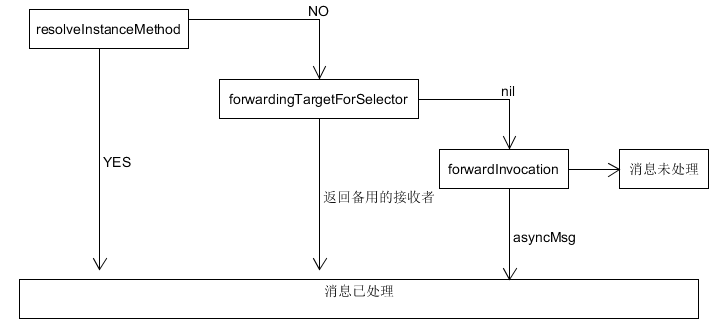

# 理解“属性”这一概念

1、ObjC中，把实例变量当做一种存储偏移量所有的“特殊变量”，交由类对象保管。偏移量会在运行期查找，如果类的定义变了，那么存储的偏移量也就变了。

2、使用[person name]与person.name没有丝毫区别

property合成方法的过程是在编译期完成的，还会生成两个实例变量，以下划线开头。也可以在实现代码中通过@synthesize来指定名字

阻止编译器自动合成存取方法，使用@dynamic。如果用代码访问其中的属性，也不会报错

# property的三种attribute

1、原子性

默认是atomic，nonatomic则不使用同步锁

2、读写权限

readwrite、readonly。前者有getter和setter，该属性由@synthesize实现，则编译器会自动合成两个方法。后者只有getter，只有当该属性由@synthesize实现时，编译器才会为其合成获取方法

3、内存管理语义

assign，纯量类型的赋值，CGFloat、NSInteger的简单赋值操作

strong，表明拥有关系，先保留新值，然后释放旧值，再将新值设上去

weak，非拥有关系，既不保留新值，也不释放旧值。但在属性所指的对象被摧毁时，属性值也会被清空

unsafe_unretained，与assign相同，但适用于“对象类型”，非拥有关系。但目标对象被摧毁时，属性值不会自动清空

copy，表达的属性关系与strong类似。然后设置方法并不保留新值，而是拷贝。常用于NSString*

# 在对象内部尽量直接访问实例变量

1、在对象内部，尽量直接访问实例变量，即_firstname。这样编译器生成的代码会直接找内存。在写入时，通过属性来写。这样防止NULL。否则会跳过“设置方法”，绕过了为相关属性所定义的“内存管理语义”

2、在初始化方法中及dealloc方法中，总之应该直接通过实例变量来读写数据

3、有时会使用惰性初始化技术配置某份数据，在这种情况下，需要通过属性来读取数据

==只比较两个指针本身，而不是其所指的对象。NSObject协议中有isEqual方法。另外还有hash函数

1、如果isEqual方法为YES，那么hash方法必须返回同一个值

2、如果hash方法返回同一个值，isEqual不见得相等

3、把某个对象放入容器之后，就不应该改变其哈希吗，否则会造成隐患

NSString有isEqualToString，NSArray有isEqualToArray，NSDictionary有isEqualToDictionary

若想判断某对象是否位于类族中，不要直接检测两个类对象是否等同，而应该

id maybeAnArray = /* ... */

if ([maybeAnArray isKindOfClass : [NSArray class]])

{

     // will be hit

}

ObjCk可以给对象关联很多其他对象（objc_setAssociatedObject,objc_getAssociatedObject），通过“键”来区分。只有当其他方法不可用时，才用本方法

# 消息传递

消息传递，都是使用objc_msgSend来实现

void objc_msgSend(id self, SEL cmd, ...)

消息派发系统

 

当对象接收到无法解读的消息后，就会触发“消息转发”机制。消息转发分为两个阶段：

1、征询接收者，能否动态添加方法，以处理这个“未知的selector”。这叫动态方法解析

resolveInstanceMethod, resolveClassMethod

使用这种方法的前提是，相关方法的实现代码已经写好，只能这运行的时候动态插入在类里面即可。

2、请求接收者以其他手段来处理与消息相关的方法调用，首先，请接收者看看有没有其他对象能处理这个消息，若有，转给它。forwardTargetForSelector（可以模拟多重继承）

若没有，把消息有关的细节全部封装到NSInvocation中，再给接收者最后一次机会，令其设法解决当前消息

在运行期，可以向类中添加或替换selector对应的方法实现

void method_exchangeImplementations(Method m1, Method m2)

Method class_getInstanceMethodClass(Class aClass, SEL aSelector)

每个实例都有一个指向Class 对象的指针

typedef struct objc_object

{

     Class isa'

} *id;

isMemberOfClass能够判断出对象是否为某个特定类的实例，isKindOfClass能够判断对象是否为某类或某派生类的实例

尽量使用类型信息查询方法来确定对象类型，而不要直接比较类对象，因为某些对象可能实现了消息转发机制
