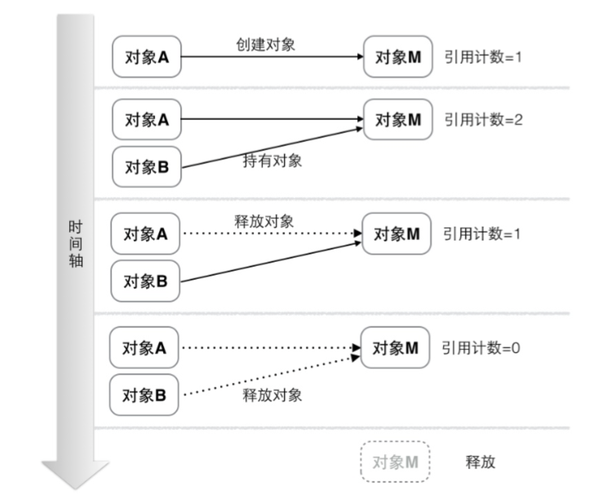
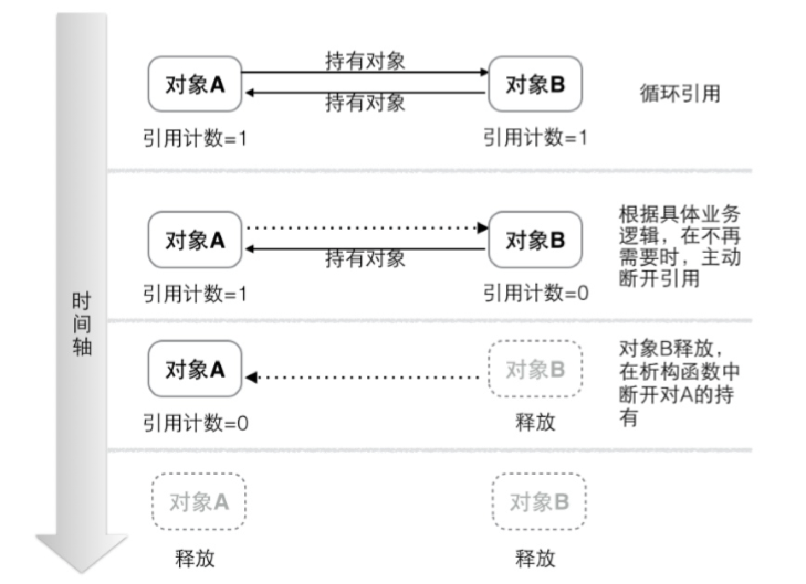

<!-- START doctoc generated TOC please keep comment here to allow auto update -->
<!-- DON'T EDIT THIS SECTION, INSTEAD RE-RUN doctoc TO UPDATE -->
**Table of Contents**  *generated with [DocToc](https://github.com/thlorenz/doctoc)*

- [内存管理](#%E5%86%85%E5%AD%98%E7%AE%A1%E7%90%86)
- [手动内存管理](#%E6%89%8B%E5%8A%A8%E5%86%85%E5%AD%98%E7%AE%A1%E7%90%86)
- [自动内存管理：ARC](#%E8%87%AA%E5%8A%A8%E5%86%85%E5%AD%98%E7%AE%A1%E7%90%86arc)
  - [循环引用问题](#%E5%BE%AA%E7%8E%AF%E5%BC%95%E7%94%A8%E9%97%AE%E9%A2%98)
- [调试内存问题](#%E8%B0%83%E8%AF%95%E5%86%85%E5%AD%98%E9%97%AE%E9%A2%98)

<!-- END doctoc generated TOC please keep comment here to allow auto update -->

# 内存管理

Objective-C的内存管理方式都是基于引用计数。每个对象都有一个引用计数（retainCount）表明这个对象还有几个引用。

当我们创建一个新对象的时候，它的引用计数为 0，当有一个新的指针指向这个对象时，我们将其引用计数加1，当某个指针不再指向这个对象时，我们将其引用计数减1，当对象的引用计数变为0时，说明这个对象不再被任何指针指向了，这个时候我们就可以将对象销毁，回收内存。




基于此，Objective-C中提供了两种内存管理机制：手动引用计数和 ARC(Automatic Reference Counting)。

# 手动内存管理

当你决定手动管理内存的时候，必须遵守以下准则：

1. 如果你用alloc/new/copy为前缀的方法创建了一个对象，你就负责销毁它
2. 当你不需要一个对象时，向其发送release或autorelease消息

你必须在合适的地方，显式调用如下函数：

| 对象操作    | 方法                         | 引用计数 |
| ------- | -------------------------- | ---- |
| 生成并持有对象 | alloc/new/copy/mutableCopy | +1   |
| 持有对象    | retain                     | +1   |
| 释放对象    | release                    | -1   |
| 废弃对象    | dealloc                    | -    |

特殊地，autorelease使得对象在超出生命周期后能正确的被释放（通过调用release方法）。在调用 release 后，对象会被立即释放，而调用 autorelease后，对象不会被立即释放，而是注册到 autoreleasepool中，经过一段时间后 pool结束，此时调用release方法，对象被释放。

PS. 我们向一个已经被回收的对象发了一个消息，所以它的输出结果应该是不确定的，如果该对象所占的内存被复用了，那么就有可能造成程序异常崩溃。

# 自动内存管理：ARC

ARC没有改变retainCount为0时回收对象的做法，只是编译的时候，在需要retain和release的地方，自动加上了retain和release。

为了能让编译器准确地加入retain和release等代码，ARC引入了几种对象的分类。例：

```objective-c
    [a setCount:n];
```

编译器需要在setCount里面加入

```objective-c
[newCount retain];
```

这样的代码么？要看情况: 

1. 如果我的意图是只要a没被销毁，n就不能被销毁，那么是需要加入retain的。 
2. 如果a对n是否被销毁无所谓，那么就不用了。

所以ARC下引入了几种*变量标识符*让程序员来区分上面的情况：

| 关键字                   | 作用                                       |
| --------------------- | ---------------------------------------- |
| \_\_strong            | 默认使用的标识符。只有还有一个强指针指向某个对象，这个对象就会一直存活。     |
| \_\_weak              | 声明这个引用不会保持被引用对象的存活，如果对象没有强引用了，弱引用会被置为 nil。 |
| \_\_unsafe_unretained | 声明这个引用不会保持被引用对象的存活，如果对象没有强引用了，它不会被置为 nil。如果它引用的对象被回收掉了，该指针就变成了野指针。 |
| \_\_autoreleasing     | 用于标示使用引用传值的参数（id *），在函数返回时会被自动释放掉。       |

如上面的#1为\_\_strong, 而#2的情况就有点复杂，可以是\_\_weak或者\_\_unsafe_unretained.

类中的属性也可以加上标志符：

```objective-c
@property (assign/retain/strong/weak/unsafe_unretained/copy) Number* num;
```

| 关键字               | 作用                                       | 使用场景                                     |
| ----------------- | ---------------------------------------- | ---------------------------------------- |
| assign            | 表明 setter 仅仅是一个简单的赋值操作，不改变引用计数。          | 基本的数值类型，如`CGFloat`和`NSInteger`。          |
| retain            | 释放旧的对象，将旧对象的值赋予输入对象，再提高输入对象的索引计数为1。      | 非字符串对象                                   |
| strong            | 表明属性定义一个拥有者关系。当给属性设定一个新值的时候，首先这个值进行 `retain` ，旧值进行 `release` ，然后进行赋值操作。 |                                          |
| weak              | 表明属性定义了一个非拥有者关系。当给属性设定一个新值的时候，这个值不会进行 `retain`，旧值也不会进行 `release`， 而是进行类似 `assign` 的操作。不过当属性指向的对象被销毁时，该属性会被置为nil。 |                                          |
| unsafe_unretained | 语义和 `assign` 类似，不过是用于对象类型的，表示一个非拥有(unretained)的，同时也不会在对象被销毁时置为nil的(unsafe)关系。 |                                          |
| copy              | 类似于 `strong`，不过在赋值时进行 `copy` 操作而不是 `retain` 操作。 | 在需要保留某个不可变对象，并且防止它被意外改变时使用。如NSString，NSArray，NSDictionary。 |


## 循环引用问题

解决循环引用问题主要有两个办法：

1. 明确知道这里会存在循环引用，在合理的位置主动断开环中的一个引用，使得对象得以回收。



2. 使用弱引用（weak reference）的办法。弱引用虽然持有对象，但是并不增加引用计数,这样就避免了循环引用的产生。在iOS开发中，弱引用通常在delegate模式中使用。


# 调试内存问题

启动僵尸对象

1、启用NSZombieEnabled后，运行期系统会把所有已经回收的实例转为特殊的”僵尸对象“，而不是回收它们。这些对象所在的核心内存无法重用，也就不可能覆写。僵尸对象收到消息后，会抛出异常，其中准确说明了发送来的消息，并描述了回收前的对象。

2、系统会修改对象的isa指针，令其指向特殊的僵尸类。僵尸类能够响应所有的selector，打印消息

绝对不要用retainCount方法，它不能反映对象生命期的全貌。

