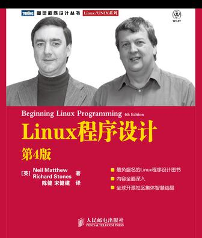

<!-- START doctoc generated TOC please keep comment here to allow auto update -->
<!-- DON'T EDIT THIS SECTION, INSTEAD RE-RUN doctoc TO UPDATE -->
**Table of Contents**  *generated with [DocToc](https://github.com/thlorenz/doctoc)*

- [目录](#%E7%9B%AE%E5%BD%95)

<!-- END doctoc generated TOC please keep comment here to allow auto update -->

[《Linux程序设计》](https://book.douban.com/subject/4831448/) 读书笔记。

# 目录

[1. 入门](入门.md)

[2. shell程序设计](shell程序设计.md)

[3. 文件操作](文件操作.md)

[4. Linux环境](Linux环境.md)

[5. 终端](终端.md)

[6. curses函数库](curses函数库.md)

[7. 数据管理](数据管理.md)

[8. MySQL](MySQL.md)

[9. 开发工具](开发工具.md)

[10. 调试](调试.md)

[11. 进程和信号](进程和信号.md)

[12. POSIX线程](POSIX线程.md)

[13. 进程间通信：管道](进程间通信：管道.md)

[14. 信号量、共享内存和消息队列](信号量、共享内存和消息队列.md)

[15. 套接字](套接字.md)
