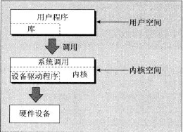

<!-- START doctoc generated TOC please keep comment here to allow auto update -->
<!-- DON'T EDIT THIS SECTION, INSTEAD RE-RUN doctoc TO UPDATE -->
**Table of Contents**  *generated with [DocToc](https://github.com/thlorenz/doctoc)*

- [3.1 目录](#31-%E7%9B%AE%E5%BD%95)
- [3.2 系统调用和设备驱动程序](#32-%E7%B3%BB%E7%BB%9F%E8%B0%83%E7%94%A8%E5%92%8C%E8%AE%BE%E5%A4%87%E9%A9%B1%E5%8A%A8%E7%A8%8B%E5%BA%8F)
- [3.3 库函数](#33-%E5%BA%93%E5%87%BD%E6%95%B0)
- [3.4 底层文件访问](#34-%E5%BA%95%E5%B1%82%E6%96%87%E4%BB%B6%E8%AE%BF%E9%97%AE)
- [3.5 标准IO库](#35-%E6%A0%87%E5%87%86io%E5%BA%93)
- [3.6 格式化输入和输出](#36-%E6%A0%BC%E5%BC%8F%E5%8C%96%E8%BE%93%E5%85%A5%E5%92%8C%E8%BE%93%E5%87%BA)
- [3.7 文件和目录的维护](#37-%E6%96%87%E4%BB%B6%E5%92%8C%E7%9B%AE%E5%BD%95%E7%9A%84%E7%BB%B4%E6%8A%A4)
- [3.8 扫描目录](#38-%E6%89%AB%E6%8F%8F%E7%9B%AE%E5%BD%95)
- [3.9 错误处理](#39-%E9%94%99%E8%AF%AF%E5%A4%84%E7%90%86)
- [3.10 /proc文件系统](#310-proc%E6%96%87%E4%BB%B6%E7%B3%BB%E7%BB%9F)
- [3.11 fcntl和mmap](#311-fcntl%E5%92%8Cmmap)
- [导航](#%E5%AF%BC%E8%88%AA)

<!-- END doctoc generated TOC please keep comment here to allow auto update -->

# 3.1 目录

`/dev/console` 系统控制台。错误信息和诊断信息会发送到这个设备。每个Unix都会有一个指定的终端或显示屏来接受控制台消息

`/dev/tty` 控制终端的别名（显示屏和键盘、或窗口和键盘）

`/dev/null` 空设备

 

# 3.2 系统调用和设备驱动程序

系统调用：通向操作系统本身的接口

设备驱动：操作系统的内核，对硬件进行控制的底层接口。硬件的特有功能，可以通过 ioctl 系统调用来提供

访问设备驱动程序的底层函数

1. `open`
2. `read`
3. `write`
4. `close`
5. `ioctl` 把控制信息传递给设备驱动程序。它不可移植

 

# 3.3 库函数

 

# 3.4 底层文件访问

| write            | size_t  write(int fildes, const void *buf, size_t nbytes) ; | 将缓冲区buf的前nbytes个字节写入到文件描述符fildes关联的文件中。返回实际写入的字节数 |
| ---------------- | ---------------------------------------- | ---------------------------------------- |
| read             | size_t  read(int fildes, void *buf, size_t nbytes) ; | 从文件描述符fildes关联的文件中读入nbytes个字节的数据，并放入数据区buf中。返回实际读入的字节数 |
| open             | int  open(const char *path, int oflags)  int  open(const char *path, int oflags, mode_t mode); | 创建并返回一个新的文件描述符，新文件的访问权限，收到umask值的制约  POSIX标准的creat函数，相当于将oflags置为O_CREAT\|O_WRONLY\|O_TRUNT来调用open |
| close            | int  close(int fildes);                  | 终止文件描述符及其对应文件的关联                         |
| ioctl            | int  ioctl(int fildes, int cmd, ...) ;   |                                          |
| lseek            | off_t  lseek(int fildes, off_t offset, int whence) ; | 对文件的读写指针进行设置，返回字节偏移值                     |
| fstat、stat和lstat | int  fstat(int fildes, struct stat *buf) ;  int stat(const char *path, struct stat *buf) ; // 返回符号链接指向的文件的信息  int lstat(const char *path, struct stat *buf) ; // 返回符号链接本身的信息 | 返回文件的状态信息                                |
| dup和dup2         | int  dup(int fildes) ;  int  dup2(int fildes, int fildes2) ; | 复制文件描述符                                  |

 

# 3.5 标准IO库

标准IO库，与底层文件描述符对应的是流（stream），它被实现为指向结构FILE的指针。比如stdin、stdout、stderr

| fopen              | FILE  *fopen(const char *filename, const char *mode) ; | 类似于底层的open函数，用于文件的输入输出。打开的文件流数量受到FOPEN_MAX的限制 |
| ------------------ | ---------------------------------------- | ---------------------------------------- |
| fread              | size_t  fread(void *ptr, size_t size, size_t nitems, FILE *stream) ; | 数据从stream中流入ptr指向的数据缓冲区，但会成功读到缓冲区的记录个数   |
| fwrite             | size_t  fwrite(const void *ptr, size_t size, size_t nitems, FILE *stram) ; |                                          |
| fclose             | int dclose(FILE *stram) ;                | 关闭指定文件流，使所有尚未写出的数据都写出                    |
| fflush             | int  flush(FILE *stream) ;               | 将文件流中的未写出数据立刻写出，flose隐含了一次fflush         |
| fseek              | int fseek(FILE *stream, long int offset,  int whence) ; | 在文件流里为下一次读写指定位置，返回0表示成功，-1表示失败           |
| fget/getc/getcbar  | int fgetc(FILE *stream) ;  int  getc(FILE *stream) ;  int  getchar() ; | fgetc从文件流中取出下一个字节并把它作为一个字符返回。getc和fgetc一样，担忧可能被实现为一个宏。getchar相当于getc(stdin) |
| fputc/putc/putchar | int  fputc(int c, FILE *stream) ;  int putc  (int c, FILE *stream) ;  int putchar() ; | 把一个字符写到输出文件流                             |
| fgets/gets         | int  *fgets(char *s, int n, FILE *stream) ;  char  *gets(char *s) ; | 从输入文件流读取一个字符串                            |

 

# 3.6 格式化输入和输出

| printf/fprintf/sprintf | int  printf(const char *format, ...) ;  int  sprintf(char *s, const char *format, ...) ;  int  fprintf(FILE *stream, const char *format, ...) ; | fprintf把输出送到一个指定的文件流，sprintf把输出和一个结尾空字符写到参数传递过来的字符串s里。这个字符串必须足够容纳所有的输出数据 |
| ---------------------- | ---------------------------------------- | ---------------------------------------- |
| scanf/fscanf/sscanf    | int  scanf(const char *format, ...) ;  int  fscanf(FILE *stream, const char *format, ...) ;  int  sscanf(const char *s, const char *format, ...) ; | scanf("Hello %d", &num) ; // 只有在标准输入接下来的五个字符比配“Hello”的情况下才会成功，其中空格用户忽略数据中位于转换空字符之间的各种空白字符 |
| fgetpos/fsetpos        |                                          | 获取/设置文件流的当前（读写）位置                        |
| ftell                  |                                          | 返回文件流当前读写位置的偏移值                          |
| rewind                 |                                          | 重置文件流里的读写位置                              |
| freopen                |                                          | 重新使用一个文件流                                |
| setvbuf                |                                          | 设置文件流的缓冲机制                               |
| remove                 |                                          | 相当于unlink，但如果它的path参数是一个目录的话，相当于rmdir    |
| errno                  | extern int errno;  int  ferror(FILE *stream) ;  int  feof(FILE *stream) ;  void  clearerr(FILE *stream) ; | 文件流错误。ferror测试一个文件流的标识错误；feof测试一个文件流的文件尾标识；clearerr消除由stream指向文件流的文件文标识和错误标识 |
| 文件流和文件描述符              | int fileno (FILE  *stream) ;  FILE *fdopen (int  fildes, const char *mode) ; | fdopen为一个已打开的文件描述符提供stdio缓冲区             |

# 3.7 文件和目录的维护

| chmod               | int chmod (const char *path, mode_t mode)  ; | 改变文件或目录的访问权限                             |
| ------------------- | ---------------------------------------- | ---------------------------------------- |
| chown               | int chown (const char *path, uid_t owner, gid_t group) ; | 改变一个文件的属主                                |
| unlink/link/symlink | int unlink (const char *path);  int link  (const char *path1, const char *path2);  int  symlink (const char *path1, const char *path2); | unlink删除一个文件，删除一个目录项时并减少它的链接数。link将创建一个指向已有path1的新链接，新目录项由path2给出。symlink针对的是符号链接 |
| mkdir/rmdir         | int  mkdir (const char *path, mode_t mode);  int  rmdir (const char *path); | 建立和删除目录。rmdir只有在目录为空时才行                  |
| chdir/getcwd        | int  chdir (const char *path);  char  *getcwd (char *buf, size_t size) ; | chdir切换目录，getcwd返回当前工作目录                 |

 

# 3.8 扫描目录

| opendir  | DIR  *opendir (const char *name);       | 打开一个目录，底层还是使用文件描述符访问目录，收到最大打开数的限制 |
| -------- | --------------------------------------- | --------------------------------- |
| readdir  | struct dirent *readdir (DIR *dirp);     | 结构dirent中保存着目录流dirp中下一个目录项的有关信息   |
| telldir  | long int telldir (DIR *dirp);           | 返回值记录了一个文件流里的当前位置                 |
| seekdir  | void seekdir (DIR *dirp, long ing loc); | 设置目录流dirp的目录项指针                   |
| closedir | int closedir (DIR *dirp);               | 关闭一个目录流，并释放资源                     |

# 3.9 错误处理

| strerror | char  *strerror (int errnum); | 把错误代码映射为一个字符串                            |
| -------- | ----------------------------- | ---------------------------------------- |
| perror   | void perror (const char *s);  | 将errno变量中的当前错误映射到一个字符串，并把它输出到标准错误输出流。该字符串的前面加上字符串s，再加上一个冒号和空格 |

 

# 3.10 /proc文件系统

/proc目录包含了很多特殊文件来对驱动程序和内核信息进行更高层的访问

1. /proc/cpuinfo
2. /proc/meminfo
3. /proc/version
4. /proc/net/sockseat
5. /proc/sys/fs/file-max
6. /proc/9118     - 某进程信息

 

# 3.11 fcntl和mmap

| fcntl  | int fcntl (int fildes, int cmd);  int fcntl (int fildes, int cmd, long arg); | 对底层文件描述符的更多操纵方法                          |
| ------ | ---------------------------------------- | ---------------------------------------- |
| mmap   | void mmap (void *addr, size_t len, int prot, int flags, int  fildes, off_t off); | 创建一段内存区域的指针，该区域与可以通过一个打开的文件描述符访问的文件的内容相关联，prot表示权限，flags表示程序对内存的改变所造成的影响 |
| msync  | int mysync (void *addr, size_t len, int  flags); | 把该内存段的某个部分的修改写回到被映射的文件中，或者从被映射文件中读出      |
| munmap | int munmap (void *addr, size_t len);     | 释放内存段                                    |

# 导航

[目录](README.md)

上一章：[2. shell程序设计](shell程序设计.md)

下一章：[4. Linux环境](Linux环境.md)