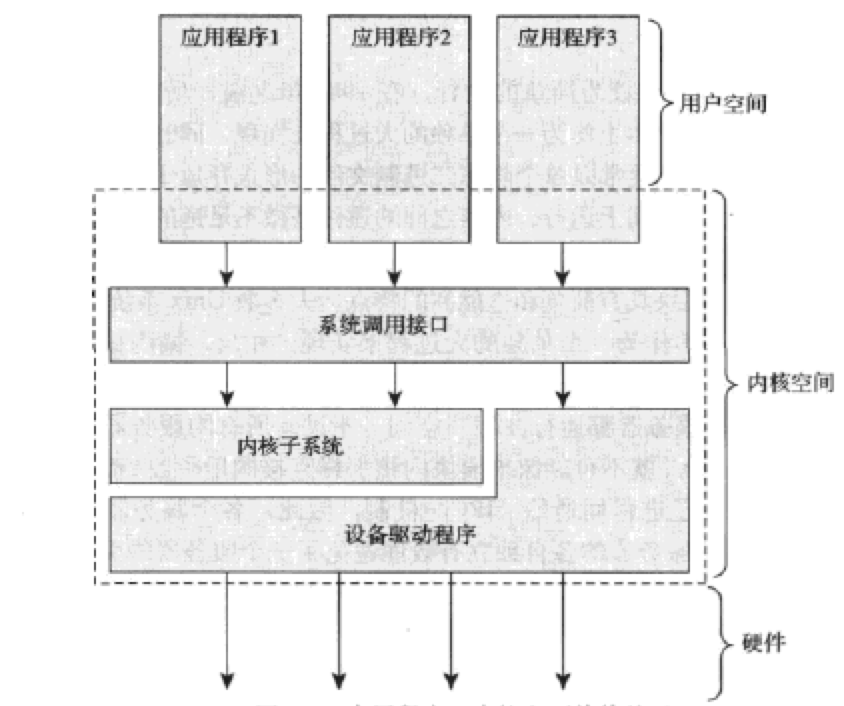

若要了解Linux，必先认识UNIX。

# 1.1 Unix的历史

1969年，Dennis Ritchie和Ken Thompson铸造了Unix这个传奇。Unix是从贝尔实验室一个失败的多用户操作系统Multics涅槃而生的。

1973年，整个Unix用C语言重写，给后来的广泛移植铺平了道路。

由于Unix设计简洁，并且在发布时提供源码，所以很多组织都对它进行了进一步的开发。比较出名的是加州大学伯克利分校的BSD。BSD继续衍生出了Darwin、FreeBSD、NetBSD和OpenBSD。

20世纪80和90年代，许多工作站和服务器厂商退出了自己的Unix，如Digital的Tru64、HP的HP-UX、IBM的AIX、Sequent的DYNIX/ptx、SGI的IRIX和Sun的Solaris和SunOS。

Unix强大的根本原因：

1. 简洁。Unix仅提供几几百个系统调用，明确有一个非常明确的设计目的。
2. 一切皆文件。这种抽象使得对数据和设备的操作都是通过一套相同的系统调用接口完成的：`open()`、`read()`、`write()`、`lseek()`和`close`。
3. C语言编写带来的移植能力。
4. 进程创建非常迅速，有个非常独特的`fork()`系统调用。
5. 有一套非常简单且稳定的进程间通信元语。快速简洁的进程创建过程似的Unix的程序把目标放在**一次执行保质保量地完成一个任务上**，简单稳定的进程间通信机制又保证这些简单程序可以方便组合在一起。

今天，Unix已经发展成了一个支持抢占式多任务、多线程、虚拟内存、换页、动态链接和TCP/IP网络的现代化操作系统。

# 1.2 追寻Linus足迹：Linux简介

1991年，Linus Torvalds为新推出的Intel 80386开发了一套全新的操作系统，Linux由此诞生。Linux成功的一重要因素是，它吸引了众多开发者、黑客对其源码进行修改和完善。

Linux是类Unix系统，但不是Unix。它借鉴了Unix的许多设计并实现了Unix的API，但没有直接使用Unix的源码。Linux内核是自由软件，使用GNU的GPL第2版作为限制条款。

从轻小的消费电子设备，到服务规模放大的数据中心，都能看到Linux的身影。

# 1.3 操作系统和内核简介

操作系统指的是整个系统中负责完成最基本功能和系统管理的那部分，包括内核、设备驱动程序、启动引导程序、命令行Shell和其他种类的用户界面、、基本的文件管理和系统工具。

内核是操作系统的核心，它包括

- 负责响应中断的中断服务程序
- 负责管理多个进程而分享处理器时间的调度程序
- 负责管理进程地址空间的内存管理程序
- 网络、进程间通信等系统服务程序

对于提供保护机制的现代操作系统来说，内核独立于普通阴影进程，处于系统态，拥有受保护的内存空间和访问硬件设备的所有权限。这种系统态和被保护起来的内存空间，统称为**内核空间**。应用程序在用户控件执行，只能看到部分系统资源，只能使用特定的系统功能，不能直接访问硬件，也不能访问内核划分给别人的内存范围。

内核运行时，系统以内核态进入内核空间执行。执行普通程序时，系统以用户态进入用户看见执行。

应用程序通过**系统调用**和内核通信。应用程序通常调用库函数（如C库函数），再由库函数调用系统调用，让内核完成各种任务。当一个应用程序执行一条系统调用，称之为「内核正在代其执行」。这种情况下，应用程序通过系统调用*在内核空间*运行，内核运行于*进程上下文中*。

内核还负责管理系统的硬件设备。硬件设备想和系统通信时，首先发出一个一步的中断信号去打断处理器的执行，继而打断内核的执行。中断对应一个中断号，内核通过这个中断号找到相应的中断服务程序，调用它处理中断。Linux的中断服务程序，不在进程上下文中执行，它在所有进程无关的，专门的中断上下文中运行。之所以这样做，是为了保证中断在第一时间被响应和处理。

每个处理器在任何时间点上的活动都必然为以下三者之一：

1. 运行于用户空间，执行用户进程。
2. 运行于内核空间，处于进程上下文，代表某个特定的进程执行。
3. 运行于内核空间，处于中断上下文，与任何进程无关，处理某个特定的中断。

# 1.4 Linux内核与传统Unix内核的比较

Unix内核几乎毫无例外地都是一个不可分割的静态可执行库，它们必须以巨大、单独的可执行块的形式在一个单独的地址空间运行。Unix内核通常需要硬件系统提供页机制（MMU）以管理内存。Linux则不强求MMU。

## 单内核和微内核设计之比较

操作系统内核可分为两大阵营：

- 单内核
- 微内核

单内核是较为简单的设计，1980年之前，几乎所有的内核都被设计为单内核。单内核就是把它从整体上作为一个单独的大过程来实现，同时运行在一个单独的地址空间上。这样的内核常以单个静态二进制文件存放于磁盘，所有内核服务都在一个大内核地址空间上运行。内核可以直接调用函数，这也用户空间应用程序没有区别。

微内核的功能被划分为多个独立的过程，每个过程叫做一个服务器。只有强烈要求特权服务的服务器才运行在特权模式，其他服务器在用户空间。所有的服务器都保持独立并运行在各自的地址空间。内核通信通过*消息传递*：系统采用了进程间通信（IPC）机制。因为IPC的开销多于函数调用，又会涉及内核空间和用户空间的上下文切换，消息传递需要一定的周期。

Windows NT内核、Mach（Mac OS X）都是微内核的典型实例。Linux是一个单内核，Linux内核运行在独立的内核地址空间上。同时，Linux汲取了微内核的精华：模块化设计、抢占式内核、支持内核线程，动态装载内核模块。

Linux内核与传统的Unix系统存在显著的差异：

- Linux支持动态加载内核模块。
- Linux支持对称多处理（SMP）机制。
- Linux内核可以抢占。
- Linux内核并不区分线程和其他一般进程。
- Linux提供具有设备类的面向对象的设备模型、热拔插事件，以及用户空间的设备文件系统（sysfs）。
- Linux忽略了一些拙劣的Unix特性，如STREAMS。

# 1.5 Linux内核版本

Linux内核有两种：

- 稳定的。具有工业级的强度，可以广泛应用和部署。大部分都是修正了一些Bug或是加入一些新的设备驱动程序。
- 处于开发中的。许多东西变化地很快，开发者不断试验新的解决方案。

Linux内核的版本命名规则，例如 2.6.26.1

| 主版本号 | 从版本号，偶数表示稳定版，奇数表示开发版 | 修订版本号 | 稳定版本号 |
| ---- | -------------------- | ----- | ----- |
| 2    | 6                    | 26    | 1     |

# 1.6 Linux内核开发者社区

linux kernel mailing list（缩写为lkml），可以在 [http://vegr.kernel.org](http://vegr.kernel.org) 上订阅邮件。

# 导航

[目录](README.md)

下一章：[2. 从内核出发](2. 从内核出发.md)
