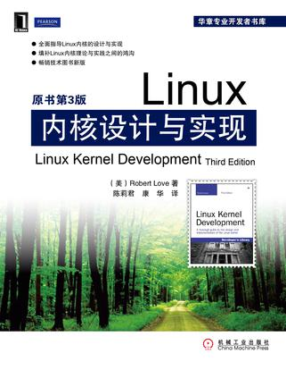

<!-- START doctoc generated TOC please keep comment here to allow auto update -->
<!-- DON'T EDIT THIS SECTION, INSTEAD RE-RUN doctoc TO UPDATE -->
**Table of Contents**  *generated with [DocToc](https://github.com/thlorenz/doctoc)*

- [目录](#%E7%9B%AE%E5%BD%95)

<!-- END doctoc generated TOC please keep comment here to allow auto update -->

[《Linux内核设计与实现》](https://book.douban.com/subject/6097773/)的读书笔记，原书作者：Robert Love。

# 目录

[1. Linux内核简介](Linux内核简介.md)

[2. 从内核出发](从内核出发.md)

[3. 进程管理](进程管理.md)

[4. 进程调度](进程调度.md)

