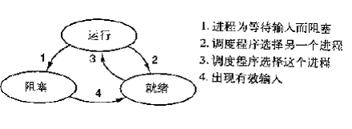

# 进程

一个进程就是一个正在执行的程序，包括程序计数器、寄存器和变量的当前值。

## 创建进程

有四种原因导致创建进程：

1. 系统初始化

2. 执行了从事创建进程的一个系统调用，该系统调用被正在运行的进程所调用

3. 用户请求创建一个新进程

4. 一个批处理作业的初始化

在UNIX中，只能一个系统调用可以用来创建新进程：`fork()`， 它会创建一个与调用进程相同的副本。子程序接着执行`execve`，以修改其存储映像并运行一个新程序。

Windows中调用`CreateProcess`既处理进程的创建，又把正确的程序转入新的进程。

## 进程的终止

1. 正常退出（自愿的）：UNIX的`exit`，Windows的`ExitProcess`

2. 出错退出（自愿的）

3. 严重错误（非自愿的）

4. 被其他进程杀死（非自愿）：UNIX 的`kill`，Wind32对应的是`TerminateProcess`


## 进程的层次结构

进程只有一个父母，但是可以有0个或多个子女。

UNIX中，进程和它的所有子女以及后裔共同组成了一个进程组，向进程组发出信号，每个进程都可以分别捕获、处理该信号。

Windows中不存在任何进程层次的概念，所有的进程地位都是相同的。例外：创建进程的时候，父进程会得到一个令牌（句柄），以此来控制子进程。可以把令牌传送给其他进程。UNIX中，进程不能拒绝其子女的继承权。


## 进程的状态

进程的3个状态：

1. 运行态（进程实际占据CPU）

2. 就绪态（可运行，但因为其他进程正在运行而暂时停止）

3. 阻塞态（除非某种外部事件发生，否则进程不能运行）



## 进程的实现

操作系统维护一张表格，即进程表，每个进程占用一个表项（PCB），PCB包括了进程的状态信息、程序计数器、堆栈指针、内存分配状况、所打开文件的状态、帐号和调度信息、其他进程状态转换时要保存的信息。

中断向量，保存了中断服务程序的入口地址。所有的中断都是从保存寄存器开始的

中断发生后，操作系统最底层的工作步骤：

1. 硬件压入堆栈程序计数器等

2. 硬件从中断向量装入新的程序计数器

3. 汇编语言过程保存寄存器值

4. 汇编语言过程设置新的堆栈

5. 中断服务例程运行

6. 调度程序决定下一个将运行的进程

7. 过程返回至汇编代码

8. 汇编代码过程开始执行新的当前进程 

# 线程

进程用于把资源集中到一起，线程则是在CPU上被调度执行的实体。

所有的线程都有完全一样的地址空间，也共享相同的全局变量，一个线程可以读写另一个线程的堆栈。

| 每个进程中的内容                 | 每个线程中的内容 |
| ------------------------ | -------- |
| 地址空间                     | 程序计数器    |
| 全局变量                     | 寄存器      |
| 打开文件                     | 堆栈       |
| 子进程                      | 状态       |
| 即将发生的警报  信号与信号处理程序  账户信息 |          |

线程的使用线程的执行过程：thread_create, thread_exit, thread_wait, thread_yield

## 用户空间中实现线程

内核对线程一无所知，从内核角度考虑，就是按正常的方式管理，即单线程进程。每个进程都需要有其专用的线程表。用户空间的线程，启动效率比内核调用效率要高，不需要陷入、不需要上下文切换，这就使得调度灰常快捷。

用户级线程的问题：如何实现阻塞系统调用，程序都是永久运行的

## 内核中实现线程

内核中有记录系统中所有线程的线程表。当一个线程阻塞时，内核根据其选择，可以运行同一个进程中的另一个线程或者另一个进程中的线程。而在用户级线程中，运行时系统始终运行自己进程中的线程，直到被内核剥夺其CPU。

在内核中创建和撤销线程的代价较大，当某个线程被撤销时，就把它标记为不可运行的，但是其内核数据结构没有受到影响。稍后创建一个新进程时，就重新启动某个旧线程，这就节省了一些开销。 

# 进程间通信

竞争条件：两个或多个进程读写某些共享数据，而最后的结果取决于进程运行的精确时序。

临界区：对共享内存进行访问的程序片段。

任何一个好的解决互斥的方案必须满足四个条件：

1. 任何两个进程不能同时位于其临界区

2. 不应对CPU的速度和数量做任何假设

3. 临界区外运行的进程不得阻塞其他进程

4. 不得使进程无限期等待进入临界区
 

## 实现互斥的方案

1. 禁止中断：每个进程刚刚进入临界区后立即禁止所有的中断，并在就要离开之前再打开中断。禁止中断后，CPU就不会切换到其他进程

2. 锁变量：一个共享变量，初值为0。这个办法不能很好解决互斥问题，假设进程P1读取变量值为0，而在P1将它设为1之前，P2被调度运行，将锁变量设为1，这时就有两个进程进入临界区

3. 严格轮转法：

```c
while(true) {

while(turn != 0)

critical_region();

turn= 1;

noncritical_region();

}

while(true) {

while(turn != 0)

critical_region();

turn= 1;

noncritical_region();

}
```

这个办法避免了所有的竞争条件，但是会让临界区外的进程阻塞其他进程

4. Peterson解法

```c
void enter_region(int process)

{

    int other;

    other = 1 - process;

    interested[process] = true;

    turn = process;

    while(turn == process && interested[other] == true)

}

void leave_region(int process)

{

    interested[process] = false;

}
```

5. TSL指令，需要硬件支持

信号量

PV操作

管程（一个由过程、变量及数据结构等组成的集合），任意时刻管程中只能有一个活跃进程。

消息传递，两条进程原语：send和receive。


# 调度

调度算法的目标：公平、策略强制执行、平衡。批处理系统的目标是吞吐量、周转时间、CPU使用率。交互式系统的目标是响应时间、均衡性，实时系统的目标是截止时间、可预测性。

批处理系统中的调度：先来先服务、最短作业优先、最短剩余作业优先、三级调度（输入、内存调度、CPU调度）。

交互式系统的调度：轮转调度、优先级调度、多级队列、最短进程优先、保证调度、彩票调度、公平分享调度。

实时系统中的调度：硬实时、软实时。

# 导航

[目录](README.md)

上一章：[1. 引论](1. 引论.md)

下一章：[3. 死锁](3. 死锁.md)
