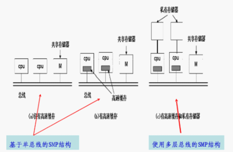
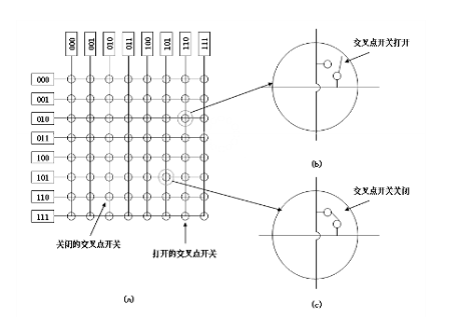
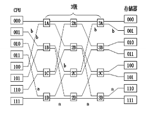
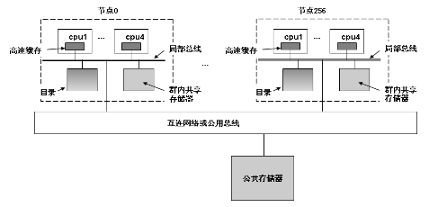

根据消息传递的方法

1. 共享存储器多处理机
2. 消息传递多计算机
3. 广域分布式系统

# 多处理机

共享存储器处理机，其两个或更多的CPU全部共享访问一个共用的RAM，运行在任何一个CPU上的程序都看到一个普通（可分页）的虚拟地址空间。 

## 多处理机硬件

UMA：Uniform Memory Access 

## 基于单总线的UMA

最简单的多处理机是基于单总线的，多个处理器与一个集中的存储器相连，每个处理机可以分为不同存储器模块中的单元，以及与其它处理机进行通信。

为了解决总线带宽的限制，可以为每个CPU添加一个高速缓存，甚至，还可以有一个私有存储器，它通过一个指定的私有总线访问。这样，私有数据可以放进去，共享数据可以放入共享存储器。

 

## 使用交叉开关的的UMA

连接n个CPU到K个存储器的最简单电路就是交叉开关，每个交叉开关均为其中两个结点（CPU与存储器）之间提供一条专用连接通路。

交叉开关最好的特性是非阻塞网络，缺点在于交叉点数量以指数级增长

## 使用多级交换网络的UMA

在单级交叉开关网络结构的基础上，将多个单级交叉开关分级连接起来，形成了多级开关网络。在相邻交叉开关级之间，设置固定的物理连接。处理机何如存储器模块分别位于网络的两侧，每台处理机通过网络访问存储器模块，而且所有处理机的访问方式都是一样的，机会均等。

Omega网络的全混洗：

## NUMA多处理机

各个节点之间通过一条公共总线或者互连模块进行连接和信息交互，每个节点又可以由多个处理机组成，它们分别拥有各自独立的本地存储器、IO设备等，并通过一条局部总线与一个单独的主板上的共享存储器连接。

NUMA的三层存储器：1、本地存储器 2、群内共享存储器 3、全局共享存储器或其它节点存储器

基于目录的多处理机，维护一个表示每个告诉缓存行的位置和状态的数据库。当一个高速缓存行被引用时，就查询数据库找出它的位置以及它是干净的or脏的。

 

## 多处理机操作系统类型

1. 每个CPU都与自己的操作系统

2. 主从多处理机

3. 对称多处理机：在存储器里有操作系统和的副本，任何CPU都可以运行它。

## 多处理机同步

必须采用一个合适的互斥信号量协议，保证所有的CPU顺利工作，任何互斥信号量的核心都是一条指令，该指令允许检测一个存储器并以一种不可见的方式操作设置。TSL（Test and Set Lock）

减少总线流量的方法：

1. 高速缓存，带锁

2. 以太网二进制指数补偿算法，不采用连续轮询，而是把一个延迟循环插入轮询，如果锁忙，延迟被加倍成为两条指令。。。

3. 让每个打算获得互斥信号量的CPU都拥有各自的测试用私有锁变量

## 多处理机调度

1. 分时系统，时间片调度

2. 空间共享

3. 群调度

# 多计算机

## 多计算机硬件

互连技术：星形、环形、网格、双凸面、立方体、超立方体

交换机制：存储转发包交换、电路交换

## 负载均衡

1. 图论确定算法

2. 发送者发起分布式启发算法

3. 接收者发起分布式启发算法

4. 竞标算法

## 分布式系统

网络硬件：以太网、因特网

网络服务：面向连接、无连接

网络协议：IP和TCP

基于文档的中间件

基于文件系统的中间件

基于共享对象的中间件

基于协作的中间件

# 导航

上一章：[6. 文件系统](6. 文件系统.md)

下一章：[9. 安全](9. 安全.md)
