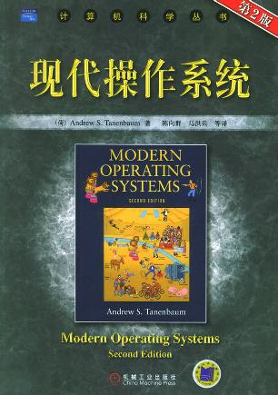

<!-- START doctoc generated TOC please keep comment here to allow auto update -->
<!-- DON'T EDIT THIS SECTION, INSTEAD RE-RUN doctoc TO UPDATE -->
**Table of Contents**  *generated with [DocToc](https://github.com/thlorenz/doctoc)*

- [目录](#%E7%9B%AE%E5%BD%95)

<!-- END doctoc generated TOC please keep comment here to allow auto update -->

[《现代操作系统》](https://book.douban.com/subject/1390650/)笔记

# 目录

[1. 引论](1. 引论.md)

[2. 进程与线程](2. 进程与线程.md)

[3. 死锁](3. 死锁.md)

[4. 存储管理](4. 存储管理.md)

[5. 输入-输出.md](5. 输入-输出.md)

[6. 文件系统](6. 文件系统.md)

[8. 多处理机系统](8. 多处理机系统.md)

[9. 安全](9. 安全.md)
