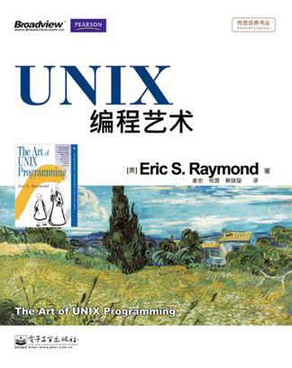

[《UNIX编程艺术》](https://book.douban.com/subject/5387401/)读书笔记，原书作者：Eric S. Raymond。

# 目录

[1. 哲学](1. 哲学.md)

[2. 历史-双流记](2. 历史-双流记.md)

[3. Unix哲学同其他哲学](3. Unix哲学同其他哲学.md)

[4. 模块性](4. 模块性.md)

[5. 文本化](5. 文本化.md)

[6. 透明性](6. 透明性.md)

[7. 多道程序设计](7. 多道程序设计.md)

[8. 微型语言](8. 微型语言.md)

[9. 生成](9. 生成.md)

[10. 配置](10. 配置.md)

[11. 接口](11. 接口.md)

[12. 优化](12. 优化.md)

[13. 复杂度](13. 复杂度.md)

[14. 语言：C还是非C](14. 语言：C还是非C.md)

[15章 - 19章](15-19.md)
