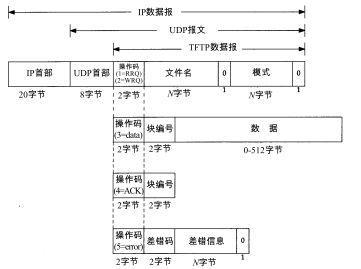

<!-- START doctoc generated TOC please keep comment here to allow auto update -->
<!-- DON'T EDIT THIS SECTION, INSTEAD RE-RUN doctoc TO UPDATE -->
**Table of Contents**  *generated with [DocToc](https://github.com/thlorenz/doctoc)*

- [导航](#%E5%AF%BC%E8%88%AA)

<!-- END doctoc generated TOC please keep comment here to allow auto update -->

TFTP将使用UDP。

TFTP使用不可靠的UDP，TFTP就必须处理分组丢失和分组重复。分组丢失可通过发送方的超时与重传机制解决。

TFTP协议没有提供安全特性。大多数执行指望TFTP服务器的系统管理员来限制客户的访问，只允许它们访问引导所必须的文件。

TFTP使用停止等待协议，数据发送方在发送下一个数据块之前需要等待接受对已发送数据的确认。

# 导航

[目录](README.md)

上一章：[14、DNS：域名系统](14、DNS：域名系统.md)

下一章：[16、BOOTP：引导程序协议](16、BOOTP：引导程序协议.md)
