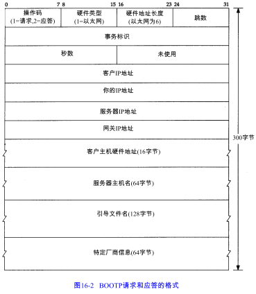

<!-- START doctoc generated TOC please keep comment here to allow auto update -->
<!-- DON'T EDIT THIS SECTION, INSTEAD RE-RUN doctoc TO UPDATE -->
**Table of Contents**  *generated with [DocToc](https://github.com/thlorenz/doctoc)*

- [BOOTP 的分组格式](#bootp%C2%A0%E7%9A%84%E5%88%86%E7%BB%84%E6%A0%BC%E5%BC%8F)
- [导航](#%E5%AF%BC%E8%88%AA)

<!-- END doctoc generated TOC please keep comment here to allow auto update -->

BOOTP使用UDP，且通常需与TFTP协同工作。

# BOOTP 的分组格式

BOOTP有两个熟知端口：BOOTP服务器为67，BOOTP客户为68。这意味着BOOTP客户不会选择未用的临时端口，而只用端口68。选择两个端口而不是仅选择一个端口为BOOTP服务器用的原因是：服务器的应答可以进行广播（但通常是不用广播的）。 

BOOTP服务器比ARP服务器更易于实现，因为BOOTP请求和应答是在UDP数据报中，而不是特殊的数据链路层帧。一个路由器还能作为真正 BOOTP服务器的代理，向位于不同网络的真正BOOTP服务器转发客户的BOOTP请求。RARP是链路层广播，不会被路由器转发。

# 导航

[目录](README.md)

上一章：[15、TFTP：简单文件传送协议](15、TFTP：简单文件传送协议.md)

下一章：[17、TCP：传输控制协议](17、TCP：传输控制协议.md)

