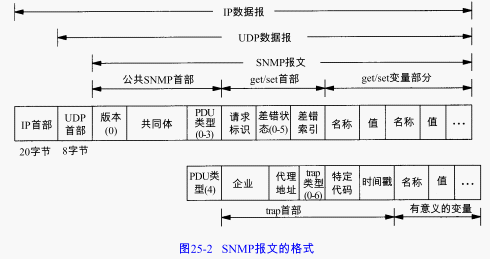

基于TCP/IP的网络管理包含两个部分：网络管理站（也叫管理进程， manager）和被管的网络单元（也叫被管设备）。被管设备端和管理相关的软件叫做代理程序( agent)或代理进程。
    
管理进程和代理进程之间的通信可以有两种方式。一种是管理进程向代理进程发出请求，询问一个具体的参数值（例如：你产生了多少个不可达的 ICMP端口？）。另外一种方式是代理进程主动向管理进程报告有某些重要的事件发生。
    
基于TCP/IP的网络管理包含3个组成部分：

1. 一个管理信息库MIB（Management Information Base）。管理信息库包含所有代理进程的所有可被查询和修改的参数。
2. 关于MIB的一套公用的结构和表示符号。叫做管理信息结构SMI（Structure of Management Information）。
3. 管理进程和代理进程之间的通信协议，叫做简单网络管理协议SNMP（Simple Network Management Protocol）。

# 协议

关于管理进程和代理进程之间的交互信息， SNMP定义了5种报文：

1. get-request操作：从代理进程处提取一个或多个参数值。
2. get-next-request操作：从代理进程处提取一个或多个参数的下一个参数值
3. set-request操作：设置代理进程的一个或多个参数值。
4. get-response操作：返回的一个或多个参数值。这个操作是由代理进程发出的。它是前面3中操作的响应操作。
5. trap操作：代理进程主动发出的报文，通知管理进程有某些事情发生。
前面的3个操作是由管理进程向代理进程发出的。后面两个是代理进程发给管理进程的。

# 管理信息结构

SNMP中，数据类型不多，只有INTEGER，OCTER STRING，IPAddress等

# 对象标识符

对象标识是一种数据类型，它指明一种“授权”命名的对象。“授权”的意思就是这些标识不是随便分配的，它是由一些权威机构进行管理和分配的。

对象标识是一个整数序列，以点（“.”）分隔。这些整数构成一个树型结构，类似于DNS或Unix的文件系统。

# 管理信息库介绍

所谓管理信息库，或者MIB，就是所有代理进程包含的、并且能够被管理进程进行查询和设置的信息的集合。

MIB组：system（系统标识）、if（接口）、at（地址转换）、ip、icmp和tcp。

- system组非常简单，它包含7个简单变量
- interface组只定义了一个简单变量，那就是系统的接口数量
- ip组定义了很多简单变量和3个表格变量
- icmp组包含4个普通计数器变量（ ICMP报文的输出和输入数量以及 ICMP差错报文的输入和输出数量）和22个其他ICMP报文数量的计数器：11个是输出计数器，另外11个是输入计数器。
- tcp组中的简单变量几乎都和TCP状态有关。

# 导航

[目录](README.md)

上一章：[24. TCP的未来和性能](24. TCP的未来和性能.md)

下一章：[26. Telnet和Rlogin：远程登录](26. Telnet和Rlogin：远程登录.md)
