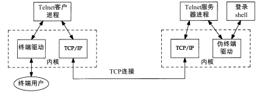

Telnet客户和服务器的典型连接图：

# Rlogin协议

Rlogin只提供一个选项，因为它假定连接双方都是Unix主机。

默认情况下，流量控制是由 Rlogin的客户进程完成的。客户进程能够识别用户键入的`STOP`和`START`的ASCII字符（`Control_S`和`Control_Q`），并且终止或启动终端的输出。

# Telnet协议

Telnet通信的两个方向都采用带内信令方式。

Telnet提供客户进程和服务器进程的选项协商机制。如果连接的双方都支持这些选项，则可以增强一些功能。对于比较简单的客户进程和服务器进程，它可以提供Telnet的基本功能，而当双方都支持某些选项时，它又可以充分利用双方的新特性。

Telnet的3种数据传输的方式：

- 单字符方式
- 准行方式
- 实行方式

Rlogin服务器和Telnet服务器通常都将设置TCP的保活选项以检测客户主机是否崩溃。这两种应用都采用了TCP紧急方式，以便即使从服务器到客户的数据传输被流量控制所终止，服务器仍然可以向客户发送命令。

 

| 特征   | Rlogin                                   | Telnet                                   |
| ---- | ---------------------------------------- | ---------------------------------------- |
| 运输协议 | 一个TCP连接。使用紧急方式                           | 一个TCP连接。使用紧急方式                           |
| 分组方式 | 总是一次一字符。远程回显                             | 通常的默认是一次一字符，远程回显。带客户回显的准行方式也支持带回显的实行模式。但服务器上的应用程序请求时，总是一次一字符的方式 |
| 流量控制 | 通常由客户完成，可以被服务器禁止                         | 通常由服务器完成，选项允许客户端来完成                      |
| 终端类型 | 总是提供                                     | 选项，通常被支持                                 |
| 终端速率 | 总是提供                                     | 选项                                       |
| 窗口大小 | 大多数服务器支持此选项                              | 选项                                       |
| 环境变量 | 不支持                                      | 选项                                       |
| 自动登录 | 默认。提供用户键入口令，口令以明文发送。较新的版本支持Kerberos方式的登录 | 默认是键入登录名和口令。口令以明文发送，较新的版本支持鉴别选项          |

# 导航

[目录](README.md)

上一章：[25. SNMP：简单网络管理协议](25. SNMP：简单网络管理协议.md)

下一章：[27. FTP：文件传送协议](27. FTP：文件传送协议.md)
