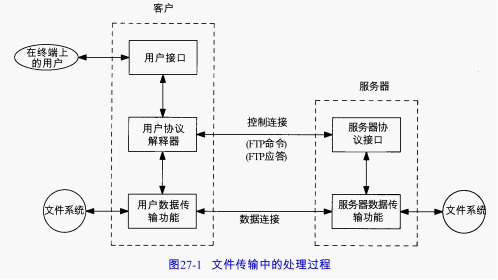

FTP与我们已描述的另一种应用不同，它采用两个 TCP连接来传输一个文件：

- 控制连接以通常的客户服务器方式建立。服务器以被动方式打开众所周知的用于FTP的端口（21），等待客户的连接。客户则以主动方式打开 TCP端口21，来建立连接。控制连接始终等待客户与服务器之间的通信。该连接将命令从客户传给服务器，并传回服务器的应答。由于命令通常是由用户键入的，所以IP对控制连接的服务类型就是“最大限度地减小迟延”。
- 每当一个文件在客户与服务器之间传输时，就创建一个数据连接。（其他时间也可以创建）。由于该连接用于传输目的，所以I P对数据连接的服务特点就是“最大限度提高吞吐量”

文件类型：ASCII码文件，EBCDID文件，图像文件，本地文件。

格式控制：非打印，远程登录格式控制，Fortran回车控制。

结构：文件结构，记录结构，页结构。

传输方式：流方式，块方式，压缩方式。

# FTP命令

命令和应答在客户和服务器的控制连接上以 NVT ASCII码形式传送。这就要求在每行结尾都要返回CR、LF对（也就是每个命令或每个应答）。从客户发向服务器的 Telnet命令（以IAC打头）只有中断进程（ < IAC , IP >）和Telnet的同步信号（紧急方式下 < IAC , DM >）。

FTP应答都是ASCII码形式的3位数字，并跟有报文选项。