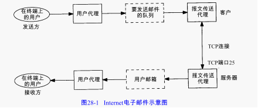

<!-- START doctoc generated TOC please keep comment here to allow auto update -->
<!-- DON'T EDIT THIS SECTION, INSTEAD RE-RUN doctoc TO UPDATE -->
**Table of Contents**  *generated with [DocToc](https://github.com/thlorenz/doctoc)*

- [SMTP协议](#smtp%E5%8D%8F%E8%AE%AE)
- [导航](#%E5%AF%BC%E8%88%AA)

<!-- END doctoc generated TOC please keep comment here to allow auto update -->

 

 

# SMTP协议

两个MTA之间用NVT ASCII进行通信。客户向服务器发出命令，服务器用数字应答码和可选的人可读字符串进行响应。

最小SMTP实现支持8种命令：HELO，MAIL，RCPT，DATA，QUIT，RSET，VPFY，NOOP。

电子邮件由三部分组成：

1. 信封（envelope）是MTA用来交付的。在我们的例子中信封由两个SMTP命令指明：

   > MAIL From: <rstevens@sun.tuc.noao.edu>
   >
   > RCPT To: <estevens@noao.edu>

2. 首部由用户代理使用。在我们的例子中可以看到9个首部字段： Received、Message-Id、From、Data、Reply-To、X-Phone、X-Mailer、To和Subject。每个首部字段都包含一个名，紧跟一个冒号，接着是字段值。 RFC 822指明了首部字段的格式的解释（以X-开始的首部字段是用户定义的字段，其他是由 RFC 822定义的）。

3. 正文（body）是发送用户发给接收用户报文的内容。 RFC 822  指定正文为NVT ASCII文字行。当用DATA命令发送时，先发送首部，紧跟一个空行，然后是正文。用 DATA命令发送的各行都必须小于1000字节。

用户接收我们指定为正文的部分，加上一些首部字段，并把结果传到 MTA。MTA加上一些首部字段，加上信封，并把结果发送到另一个 MTA。

内容（content）通常用于描述首部和正文的结合。内容是客户用 DATA命令发送的。

一些新的扩充：用于信封和非 ASCII首部的扩充SMTP，以及使用MIME的正文增加了结构。MIME的结构和编码允许使用已有的7bit SMTP MTA交换任意二进制数据。

# 导航

[目录](README.md)

上一章：[27、FTP：文件传送协议](27、FTP：文件传送协议.md)

下一章：[29、网络文件系统](29、网络文件系统.md)
