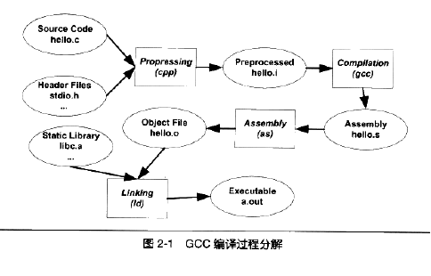
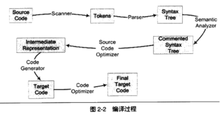
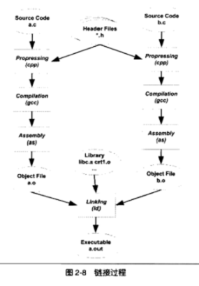

# 第2章 编译和链接

## 被隐藏了的过程

**预处理**：处理源文件中以#开头开始的预编译指令。

> 1. 展开所有的宏定义，#define
> 2. 处理所有的条件预编译指令，#ifdef
> 3. 处理#include预编译指令，递归进行
> 4. 删除所有的注释
> 5. 添加行号和文件名标识
> 6. 保留所有的#pragma编译器指令

**编译**：预处理完的文件进行一系列词法分析、语法分析、语义分析及优化后产生相应的汇编代码文件。
**汇编**：汇编代码转变成机器可以执行的指令。
**链接**：

# 编译器做了什么？

### 编译过程

源代码---扫描器--->符号----解析器----->语法树----语义分析--->标注语法树---源代码优化--->中间代码生成---代码生成器---->目标代码---代码优化器---->最终代码

1. **词法分析**——运用一种类似于有限状态机的算法将源代码字符分割成一系列的记号（Token），其中记号分为关键字、标识符、字面量（常数、字符串等）和特殊符号（运算符号等）这几类。进行词法分析的工具为lex。
2. **语法分析**——采用上下文无关语法，生成以表达式为节点，以常数和标识符最基层叶子的语法树，完成高级语言的语法分析。进行语法分析的现成工具为yacc，根据用户给定的语法规则对输入的记号序列进行解析，因此使用yacc可以针对不同的编程语言，只需改变规则就可以得到相应的语法分析器。
3. **语义分析**——语法分析仅仅完成了源代码的语法层面的分析，但是对于表达式是否有意义，是否合法并不清楚，这就需要进行表达式的语义分析，并完成一些潜在的类型转换、匹配等。完成语义分析后，语法树的每一个表达式都被标识了相应的类型，如果有些类型需要隐式转化，必须插入相应的转换节点。
4. **中间语言生成**——将整个语法树转换为与硬件无关的中间代码。常见的中间代码类型为“三地址码”，形如 x = y op z 。中间代码的存在使得整个编译器软件被分为了与硬件无关的前端和与硬件相关的后端，这就使得编译器可以支持多种编程语言的编译工作，使用相同的前端，需要改变的仅仅只是后端而已。
5. **目标代码生成与优化**——根据特定硬件的字长、寄存器、指令集等特性，将中间代码生成相应的汇编语言代码。

## 链接器

现代软件规模非常庞大，因此软件的分模块成为了必然的趋势，各个模块代码被单独编译得到目标文件，然后将这些模块组装到一起成为一个可执行文件，就是链接器的工作，其主要内容其实就是将各个模块之间的相互引用处理好，将一些指令对在其他模块定义的符号的引用进行地址的修正。

仅仅通过编译得到的目标文件中存在着很多的重定位入口，即不能确定物理地址的符号，在未经链接的目标文件中这些符号的物理地址往往都被置为0，需要由链接器来对其进行修正——即重定位。

C++模块通信的两种方式：

1. 模块间的函数调用
2. 模块间的变量访问

这两种方式都归结为一种，就是模块间的引用。

链接的主要内容就是把各个模块之间相互引用的部分都处理好，各个模块之间能够正确地衔接。链接的过程包括了地址和空间分配、符号决议（符号绑定）、重定位。

所谓的库文件可以理解为一组常用代码编译得到的目标文件的打包，最常见的库就是运行时库，是支持程序运行的基本函数的集合。静态链接的过程就是将多个目标文件与库文件进行链接得到可执行文件的过程。

# 导航

[目录](README.md)

上一章：[1. 温故而知新](1. 温故而知新.md)

下一章：[3. 目标文件里有什么](3. 目标文件里有什么.md)
