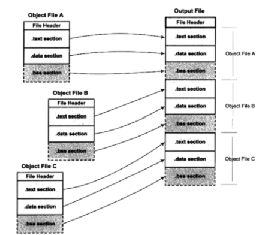
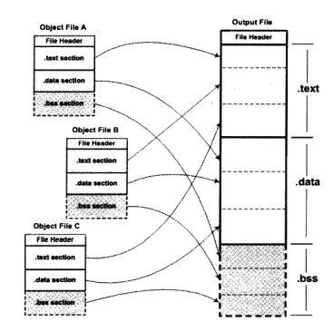
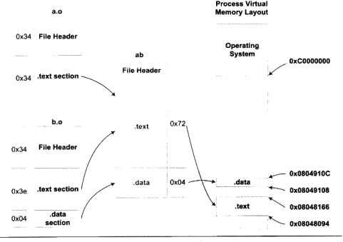

# 第4章 静态链接

## 空间与地址分配

整个链接过程，链接器就是将几个输入目标加工后合并成一个输出文件。

按序叠加：碎片

相似段合并

链接器为目标文件分配地址和空间有两个含义：第一是在输出的可执行文件中的空间；第二是在装载后的虚拟地址中的虚拟地址空间。

现在的链接器空间分配的策略基本上是第二种，两步链接法：

1. 空间与地址分配：扫描所有的输入目标文件，获得它们每个段的长度、属性和位置，并将输入目标文件中的符号中所有的符号定义和符号引用收集起来，统一放到全局符号表。这一步中，链接器获得所有输入目标文件的段长度，将它们合并，计算新的长度和位置，并建立映射关系。
   
2. 符号解析与重定位

## 符号解析与重定位

链接前后（完成地址和空间分配）的程序中使用的地址已经是程序在进程中的虚拟地址。

链接器需要根据新得到的全局符号表对这些假地址进行修正，每一个这样需要重定位的地方都称为一个“重定位入口”。

首先，链接器是怎么知道输入目标文件中哪些地方需要进行修正的呢？这完全归功于编译器单元创建的“重定位表” — 用来描述如何修改相应的段里的内容 — 在段表section header table中类型为SHT_REL。可重定位ELF文件中每一个需要进行重定位的section都对应这一个重定位表，例如`.text`对应的`.rel.text`，`.data`对应的`.rel.data`。与ELF文件中其他的“表”一样，重定位表也是结构体`Elf32_Rel`（重定位入口）的数组，其中每个Elf32_Rel结构体包含两个域：

> r_offset;  ——该重定位入口相对于所在段起始的偏移量
> r_info;    —— 低8位表征重定位入口类型和符号（不同类型，计算修正量地址的方法是不一样的），高24位表征重定位入口的符号在新的输出可执行文件中的实际地址

**符号解析**：重定位过程中，每个重定位的入口都是对一个符号的引用，那么当连接器需要对某个符号的引用最近重定位时，它就要确定这个符号的目标地址。这时连接器就会去查找由所有目标文件的符号组成的全局符号表，找到相应的符号后进行重定位。在链接器扫描完所有的输入目标文件之后，所有未定义的符号必须也在全局符号表中，否则链接器报错。

如果链接器在ab的新全局符号表中没有找到某个重定位入口符号的定义，则会报错 —— 这就是常见的连接错误类型；如果在全局符号表中找到了这些未定义的符号，则会根据重定位入口指令的类型进行符号引用地址的修正，32位平台下的计算方式包括绝对近址寻址修正和相对近址寻址修正两种方法，分别对应于`R_386_32`类型的重定位入口和`R_386_PC32`类型的重定位入口。相对寻址修正方式中，重定位入口所在指令的下一条指令的地址 + 修正后的地址值 = 该符号的实际定义地址。

### COMMON块

当前的链接器并不支持符号类型，即链接器并不知道各个符号的数据类型究竟是什么，而仅仅知道该符号的大小而已。当输入目标文件中存在着多个同名符号时，链接器需要根据强符号/弱符号机制进行处理，对于均为弱符号的情况，则选择最大的那一个进行连接——这也就是所谓的COMMON块机制。

未初始化的全局变量之所以被编译器归为COMMON而不是在`.bss`段中分配空间（即使`.bss`段在编译时并未分配真正的空间)，这是因为这种变量被划定为弱符号，在编译时并不能知道是否在其他目标文件中存在相同的未定义全局变量，编译器不能确定在链接时这个名字的符号究竟占多大的空间。但是链接器却能够知道最终这个符号占多少空间，所以在最终的输出可执行文件中，这样的未初始化全局变量会在`.bss`段中被分配空间，即最终还是和未初始化的局部静态变量一起放在`.bss`段中的。

GCC中可以通过 `-fno_common `编译选项，或者在源码中使用 __attribute__((nocommon)) 定义未初始化全局变量，这样该变量就不会以COMMON符号方式被处理，而变成了一个强符号。

### C++相关问题
**重复代码消除**：模版、外部内联函数、虚函数表都有可能在不同的编译单元中生成相同的代码。一个有效的做法，就是将每个模版的实例代码单独存放在一个段里，每个段只包含一个模版实例，比如有个模版函数`add<T>()`，某个编译单元用int和float实例化了该模版函数，那么该编译单元的目标文件中就包含了两个该模版实例的段：`.temp.add<int>`和`.temp.add<float>`。这样，当别的编译单元也以`int`或`float`实例化该模版函数后，也会生成同样的名字，这样链接器在最终链接的时候可以区分这些相同的模版实例段，最终将它们合并入最后的代码段。

外部内联函数、默认构造函数、默认拷贝构造函数和赋值操作符也采用类似的方法消除类似。

函数级别链接：将每个函数或变量分别保持在独立的段中。

**全局构造与析构**：我们知道C++全局对象的构造函数在main之前被执行，C++全局对象的析构函数在main之后被执行。

Linux系统下一般程序的入口是`_start`，这个函数是Linux系统库（Glibc）的一部分。当我们的程序与Glibc链接在一起形成最终可执行文件以后，这个函数就是程序的初始化部分的入口，程序初始化部分完成一系列初始化过程之后，会调用main函数来执行程序主体。

在main函数前后执行的一般放在ELF文件中的两个特殊段：

- `.init`  该段里面保存的是可执行指令，它构成了进程的初始化代码。
- `.fini`  该段保存着进程终止代码指令。

如果一个函数放在`.ini`t段，在`main`函数执行前系统就会执行它。同理，假如一个函数放到`.fint`段，在`main`函数返回后该函数就会被执行。

不同编译器编译出来的目标文件是否可以链接在一起呢？

如果能，须要：采用相同的目标文件格式，拥有同样的符号修饰标准、变量的内存分布方式相同、函数的调用方式相同等等。其中我们把符号修饰标准、变量内存布局、函数调用方式等这些跟可执行代码二进制兼容相关的内容称之为ABI：application binary interface，应用程序二进制接口。

影响ABI的因素非常多，硬件、编程语言、编译器、连接器、操作系统等都会有影响到ABI。

对于C语言的目标代码来说，一下几个方面会决定目标文件之间是否二进制兼容：

1. 内置类型（`int`，`float`，`char`等）的大小和在存储器中的防止位置（大小端、对齐方式等）。
2. 组合类型（`struct`、`union`、数组等）的存储方式和内存布局。
3. 外部符号与用户定义的符号之间的命名方式和解析方式，如函数`func`在C语言的mubi9ao文件中是否被解析成为外部符号`_func`。
4. 函数的调用方式，比如参数入栈顺序、返回值如何保持等。
5. 堆栈的分布方式，比如参数和局部变量在堆栈里面的位置，参数传递方法等。
6. 寄存器使用约定，函数调用时那些寄存器可以修改，哪些需要保存等。

C++要做到二进制兼容比C更不容易：

1. 继承类体系的内存分布，如基类，虚基类在继承类中的位置等。
2. 指向成员函数的指针的内存分布，如何通过指向成员函数的指针来调用成员函数，如何传递this指针。
3. 如何调用虚函数，vtable的内容和分布形式，vtable指针在object中的位置等。
4. template如何实例化。
5. 外部符号的修饰。
6. 全句对象的构造和析构。
7. 一次的产生和捕获机制。
8. 标准库的细节问题，RTTI如何实现等。
9. 内嵌函数的访问细节。

C++一直为人诟病的一大原因是它的二进制兼容性不好。

## 静态链接

静态链接库可以简单看成一组目标文件的集合。

## 链接过程控制

在大部分情况下，我们使用链接器提供的默认链接规则对目标文件进行链接。这一般没有问题，但对于特殊要求的程序，比如操作系统内核，BIOS或一些没有操作系统的情况下运行的程序（Boot Loader或者嵌入式系统程序），以及另外的一些需要特殊的链接过程的程序，如内核驱动程序等。

连接器提供的控制整个链接过程的方法：

1. 使用命令行来给连接器指定参数
2. 将链接指令存放在目标文件里面，编译通常通过这种方法想连接器传递指令。VISUAL C++编译器会把链接参数放在PE目标文件的`.drectve`段。
3. 使用连接控制脚本

BFD库是一个GNU项目，希望通过一种统一的接口来处理不同的目标文件格式。

# 导航

[目录](README.md)

上一章：[3. 目标文件里有什么](3. 目标文件里有什么.md)

下一章：
