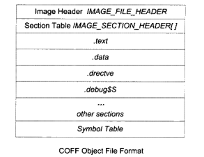
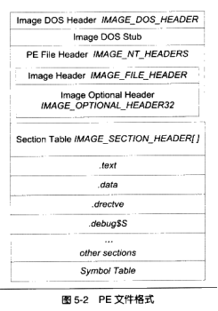

# 第5章 Windows PE/COFF

PE（Protable Executable）的可执行格式，PE与ELF是同根同源，都是由COFF发展而来的。PE/COFF也采用基于段的格式，一个段可以包含代码、数据、其他信息，也允许将变量或函数放到自定义的段。 

## COFF

映像：因为PE文件装载时被直接映射到进程的虚拟空间中运行，它是进程虚拟空间的映像。所以PE可执行文件很多时候叫做映像文件。

COFF文件组成依次为：

1. COFF文件头——包括 Image Header 和 段表 两部分，这点与ELF格式有所不同，Image Header中不再需要有段表的偏移。
2. 各个不同的段——与ELF格式基本一致。
3. 符号表——与ELF格式一致。

## 链接指示信息

COFF格式的段类型中相对于ELF而言，多了`.drectve` 段和 `.debug$S` 段。 

`.drectve`段保存的是编译器传递给链接器的链接指令，默认地，该段的原始数据内容就是`/DEFAULTLIB:'LIBCMT'`这样的链接指令，意思是链接器在链接时需要将 libcmt.lib 库文件加入到输入文件中。其中libcmt.lib库文件表示VC的静态链接的多线程C库。

COFF的符号表结构与ELF格式也基本一致，其中一个不同的地方是，对于C语言的符号，COFF只区分两种——变量或其他符号(`notye`)，函数( `notye()` )，而ELF的符号表中区分的C语言符号包括`NOTYPE`、`OBJECT`、`FUNC`、`FILE`等几类。

`debug$S` 段表示包含的是符号相关的调试信息。

符号表：对于C语言的符号，COFF值区分两种：变量与函数。

## PE

 Windows的可执行文件格式PE源于COFF，最主要的变化包括两点：

1. 文件开头不再是COFF文件头，而是DOS MZ可执行文件格式的文件头和DOS桩代码——这点完全是为了当初与DOS下可执行文件的MZ格式兼容。

   >虽然Windows下和DOS下的可执行文件都是exe后缀，但是二者其实完全不同，在纯DOS下是不能运行PE文件的，如果在纯DOS环境下运行PE格式的exe文件，DOS操作系统在识别了PE格式的DOS MZ文件头之后，会跳转到DOS桩代码，执行结果为“This program cannot be run in DOS”后退出。
   >
   >反之，在Windows下则可以执行DOS下的exe文件，这是通过判断`IMAGE_DOS_HEADER`结构体中的 `e_lfanew` 域实现的。`e_lfanew` 域指出了PE文件真正的头在文件中的偏移量，对于纯DOS MZ可执行文件，该域永远为0，Windows可以调用DOS子系统来执行该程序。

2. 原来的COFF文件头被扩展为了PE的文件头，其中既包括了COFF文件头 `IMAGE_FILE_HEADER` 结构体，同时增加了一个 IMAGE_OPTINAL_HEADER 扩展头结构 —— PE扩展头虽然名为OPTINAL，但是实际上对于PE和DLL文件来说是必不可少的，其定义在`WinNt.h`中，区分为32/64位两种。该结构体中最重要的是 `IMAGE_DATA_DIRECTORY  DataDirectory[ IMAGE_NUMBEROF_DIRECTORY_ENTRIES ]`，这个结构体数组被称为“PE数据目录”，定义了PE程序加载执行时所需要的众多数据结构（"XX表"，例如导入表、导出表、资源表、异常表、重定位表等），每个`IMAGE_DATA_DIRECTORY`结构体描述一个这样的“XX表”，其数据域如下：

   > VirtualAddress —— XX表所在的起始虚拟地址
   >
   > Size;—— XX表的长度

# 导航

[目录](README.md)

上一章：[5. Windows PE/COFF](5. Windows PE/COFF.md)

下一章：