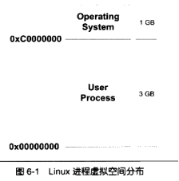
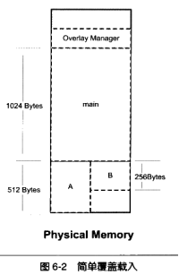
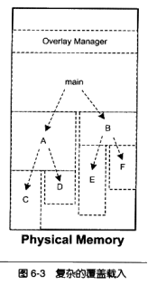
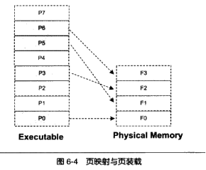
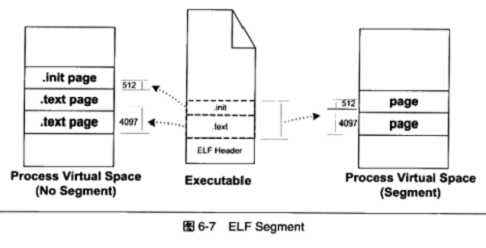
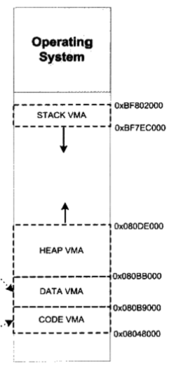
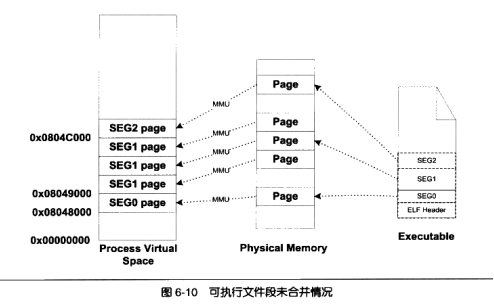
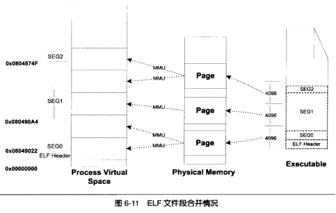

# 第6章 可执行文件的装载与进程

可执行文件和进程关系的“厨房比喻”的个人理解：

计算机系统  —— 饭店的厨房； 

CPU Core    —— 厨师； 

可执行程序  —— 菜谱，菜谱自然可以被多次复用；

输入和众多其他硬件设备 —— 厨房的厨具和做菜原料；

输出        —— 菜肴； 

计算机用户  —— 饭店的客人； 

进程        —— 厨师按照菜谱做出一道菜的过程；

多进程伪并发模型 —— 厨师同时用多个灶台和厨具做多个菜，每个菜对应一个菜谱，根据客人的轻重缓急和各种菜的做法情况，厨师尽可能地在多个灶台和厨具之间来回切换；

单核多线程  —— 只有一个厨师，每个锅可以被分割为几个小块，每个小块负责该道菜的一个相对独立的环节，厨师在轮换到做这一道菜的时间片内（一个进程的时间片內）交替完成这几个小块的烹制，最终各个小块共同完成这一道菜的烹制。并且这个厨师交替做的每个菜肴都可以在各自的锅中分割成这样的小块。

每道较复杂的菜谱中包含多个步骤和技巧（代码中的多个函数），而每个锅内的小块（共享进程地址空间）均可以使用任意的这些步骤和技巧（共享进程代码段），共同使用油盐酱醋与火力（共享进程数据段），但是每个小块都严格在自己的物理区域内（线程独立的栈空间），厨师严格按照按照菜谱中的规定步骤操作该小块（线程独立的PC控制流）。

这就意味着，宏观上一眼看去厨师需要在多个灶台和炒锅之间来回跑以操作不同的菜肴制作（进程切换），而仔细地观察该厨师实际上是以不同的锅内的不同小块为奔波的对象（线程切换）——这样的厨师真的非常辛苦，效率到了一定程度之后也就无法再提高了！

多核多线程  ——厨师不再是一个而是多个，从而可以真正地使用多个灶台和厨具并行做菜，这种并行既可以是每个厨师做不同的菜，也可以是多个厨师同时做一个菜的多个小块，只要分块得当，这种方式效率高得多。

## 进程虚拟地址空间
虚拟地址空间的大小是由CPU的位数决定的。一般来说，C语言指针的位数与虚拟空间的位数相同。

32位CPU下。程序使用的“虚拟地址空间”不得超过4G，使用“计算机的内存空间”可以超过4G。

PAE：Intel自从1995年的Pentium Pro CPU开始采用了36位的物理地址，也就是可以访问高达64GB的物理内存。Intel修改了页映射方式，把这个地址扩展方式叫做PAE（Physical Address Extension）。

应用程序如何使用这些大于常规内存的空间？

一个很常见的方法就是操作系统提供一个窗口映射的方法，把这些额外的内存映射到进程地址空间中来。应用程序可以根据需要来选择申请和映射。在Windows下，这个访问内存的操作方式叫做AWE（Address Windowing Extensions）；在Linux中采用`mmap()`系统调用来实现。

## 装载的方式

**覆盖装入**和**页映射**是两种很典型的动态装载方法，它们都利用了程序的局部性原理（时间局部性和空间局部性)。二者的根本区别在于程序模块化的方式，Overlay方式把这个工作交给了程序员，而Paging方式则将这个工作交由编译器、链接器和OS来完成。

理论上说，可以直接将可执行文件进行分页，然后由OS存储管理器将这些文件页直接映射到物理内存中的物理页完成加载。这样的情况下，程序中就需要直接使用物理地址，而程序页每次加载到的物理页并不确定，所以这样每次程序页装入后都需要对程序中使用的物理地址进行重定位 —— MMU和虚拟地址空间的诞生则完全改变了程序加载的方式，进程的虚拟地址空间将程序空间和物理内存空间隔离开来，充当着物理内存空间和可执行文件空间之间的桥梁。

**覆盖装入**：将挖掘内存潜力的任务交给了程序员。程序员将程序分块，然后编写辅助代码来管理这些模块何时驻留内存何时替换掉。这段辅助代码就是覆盖管理器  

多个模块的情况下，程序员需要手工将模块按照它们之间的调用依赖关系组织成树状结构。覆盖管理器要注意两点：调用路径、禁止跨树间调用。

页映射：将内存和所有磁盘中的数据和指令按照“页”为单位来划分为若干个页。“装载管理器” ----也就是现代的操作系统。

## 从操作系统角度来看可执行文件的装载

操作系统中“创建一个进程，然后装载某个可执行文件并执行“这个最常用的操作可以简单地由三步来完成：

1. 创建进程虚拟地址空间：此处所谓的“创建”并不是创建空间，而是创建虚拟空间到物理内存空间的映射函数所需要的一系列的数据结构，对于Linux就是创建一个“页目录”结构即可，并不需要设置虚拟页到物理页的映射关系。将虚拟空间的各个页映射至相应的物理空间，实际上只是分配了一个页目录（Page Directory）就可以了。这一步将物理空间与虚拟空间关联起来；
2. 读取可执行文件头，建立进程虚拟地址空间和可执行文件的映射关系：这一步将可执行文件空间与虚拟空间关联起来，使得发生缺页错误时，OS能够知道到可执行文件中的哪个位置去找到所需要加载到物理内存的内容； 这种映射关系只是保存在操作系统内部的一个数据结构。Linux中将进程虚拟空间中的一个段叫做虚拟内存区域（VMA，Virtual Memory Area）；在Windows中将这个叫做虚拟段（Virtual Section）。
3. 设置CPU的指令寄存器为可执行文件的入口地址，启动运行：OS将控制权交给了进程。

完成上述三个步骤之后，其实OS仅仅只是将物理内存空间、可执行文件空间分别与进程虚拟地址空间关联起来，将可执行文件与VMA之间建立起了映射 —— 即通常意义上所说的程序加载到了内存，实际上这里说的是程序完全加载到了虚拟内存，但是代码和数据根本就没有加载到物理内存中，VMA与物理内存空间的映射关系其实也没有建立起来，这样程序一旦开始执行，将会立即出现缺页错误，即程序将要访问的VMA地址并没有映射到物理内存空间的某个page（页错误的处理），此时OS会重新接管系统控制权，查询刚才保存的可执行文件到VMA映射关系的数据结构，找到所缺的虚拟页对应于可执行文件中的偏移，然后分配一个物理页，将可执行文件中的内容从磁盘读入到内存中，并将这个物理页与该虚拟页建立起映射，然后OS将控制权重新交给进程，程序继续执行。

## 进程虚存空间分布

ELF文件中, 段的权限只有为数不多的几种组合：

1. 以代码段为代表的权限为可读可执行的段
2. 以数据段和BSS段为代表的权限为可读可写的段
3. 以只读数据段为代表的权限为只读的段

对于相同权限的段，把它们合并到一起当作一个段进行映射。为此，ELF可执行文件中有一个专门的数据结构叫做程序头表（Program Header Table）用来保存“Segment”的信息，描述了ELF文件如何被OS映射到进程中的虚拟空间。一个Segment包含一个或多个属性类似的Section。Segment实际上是从装载的角度重新划分了ELF的各个段。系统按照Segment来映射可执行文件的。

同是一个ELF文件，此段非彼段，section是为了编译/链接而产生的ELF划分方式，称之为“ELF的链接视图”，Segment则是为了加载而产生的ELF划分方式，称之为“ELF的执行视图”。其实链接器在链接的过程中就已经完全考虑到了加载的需要，尽量将相同权限属性的section分配到相邻的空间以便形成Segment。使用 readelf -l 文件名 命令可以看到以Segment划分的ELF文件格式信息，而以 readelf -S 文件名 命令看到的则是以section来划分的ELF文件格式信息。

与ELF文件中之前提到的段表(Section Header Table)类似，ELF文件中也有一个管理Segment的表，称之为“程序头表（Program Header Table）”，其在ELF文件中的偏移量由ELF文件头结构体 `Elf32_Ehdr` 中的`e_phoff` 域表示。与段表和section的关系类似，程序头表也是`Elf32_Phdr`结构体数组，其中每个程序头（也就是segment）对应于一个`Elf32_Phdr`结构体：

- p_type  —— segment的类型，elf.h中以PT_XX 的宏定义，其中类型为PT_LOAD的segment为需要真正装载的；
- p_offset—— segment在ELF文件中的偏移量；
- p_vaddr —— segment在VMA中的地址，即对应VMA的起始地址；
- p_paddr —— segment的物理内存空间地址
- p_filesz    —— segment在ELF文件空间中占用的大小
- p_memsz —— segment在VMA中占用的大小，通常大于p_filesz，这是为了.bss的需要，具体的做法是将比p_filesz多出来的VMA全部置0，这样就不用设立额外的.bss segment了，因为BSS段和数据段唯一不同的就是BSS段内容全部被初始化为0了；
- p_flags —— segment的读R、写W、执行E属性；

如前所说，VMA可以看作是page组成的，可以看作是VMA组成的，这其实也是对同一个虚拟地址空间的两种划分方法，这其实也就是之前在读其他书籍时看到的模糊不清的“虚拟地址空间的段页管理机制”，分段是针对EFS↔VMA映射而言的，分页则是针对VMA↔PMS而言的。

**堆和栈**。OS kernel使用VMA划分来管理进程的虚拟地址空间。典型的进程包括代码：
1.     VMA（RE属性，有映像文件）
2.     数据VMA（RWE属性，有映像文件）
3.     堆VMA（RWE属性，无映像文件，向上扩展）
4.     栈VMA（RW属性，无映像文件，向下扩展）

Linux系统中，不同进程虚拟地址空间视图可以通过 cat /proc/进程号/maps 来查看，其中每一行描述的就是一个VMA的信息，几乎在每一个进程的VMA视图中都可以看见[heap]和[stack]这两个VMA，但是这两个VMA在可执行文件中都没有对应的segment存在，所以它们被称之为匿名VMA。malloc()库函数就是从堆VMA中分配空间。

前面提到过虚拟空间中的一个VMA和可执行文件中的一个segment并不是完全一致地对应。VMA↔EFS的映射是由操作系统内核负责的，自然VMA也是完全由操作系统管理的。Linux操作系统规定VMA要么映射到可执行文件的某个区域，要么完全不映射到任何文件（例如堆、栈这样的匿名VMA）；但是ELF文件中包含`.bs`s 等`SHT_NOBITS`类型section的segment中，那些`SHT_NOBITS`类型的section并没有实际的文件空间，所以这种情况下，VMA和segment就有所不同了。 

所谓的装载时的“地址对齐”是指一段物理内存于VMA建立映射关系的时候，这段空间长度必须为4096的整数倍，并且在PMS和VMA中的起始地址也都必须是0x1000的整数倍。为了满足这样的对齐要求，如果将可执行文件中的每个segment分别单独映射到VMA中的一个VMA，每个VMA起始地址和长度均为0x1000的整数倍，则将可能形成很大的内存碎片（有效字节利用率很低的page）——注意，此处虽然浪费的似乎是虚拟内存，但是这些利用率很低的虚拟page最终将可能被映射到物理内存空间，这样就成为了真正的内存碎片。

类UNIX系统中均采用两次映射的方法来解决上述问题。两次映射的原理是：逻辑上将ELF可执行文件分为多个页块（每页4096字节），实际映射时，从ELF文件头处开始仍然以segment↔VMA的方式进行，只是在碰到相邻segment接壤处并非页大小整数倍的时候，将两个相邻segment共用的那个逻辑页分别映射到VMA中相邻的两个虚拟页中，这样一来，进程虚拟地址空间中，与ELF文件中类型为PHT_LOAD的segment对应的VMA的起始地址就不再是页长0x1000的整数倍了，并且这样本来在ELF中相邻两个segment对应的两个VMA在虚拟空间中也不相邻了，中间存在着一个虚拟页大小0x1000的区域。然后在进行VMA↔PMS映射的时候，这样的两个相邻虚拟页映射到同一个物理页，这样一个物理页中就不再有为了满足对齐要求而存在的无效字节了。

计算一个ELF可执行文件中可装载segment（PHT_LOAD类型的segment）在虚拟地址空间中的起始地址时（即对应VMA的起始地址）时，遵循如下公式：

> p_vaddr % p_align = p_offset % p_align

对公式的理解为：因为将ELF文件头也映射到了虚拟地址空间中，两次映射使得VMA中多映射出来的虚拟空间大小恒为p_align的整数倍，所以任何一个segment在可执行文件中的偏移量p_vaddr ＝ p_offset ＋ N ＊ p_align，故而上述公式成立，以上例子描述中p_align为页长。

## Linux内核装载ELF过程

一个程序在开始运行之前，操作系统会将当前的环境变量（例如Linux下的HOME、PATH）和程序运行所需参数（例如main()函数的argc和argv）提前保存到该进程虚拟地址空间中的栈VMA中，这就是所谓的“进程栈初始化工作”，程序启动后，系统库函数会将这些栈中的参数信息传递给main函数。

Linux环境下，fork系统调用将会创建一个与当前task完全一样的新task，直到应用程序调用exec*系列的Glibc库函数最终调用execve()系统调用之后，Linux内核才开始真正装载ELF可执行文件（映像文件）。execve内核入口为sys_execve()，随之调用do_execve()将查找这个可执行文件，如果找到则读取ELF可执行文件的前128个字节，然后调用search_binary_handle()通过ELF文件头中的e_ident得到可执行文件的Magic Number，判断出这是一个什么类型的可执行文件，并调用不同可执行文件的装载处理程序，对于ELF可执行文件而言，其装载处理程序为load_elf_binary()，这个函数将会把execve系统调用的返回地址修改为ELF可执行文件的入口点，对于静态链接得到的ELF文件即文件头中定义的e_entry，对于动态链接得到的ELF可执行文件则是动态链接器。一步一步返回到sys_execve()之后，因为返回地址已经被修改为了ELF程序入口地址了，所以系统调用返回到用户态之后，EIP指令寄存器将直接跳转到ELF程序入口地址，程序开始执行，装载完成。

ELF文件的装载过程：

> fork   ->   execve() -> sys_execve() -> do_execve()
> do_execve() 读取文件的前128个字节判断文件的格式（一般根据魔数来判断，比如elf的头四个字节为：0x7F, e, l, f）。

然后调用search_binary_handle()去搜索和匹配合适的可执行文件装载处理过程，对于elf则调用load_elf_binary():

1. 检查ELF可执行文件格式的有效性。
2. 寻找动态链接的“.interp”段，设置动态连接器路径。
3. 根据ELF可执行文件的程序头表的描述，对ELF文件进行映射，比如代码、数据、只读数据。
4. 根据ELF进程环境，比如进程启动是EDX寄存器的地址应该是`DT_FINI`的地址。
5. 将系统调用的返回地址修改成ELF可执行文件的入口点，这个入口点取决于程序的链接方式，静态ELF可执行文件为`e_entry`所指的地址，对于动态ELF入口点为动态连接器。

`Load_elf_binary()`执行完毕，返回至`do_execve()`再返回至`sys_execve()`，最后一步的系统调用返回地址改成了被装在的ELF程序入口地址。当`sys_execve()`系统调用从内核态返回到用户态时，EIP寄存器直接跳转到了ELF程序的入口地址，新程序开始执行。

## Windows PE的装载

Windows系统的PE可执行文件的装载与ELF文件有所不同，PE文件中段的数量比ELF少得多，一般就只有程序段、数据段、BSS段等几个，所以Windows系统直接采用section（而不再像Linux使用Segment）映射到VMA中的虚拟段VS（Windows不是称为VMA），并且PE需要加载的section和VS的起始地址都扩展为页长的整数倍，这样Windows下加载PE比Linux加载ELF相对容易许多。

PE文件中引入了相对虚拟地址RVA的概念，这其实就相当于ELF中的文件偏移量，每一次PE文件在虚拟地址空间中都有一个不同的装载地址，但是文件中所有的RVA引用都不会变。

装载的过程如下：

1. 先读取文件的第一个页，包括DOS头、PE文件头、段表
2. 检查进程地址空间中，目标地址是否可用，如果不可用，另选一个装载地址
3. 使用段表提供的信息，将PE文件中所有的段一一映射到地址空间中的相应位置
4. 如果装载地址不是目标的时，则Rebasing
5. 装载所有PE文件用到的DLL文件
6. 对PE文件袋所有导入符号解析
7. 根据PE头中指定的参数，建立初始化堆栈
8. 建立主线程并启动进程

# 导航

[目录](README.md)

上一章：[4. 静态链接](4. 静态链接.md)

下一章：[6. 可执行文件的装载与进程](6. 可执行文件的装载与进程.md)