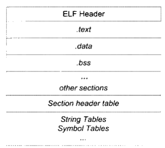

- [第3章 目标文件里有什么？](#%E7%AC%AC3%E7%AB%A0%C2%A0%E7%9B%AE%E6%A0%87%E6%96%87%E4%BB%B6%E9%87%8C%E6%9C%89%E4%BB%80%E4%B9%88)
  - [ELF文件结构](#elf%E6%96%87%E4%BB%B6%E7%BB%93%E6%9E%84)
  - [链接的接口 — 符号](#%E9%93%BE%E6%8E%A5%E7%9A%84%E6%8E%A5%E5%8F%A3--%E7%AC%A6%E5%8F%B7)
- [导航](#%E5%AF%BC%E8%88%AA)


# 第3章 目标文件里有什么？

目标文件从结构上讲，它是已编译后的可执行文件格式（Windows的.obj或Linux的.o），只是还没有经过链接的过程。它跟可执行文件的内容和结构很类似，所以一般跟可执行文件格式一起采用一种格式存储。

无论是Linux下的ELF（Executable Linkable Format）或Windows下的PE（Portable Executable）， 都是COFF（Common file format）格式的变种。目标文件与可执行文件的内容和结构很相似，动态链接库DLL和静态链接库（Windows的.lib或Linux的.a）都是按照可执行文件格式存储。

Linux下的ELF分类：

1. 可重定位文件：包含代码和数据，可以被用来链接成可执行文件或共享目标文件，静态链接库也可以归为这一类：Windows的.lib和Linux的.a
2. 可执行文件：包含可以直接执行的程序
3. 共享目标文件：包含代码和数据，链接器可以使用这种文件与其他的可重定位文件和共享目标文件链接，产生新的目标文件。动态链接器也可以用这种文件与可执行文件结合，作为进程映像的一部分来执行
4. 核心转储文件：进程意外终止时，系统将进程的地址空间及终止时的信息转储到该文件

目标文件的内容至少有编译后的机器指令代码、数据。还有链接时所需的一些信息。比如符号表、调试信息、字符串等。一些目标文件将这些信息按不同的属性，以“节”的形式存储，有时也叫“段”。

为什么要分段：    
1. 程序被装载以后数据和指令分别被放在两个虚存区域，一个只读、一个可读写，避免程序指令有意无意的修改。
2. 高速缓存的应用，指令和数据区的分离有利于提高程序的局部性。
3. 防止多个副本同时存在于内存中。

源代码编译后的机器指令常放在代码段 “.text”或“.code”，已初始化的全局变量和局部静态变量数据常放在数据段“.data”。未初始化的全局变量和局部静态变量一般放在“.bss”段里。ELF文件的开头是一个“文件头”，描述了整个文件的文件信息，包括文件是否可执行、静态链接or动态链接、入口地址、目标硬件等等。文件头还包含一个段表，描述了文件中各个段在文件中的偏移位置及段的属性等。段表其实就是一个描述文件中各个段的数组。文件头后面就是各个段的内容。

总体来说，程序源码被编译后主要分成两端：程序指令和程序数据，代码段属于程序指令，而数据段和.bss段属于程序数据。除了之外，还有只读数据段（.rodata，const变量、字符串常量）、注释信息段（.comment）和堆栈提示段（.note.GNU-stack）。

```c
static int x1=0;
static int x2=1; 
```
这是x1会存放在.bss中，x2存放在.data中，赋值为0，认为是未初始化。

## ELF文件结构



ELF目标文件的格式最前部是ELF文件头,它包含了描述整个文件的基本属性,比如ELF文件版本、目标机器型号、程序入口地址等信息。紧接着是ELF文件的各个段。其中ELF文件中与段有关的重要结构就是段表。该表描述了ELF文件包含的所有段的信息。

**ELF文件头**中定义了：ELF魔数、文件机器字节长度、数据存储方式、版本、运行平台、ABI版本、ELF重定位类型、硬件平台、硬件平台版本、入口地址、程序头入口和长度、段表的位置和长度以及段的数量等。

**魔数**：16个字节被ELF标准规定为用来标识ELF文件平台属性。

**段表**：段表描述了ELF的各段的信息，比如每个段的段名、段的长度、在文件中的偏移、读写权限及段的其他属性。段表在ELF中的位置由ELF头文件中的“e_shoff”成员决定。段表的结构比较简单，它是一个以“Elf32_Shdr”结构体为元素的数组。数组元素的个数等于段的个数，每个“Elf_Shdr”结构体对应一个段。“Elf32_Shdr”又被称为段描述符。每个段描述符为40个字节。对于编译器和连接器来说，主要决定段的属性的是段的类型(sh_type)和段的标志位(sh_flags)。段的标志位(sh_flag)表示该段在进程虚拟地址空间中的属性，比如是否可写，是否可执行等。

编译器、连接器和装载器都是依靠段表来定位和访问各个段的属性的。

**重定位表**：“.rel.text”段，它的类型(sh_type)为“SHT_REL”，也就是说它是一个重定位表（RelocationTable）。“.rel.text”段表示针对“.text”段的重定位表。

**字符串表**：字符串表把字符串集中起来存放到一个表，然后使用字符串在表中的偏移来引用字符串。一般字符串表在ELF文件中也以段的形式保存，常见的名字为“.strtab”或“.shstrtab”。分别表示字符串表和段字符串表。

## 链接的接口 — 符号

目标文件B用到目标文件A中的函数“foo”，那么我们称目标文件A定义了函数“foo”，称目标文件B引用了目标文件A中的函数“foo”。

在链接中，我们讲函数和变量统称为符号（Symbol），函数名和变量名就是符号名（Symbol Name）.
每个目标文件都会有一个相应的符号表（Symbol Table），这个表里面记录了目标文件所用到的所有符号。每个定义的符号一个一个对应的值，叫做符号值，对于变量和函数来说，符号值就是他们的地址。符号进行分类：

1. 全局符号，定义在本目标文件中，可以被其他目标文件引用
2. 外部符号，在本目标文件引用，却没有定义
3. 段名，这种符号由编译器产生，它的值就是该段的起始地址
4. 局部符号，编译单元内部可见
5. 行号信息，可选的

ELF符号表的成员：符号名、对应的值、符号大小、类型和绑定信息、符号所在的段。

**特殊符号**：ld作为可执行文件来链接产生可执行文件时，它会为我们定义很多特殊符号，这些符号并没有在你的程序中定义，但是你可以直接声明并且引用它，我们称之为特殊符号。比如：程序起始地址、代码段结束地址、数据段结束地址、程序结束地址。

符号修饰与函数签名：防止符号名称冲突，C语言源代码文件中的所有全部变量和函数编译后在相应的符号前加下划线"_"。

C++引入Namespace来解决多模块的符号冲突。

GCC通过参数"-fleading-underscore"和"-fno-leading=underscore"来打开和关闭是否在C语言符号前加下划线。

C++符号修饰：参见GCC的名称修饰标准。

C++的源代码编译后的目标文件中所使用的符号名是相应的函数和变量的修饰后名称。不同的编译器采用不同的名字修饰方法。

Extern “ C”，在C++ 编译器中不起作用。

GCC的基本C++名称修饰方法：所有的符号都以"_Z"开头，对于嵌套的名字（在名称空间或者在类里面的），后面紧跟着一个"N"，然后是各个名称空间和类的名字，每个名字前是名字字符串的长度，再以"E"结尾。

对于 C/C++语言来说，编译器默认函数和初始化了的全局变量为强符号，未初始化的全局变量为弱符号。 GCC中__attribute__((weak))来定义任何一个强符号为弱符号。（针对符号定义而非引用）。

针对强符号的概念，链接器就按如下规则处理与选择多次定义的全局符号：不允许强符号被多次定义（即不同的目标文件中不能有同名的强符号）；如果有多个强符号定义，则链接器报重复定义错误。在强符号和弱符号同时存在的一个符号选择强符号。

某个在所有目标中都是弱符号，则选择占用空间最大的弱引用指定_attribute__((weakref))，对未定义的弱引用，链接器默认为0，不会报错。

# 导航

[目录](README.md)

上一章：[2. 编译和链接](ch2.md)

下一章：[4. 静态链接](ch4.md)
