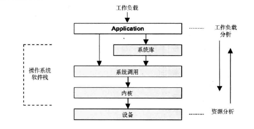

# 1.1 系统性能

系统性能是对整个系统的研究，包括了所有的硬件组件和整个软件栈。

单台服务上的通用系统软件栈

# 1.2 人员

系统性能是一项需要多类人员参与的事务，包括系统管理员、技术支持、开发、数据库管理员和网络管理员。

# 1.3 事情

性能领域包括了以下的事情，按照执行顺序：

1. 设置性能目标和模型
2. 就要软件或硬件进行性能特征归纳
3. 对开发代码进行性能分析
4. 执行软件非回归性测试（集成之前）
5. 针对软件发布版本的基准测试（软件发布前或发布后）
6. 目标环境中的概念验证测试
7. 生产环境部署的配置优化
8. 监控生产环境中的软件
9. 特定问题的性能分析

步骤 1~5 是传统产品开发过程的一部分。

# 1.4 视角

性能可以从不同的视角来审视，如负载分析和资源分析。

# 1.5 性能是充满挑战的

## 1.5.1 性能是主观的

一个给定指标是好是坏，取决于开发者和最终用户的性能预期。

通过定义清晰的目标，诸如平均响应时间、请求事件分位数，可以把主观的性能变得客观化。

## 1.5.2 性能是复杂的

性能问题可能出现在子系统之间复杂的关联上，即使各个子系统隔离时的表现都很好。也可能因为连锁故障出现性能问题。

生产环境负载的复杂，也会导致性能问题。实验环境很难重现这类情况。

## 1.5.3 可能有多个问题并存

性能分析必须量化问题的重要程度，还要估计每个问题修复之后带来的增速。

# 1.6 延时

延时表示所有操作完成的耗时。

# 1.7 动态追踪

动态追踪利用内存中的 CPU 指令并在这些指令之上动态构建检测数据。

DTrace 是一个适用于生产环境的动态追踪工具。在 DTrace 之前，系统追踪常使用静态探针（static probes）：置于内核和其他软件之上的一小套监测点。

# 1.8 云计算

云计算和虚拟化技术带来了新的难题，这包括，如何管理其他租户带来的性能影响，如何让每个租户都能对物理系统做观测。

# 导航

[目录](README.md)

下一章：[2. 方法](2-方法.md)
