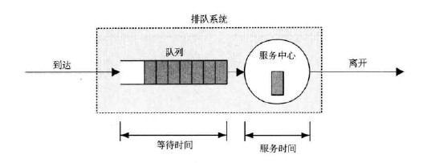
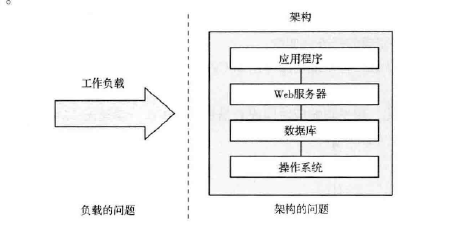
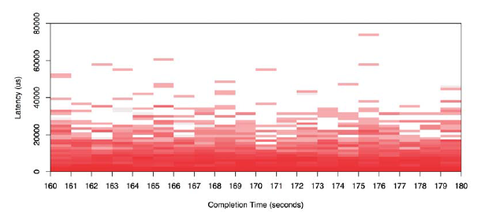

面对一个性能不佳且复杂的系统环境，第一个挑战就是知道从什么地方开始分析，收集什么样的数据，以及如何分析这些数据。

# 2.1 术语

关于性能的一些关键术语：

- IOPS：每秒的 IO 操作次数
- 吞吐量：数据传输的速度。某些情况下，吞吐量是指操作的速度（每秒的操作数）
- 响应时间：一次操作完成的时间
- 延时：描述操作里用来等待的时间
- 使用率：对于服务请求的资源，使用率描述在给定时间区间内，资源的繁忙程度
- 饱和度：某一资源无法满足服务的排队工作量
- 瓶颈
- 工作负载：系统的输入或者是对系统所施加的复杂
- 缓存

# 2.2 模型

## 2.2.1 受测系统

受测系统（SUT，system under test）的性能如图所示。


扰动（perturbation）是会影响结果的，扰动包括系统其他用户、其他的复杂等。

## 2.2.2 排队系统




# 2.3 概念

## 2.3.1 延时

延时是操作执行之前的等待时间，响应时间包括了延时和操作时间。

延时可以在不同点观测，所以要指明观测的对象。例如，网站的载入时间由三个不同的点观测的时间组成：DNS 延时，TCP 连接延时和 TCP 传输时间。

## 2.3.2 时间量级

系统各组件的延时

| 事件                      | 延时        | 相对时间比例 |
| ------------------------- | ----------- | ------------ |
| 1个CPU周期                | 0.3 ns      | 1 s          |
| L1 缓存访问               | 0.9 ns      | 3 s          |
| L2 缓存访问               | 2.8 ns      | 9 s          |
| L3 缓存访问               | 12.9 ns     | 43 s         |
| 主存访问                  | 120 ns      | 6 分         |
| 固态硬盘 I/O              | 50 - 150 us | 2-6 天       |
| 旋转磁盘 I/O              | 1 - 10 ms   | 1-12 月      |
| 互联网：旧金山 - 纽约     | 40 ms       | 4 年         |
| 互联网：旧金山 - 澳大利亚 | 183 ms      | 19 年        |
| TCP 包重传                | 1 - 3 s     | 105 - 317 年 |
| 物理系统重启              | 5 m         | 32 千年      |

## 2.3.3 权衡三角

性能/及时/成本低，这三样，最多只能获得两个。

一个常见的权衡是 CPU 和内存，内存可以缓存结果，降低 CPU 的使用。CPU 可以压缩数据来降低内存的使用。

## 2.3.4 调整的影响

性能调整发生在越靠近工作执行的地方，就越有效。

| 层级     | 调优对象                               |
| -------- | -------------------------------------- |
| 应用程序 | 执行的数据库请求                       |
| 数据库   | 数据库表的Schema、索引、缓冲           |
| 系统调用 | 内存映射、读写、同步或异步 I/O 标识    |
| 文件系统 | 记录大小、缓存大小、文件系统的可调参数 |
| 存储     | RAID级别，磁盘类型和数目               |

## 2.3.5 合适的层级

调优的层级，取决于性能技术投入的投资回报率，大公司可能有个团队来分析性能，包括内核、CPU 性能计数器。

## 2.3.6 性能建议的时间点

环境的性能特性会随着时间改变，更多的用户、新的硬件、升级的软件都是变化的因素。

性能推荐，尤其是可调整的参数值，仅仅在一段时间内有效。

## 2.3.7 负载 VS. 架构

应用程序性能差可能是因为架构的问题，也可能是由于太多的负载，导致了排队和长延时。



举个例子，架构的问题可能是一个单线程的应用在单个 CPU 上忙碌，但其他 CPU 却是空闲的。

负载的问题可能是一个多线程程序在多个 CPU 上都很忙碌，但请求依然排队的情况。负载超出了 CPU 能处理的范围。

## 2.3.8 扩展性

扩展性：负载增加下的系统所展现的性能。

例如，当 CPU 接近100% 的使用率时，调度延时增加，性能开始下降。

另一个发生性能下降可能是由于内存的负载，当系统开始换页来补充内存的时候。

磁盘 I/O 也会随着负载的增加而排队，增加了响应时间。

## 2.3.9 已知的未知

性能领域是“你知道的越多，你不知道的也就越多”。这些未知的未知，会变成你可以去查看的已知的未知。

## 2.3.10 指标

性能指标是由系统、应用程序、或者其他工具产生的度量。

常见的性能指标如下：

- IOPS: 每秒的 I/O 操作数
- 吞吐量：每秒的数据量或操作量
- 使用率
- 延时

性能指标不是免费的，有些时候要消耗一些 CPU 周期来收集和保存指标。

实际上，指标可能是混淆的、复杂的、不可靠的、不精确的，甚至是错的。

## 2.3.11 使用率

使用率是基于时间、或者基于容量的。

### 基于时间

基于时间的使用率是使用排队理论定义的：服务器或资源繁忙的均值，即

```
U = B/T
```

其中 `U` 是使用率，`T` 是观测周期，`B` 是 `T` 时间内系统的繁忙时间。

某些组件在使用率 100% 的时候，性能会有眼中的下降，有些则不会降地太大。

### 基于容量

系统或组件都能提供一定数量的吞吐。不论性能处于何种级别，系统或组件都工作在其容量的某一比例上。这个比例称为使用率。

## 2.3.12 饱和度

随着工作量增加而对资源的请求超过所能处理的程度，叫做饱和度。饱和度发生在 100% 使用率的时候。

## 2.3.13 Profilling

Profiling 是按照特定的时间间隔对系统的状态进行采样，然后对样本进行研究。

## 2.3.14 缓存

缓存是将比较慢的存储层的结果，存放在较快的存储层中。

缓存性能的重要指标是命中率：

```
命中率 = 命中次数 / (命中次数 + 失效次数)
```

另一个指标是失效率，即每秒缓存失效的次数。

工作负载的总运行时间计算方式为：

```
运行时间 = (命中率 * 命中延时) + (失效率 * 失效延时)
```

这里用的延时都是平均值。

常用的缓存算法：

- MRU（最近最常使用）
- LRU（最近最少使用）
- LFU（最近不常使用）
- NFU（不常使用）

缓存的热度：

- 冷：缓存是空的，或者填充的是无用的数据。冷缓存的命中率 0。
- 热：缓存中都是常用的数据，命中率很高。

- 温：缓存中包含有用的数据，但命中率没有预想的高。

# 2.4 视角

性能分析有两个常用的视角，每个视角的受众、指标和方法都不一样。

## 2.4.1 资源分析

资源分析以系统资源的分析为起点，涉及的资源有：CPU、内存、磁盘、网卡、总线以及之间的互联。

这个视角着重有使用率的分析，判断资源是否接近极限。

适合资源分析的指标：

- IOPS
- 使用率
- 吞吐量
- 饱和度

## 2.4.2 工作负载分析

工作负载分析查看 应用程序的性能：所施加的负载和应用程序时如何响应的。

工作负载分析的对象如下：

- 请求：所施加的工作负载
- 延时：应用程序的响应时间
- 完成度：查找错误

# 2.5 方法

## 2.5.1 街灯

用户选择熟悉的观测工具来分析性能，这些工具可能是网上找的，也可能是随意选择，仅仅是想看会有什么结果出现。

性能调整可以用试错的方式，对所知道的可调参数进行设置，熟悉不同的值，看看是否有帮助。

## 2.5.2 随机变动

用户随机猜测问题可能的位置，然后做改动，直到问题消失。整个方法如下：

1. 任意选择一个可变参数
2. 朝某个方向修改
3. 观测性能
4. 朝另一个方向修改
5. 观测性能
6. 步骤 3 和 5 是不是要好于基准值？如果是，保留修改，返回步骤 1

## 2.5.3 责怪他人

这个方法的步骤如下：

- 找到一个不是你负责的组件
- 假定问题和那个组件有关
- 把问题扔给负责那个组件的人
- 如果证明错了，返回步骤 1

## 2.5.4 Ad Hoc 核对清单

一步步地过一遍核对清单，这类清单是 Ad Hoc 的，基于该系统的经验。

比如运行 `iostat -x 1`检查 await 列，如果超过 10ms，说明磁盘太慢或过载。

这类清单在最短时间内提供最大的价值，且需要频繁更新。

## 2.5.5 问题陈述

询问客户以下问题：

1. 什么让你认为性能存在问题？
2. 系统之前运行的好吗？
3. 最近有什么改动？
4. 问题能用延时或运行时间来表述吗？
5. 问题影响其他的人和程序吗？
6. 环境是这样的？用了什么软硬件？什么版本？什么配置？

## 2.5.6 科学法

科学法研究问题是通过假设和试验：

1. 问题
2. 假设
3. 预测
4. 试验
5. 分析

## 2.5.7 诊断循环

诊断周期与科学方法类似：假设 -> 检验 -> 数据 -> 假设。

这个循环强调数据可以快速地引发新的假设，今儿验证和改良。

## 2.5.8 工具法

工具为导向的方法：

1. 列出可用的工具
2. 对每个工具，列出它提供的有用的指标
3. 对每个指标，列出阐释该指标可能的规划

这种方法的视野也不完整，通常不太高效。

## 2.5.9 USE 方法

USE 方法（Utilization，Saturation，Errors）用识别系统瓶颈：

对于所有的资源，检查它的使用率、饱和度和错误。

与工具法相反的是，USE 列举的是资源，而不是工具。这会帮助你得到一张完整的问题列表，在你寻找工具的时候做确认。

USE 方法会引导你到一定数量的关键指标上，这样可以尽快核实所有的系统资源。

| 资源     | 类型   | 指标                             |
| -------- | ------ | -------------------------------- |
| CPU      | 使用率 | CPU使用率                        |
| CPU      | 饱和度 | 分配队列长度                     |
| CPU      | 错误   | 例如，可修正的 CPU 缓存 ECC 事件 |
| 内存     | 使用率 | 可用空闲内存                     |
| 内存     | 饱和度 | 匿名换页或线程换出，或OOM事件    |
| 内存     | 错误   | 例如，失败的 malloc              |
| 网络接口 | 使用率 | 吞吐量、最大带宽                 |
| 存储设备 | 使用率 | 设备繁忙百分比                   |
| 存储设备 | 饱和度 | 等待队列长度                     |
| 存储设备 | 错误   | 设备错误（硬错误、软错误）       |

软件资源：

- 互斥锁
- 线程池
- 进程/线程容量
- 文件描述符容量：针对问题件描述符的上限

## 2.5.10 工作负载特征归纳

这个方法关注系统的输入，而不是所产生的性能问题：

- 负载是谁产生的？
- 负载为什么会被调用？
- 负载的特征是什么？
- 负载是怎样随着时间变化的？

最好的性能来自消灭不必要的工作。

## 2.5.11 向下挖掘分析

深度分析分为以下阶段：

1. 检测：用于持续记录高级层的统计数据
2. 识别：对于给定问题，缩小研究的范围，找到可能的瓶颈
3. 分析：对特定的系统部分作进一步的检查，找到问题并量化

## 2.5.12 延时分析

延时分析检查完成一项操作的时间，然后把时间再分成小的时间段。接着对最大延时的时间段再做划分，最后定位并量化问题的根本原因。

分析可以由工作负载开始，检查负载是如何在程序中被处理的，然后深入操作系统的库、系统调用、内核以及设备驱动。

比如，MySQL 的请求延时可能涉及如下问题：

1. 存在请求延时吗？
2. 请求时间大量地花在 CPU 上吗？
3. 不花在 CPU 上的时间在等什么？
4. 文件系统的 I/O 时间是花在磁盘 I/O 上还是竞争锁上？
5. 磁盘 I/O 时间主要是随机寻址的时间还是数据传输的时间？

## 2.5.13 R 方法

R 方法是针对 Oracle 数据库，基于 Oracle 的 trace events，着重于识别和量化查询过程中的时间消耗。

## 2.5.14 事件跟踪

系统的操作就是处理离散的事件，如 CPU 指令、磁盘 I/O、系统调用等。

网络排错常常要逐包检查差，推荐 tcpdump。系统调用层的工具有 strace 和 truss。

## 2.5.15 基准线统计

把当前的性能指标与之前的数值作对比，对分析问题常有启发啊。

## 2.5.16 静态性能调整

静态性能分析处理的是架构的问题，它是在系统空闲的时候进行的：

- 该组件是需要的吗？
- 配置是针对预期的负载设定的吗？
- 组件的自动配置对预期的负载是最优的吗？
- 有组件出现错误吗？

## 2.5.17 缓存调优

各级缓存的调优策略：

1. 缓存的大小尽量和栈的高度一样，靠近工作执行的地方，减少命中缓存的资源开销
2. 确认缓存正常工作
3. 确认命中率和失效率
4. 如果缓存是动态的，确认它的当前大小
5. 针对工作负载调整缓存
6. 针对缓存调整工作负载

## 2.5.18 微基准测试

微基准测试测量的是试驾了简单的人造负载的性能。它可以用以支持科学方法的假设和测试。

以下是一些微基准测试的例子：

- 系统调用：针对 `fork()`/`exec()`/`read()`
- 文件系统读取
- 网络吞吐量

# 2.6 建模

除了**测量**和**仿真**，分析**建模**可以看做是第三类性能评估方法。

如果是对一个现有系统进行分析，可以从测量开始：归纳负载特征和测量性能。分析建模基于测试和仿真的结果，用于性能预测。

可扩展性分析可以解释性能由于资源限制停止线性增长的拐点。

## 2.6.1 企业 vs. 云

利用云计算技术，任何规模的环境都可以短期租用 - 用于基准测试。不用建立模型来预测性能，可以在不同大小的云上进行特征归纳、仿真和测试。

## 2.6.2 可视化识别

当实验收集了足够多的数据结果，可以把它们绘制为性能曲线，往往可以揭示一定的规律。

曲线的类型如下：

- 线性扩展：性能随着资源的扩展，成比例地增加。
- 竞争：对共享资源的竞争会减少 扩展的效益。
- 一致性：由于要维护数据的一致性，传播数据变化的代价会超过扩展带来的好处。
- 拐点：某个因素碰到了制约点，改变了扩展曲线。
- 扩展上限：到达了一个硬性极限，可来自设备。

## 2.6.3 Amdahl 扩展定律

Amdahl 扩展定律早期的扩展特性是竞争，主要是对串行资源或工作负载的竞争。

## 2.6.4 通用扩展定律

通用扩展定律（Universal Scalability Law），引入一个系数处理一致性延时。这个定律用于描述一致性扩展的曲线，竞争的影响也被包含在内。

## 2.6.5 排队理论

排队理论用数据方法研究带有队列的系统，提供了对队列长队、等待时间、使用率的分析方法。

排队理论是建立在数据和统计的领域之上，包括概率分布、随机过程、Erlang 的 C 公式和 Little's 定律。


利用排队系统可以回答以下问题：

- 如果负载增加一倍，平均响应时间会怎样？
- 如果增加一个处理器对平均响应时间有何影响？
- 当负载增加一倍，系统 90% 的响应时间能在 100ms 以下吗？

排队系统能用以下三个要素进行归纳：

1. 到达过程：描述的是请求到达排队系统的时间间隔
2. 服务时间分布：描述的是服务中心的服务时间，可以使确定性分布、指数型等
3. 服务中心数目：一个或多个

这些要素可以用 Kendall 标记法表示。


# 2.7 容量规划

容量规划可以检查系统处理负载的情况，以及系统如何随着负载的增加而扩展。做容量规划的方法包括研究资源极限和因素分析。扩展的解决方案包括负载均衡和分片。

## 2.7.1 资源极限

该方法研究在负载之下会成为系统瓶颈的资源，步骤如下：

1. 测量服务器请求的频率，并监视频率的变化
2. 测量硬件和软件的使用，监控使用率的变化
3. 用资源的使用来表示服务器的请求情况
4. 根据每个资源来推断服务器请求的极限

要监视的资源如下：

- 硬件：CPU 使用率，内存，磁盘 IOPS，磁盘吞吐量，磁盘容量高，网络吞吐量
- 软件：虚拟内存的使用，进程/线程，文件描述符

## 2.7.2 因素分析

基于对系统最大配置的了解有一个方法：

1. 测试所有因素设置为最大时的性能
2. 逐一改变因素，测试性能
3. 基于测量的结果，对每个因素的变化引起性能下降的百分比和节省的成本做统计
4. 将最高的性能作为起始点，选择能节省成本的因素，同时确保组合后的性能下降仍满足当下所需的请求数
5. 重新测试更改后的配置，确认交付的性能

## 2.7.3 扩展方案

把负载分配给许许多多的系统，在这些系统前防止负载均衡器，称之为水平扩展。或者，建立更大的系统，这种策略叫垂直扩展。

一个常见的数据库扩展策略叫分片（sharding），把数据切分为一个个逻辑组件，每个组件由自己的数据库来管理。

# 2.8 统计

## 2.8.1 量化性能

要比较和对于问题排优先级，需要对问题和问题修复后的性能提升做量化。量化一般采用观测或实验的方法。

### 基于观测

用观测法量化性能指标：

1. 选择可靠的指标
2. 估计解决问题带来的性能受益

### 基于实验

用实验来量化性能问题：

1. 实施修复
2. 用可靠的指标量化做前后对比

## 2.8.2 平均值

平均值就是用单个数据来表示一组数据，常见的是算术平均值。其他的均值类型还包括：

- 几何平均值：数值乘积的 n 次方根。
- 调和平均值：数值的个数除以所有数值的倒数之和。
- 随着时间变化的平均值
- 衰退均值，用时间间隔测量

## 2.8.3 标准方差、百分位数、中位数

标准方差度量的是数据的离散程度。百分位数会在请求延时的性能检测时使用，对请求最慢的部分做量化。

## 2.8.4 变异系数

标准方差是相对平均数而言的，同时考虑方差和平均值时，变异就可以理解了。

## 2.8.5 多重模态分布

系统常出现多模态的情况，比如对快速的代码路径是低延时、缓慢的代码路径是高延时的。

## 2.8.6 异常值

统计的数值中，有少量极高或极低的点，不符合期望的分布。


# 2.9 监视

监视记录一段时间内的性能统计数据，方便与现在作比较找出规律。

## 2.9.1 基于时间的规律

从监控的时间图上，查看每小时、每天、每周的变化趋势。

## 2.9.2 检测产品

有很多第三方的监控产品，典型的功能包括数据存档和数据图表的网页展示，还有可配置的报警系统。

## 2.9.3 启动以来的信息统计

如果没有执行检测，可以检查系统自带的信息统计。

# 2.10 可视化

## 2.10.1 线图

线图通常用于检查一段时间内的性能指标。

## 2.10.2 散点图

散点图常用来查看数据的分布，并能够排除异常点的存在。

## 2.10.3 热图

热图把 X  和 Y 轴的区域分组量化，能解决散点图的扩展问题。




# 导航

[目录](README.md)

上一章：[1. 绪论](1-绪论.md)

下一章：[3. 操作系统](3-操作系统.md)


