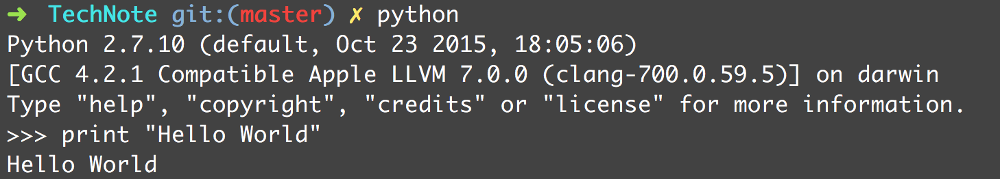

<!-- START doctoc generated TOC please keep comment here to allow auto update -->
<!-- DON'T EDIT THIS SECTION, INSTEAD RE-RUN doctoc TO UPDATE -->
**Table of Contents**  *generated with [DocToc](https://github.com/thlorenz/doctoc)*

- [1.1 运行Python](#11-%E8%BF%90%E8%A1%8Cpython)
- [1.2 变量和算术表达式](#12-%E5%8F%98%E9%87%8F%E5%92%8C%E7%AE%97%E6%9C%AF%E8%A1%A8%E8%BE%BE%E5%BC%8F)
- [1.3 条件语句](#13-%E6%9D%A1%E4%BB%B6%E8%AF%AD%E5%8F%A5)
- [1.4 文件输入输出](#14-%E6%96%87%E4%BB%B6%E8%BE%93%E5%85%A5%E8%BE%93%E5%87%BA)
- [1.5 字符串](#15-%E5%AD%97%E7%AC%A6%E4%B8%B2)
- [1.6 列表](#16-%E5%88%97%E8%A1%A8)
- [1.7 元组](#17-%E5%85%83%E7%BB%84)
- [1.8 集合](#18-%E9%9B%86%E5%90%88)
- [1.9 字典](#19-%E5%AD%97%E5%85%B8)
- [1.10 迭代与循环](#110-%E8%BF%AD%E4%BB%A3%E4%B8%8E%E5%BE%AA%E7%8E%AF)
- [1.11 函数](#111-%E5%87%BD%E6%95%B0)
- [1.12 生成器](#112-%E7%94%9F%E6%88%90%E5%99%A8)
- [1.13 协程](#113-%E5%8D%8F%E7%A8%8B)
- [1.14 对象与类](#114-%E5%AF%B9%E8%B1%A1%E4%B8%8E%E7%B1%BB)
- [1.15 异常](#115-%E5%BC%82%E5%B8%B8)
- [1.16 模块](#116-%E6%A8%A1%E5%9D%97)
- [1.17 获得帮助](#117-%E8%8E%B7%E5%BE%97%E5%B8%AE%E5%8A%A9)
- [导航](#%E5%AF%BC%E8%88%AA)

<!-- END doctoc generated TOC please keep comment here to allow auto update -->

# 1.1 运行Python

Python程序是由解释器来执行的。通常在shell中输入`python`即可启动解释器：



Python的交互模式是它最有用的功能。你可以输入人以合法的语句或语句序列，然后立即看到结果。

> 交互模式中，特殊变量`_`保存最后一次运算的结果。

执行Python程序：

```shell
python hello.py
```

在UNIX中，可以在程序首行使用`#!`，如：

```python
#!/usr/bin/env python
print "Hello World"
```

# 1.2 变量和算术表达式

Python是动态类型的语言，在程序执行的过程中，变量名会被绑定到不同的值，而且这些值可以属于不同的类型。

变量名是无类型的，在执行过程中可以引用任意类型的数据。

在同一行上，使用分号来隔开多条语句。

Python 不会指定缩进的空格数，只要在一个代码块中保持一致就行了。通常4个空格最常见。

`format`函数使用的格式说明符类似于传统格式化运算符(`%`)使用的说明符。

```python
print "%3d %0.2f" % (year, principal)
print format(year, "3d"), format(principal, "0.2f")
print "{0:3d} {1:0.2f}".format(year, principal)
```
"{0:3d} {1:0.2f}" 冒号前的数字代表传递给`format`的相关参数，冒号后是格式说明符。

# 1.3 条件语句

```python
if a < b:
    pass # do nothing
else:
    print "No"
```

使用`or`、`and`和`not`关键字，可以组成布尔表达式。

行尾使用反斜杠`\`，可以另起一行继续写代码。

Python没有`switch`或`case`来检测多个值，只能借助：

```python
if suffix == ".html":
	content = "text/html"
elif suffix = ".jpg":
    content = "img/jpeg"
else:
    raise RuntimeError("Unknown content type")
```

`in`操作符常用于检查某个值是否包含在另一对象（字符串、列表、字典）中。

# 1.4 文件输入输出

```python
f = open("foo.txt")
line = f.readline()
while line:
    print line, # 后面跟,将忽略换行符
    line = f.readline()
f.close()
```

等同于：

```python
for line in open("foo.txt"):
    print line,
```

写入文件，要在`print`语句后使用`>>`指定一个文件（Python 2）：

```python
f = open("out", "w")
while yead <= numyears:
    print >>f, "%3d %0.2f" % (year, principal)
    year += 1
f.close()    
```

`>>`语法只能用于 Python 2，如果使用Python 3，可将`print`改写如下：

```python
print ("3d %0.2f" % (year, principal), file = f)
```

另外，文件对象支持`write()`方法写入原始数据，上述`print`等同于：

```python
f.write("3d %0.2f\n" % (year, principal))
```

如果要交互式读取用户使用，可以从文件`sys.stdin`读取。要将数据输出到屏幕上，可以写入`sys.stdout`中。

```python
import sys
sys.stdout.write("Enter your name: ")
name = sys.stdin.readline()
```


# 1.5 字符串

要创建一个字符串，将字符串放在单引号、双引号或三引号中即可。

两个三引号之间的所有文本均被视作字符串的内容，而使用单引号和双引号的字符串必须在一个逻辑行上。

字符串存储一个字符序列中，可以使用整数索引：

```python
a = "Hello World"
b = a[4] # b = 'o'
```

要提取一个字符串，使用切片运算符`s[i:j]`。如果省略`i`，则假定使用字符串的起始位置，省略`j`，假定使用字符串的结尾位置：

```python
a[:5] # Hello
a[6:] # World
a[3:8] # lo Wo
```

Python不会把字符串的内容隐式地解释为数值数据。要使用`int()`或`float()`等函数将字符串转换为数值。

使用`str()`、`repr()`、`format()`函数可将非字符串值转换为字符串表示形式。`str()`的输出和`print`语句的输出相同。`repr()`创建的字符串表示程序中某个对象的精确值。

```python
x = 3.4
str(x) # '3.4'
repr(x) # '3.399999999999'
```

`format()`函数将值转换为特定格式字符串：

```python
format(x, "0.5f") # '3.4000'
```

# 1.6 列表

列表是人以对象的组成的序列，把值放入方括号中就可以创建列表。

```python
names = ["Dave", "Mark", "Ann", "Phil"]
a = names[2]
names[0] = "Jeff"

names.append("Paula")

names.insert(2, "Thomas")

names[0:2] # ["Jeff", "Mark"]
names[2:] # ["Thomas", "Ann", "Phil", "Paula"]
names[0:2] = ["Dave", "Mark", "Jeff"] # 将列表的头两项替换为邮编的列表

# 使用 + 连接链表
a = [1, 2, 3] + [4, 5]

# 列表可以包含任意类型的对象，嵌套列表需要多次索引操作来访问
[1, "Dave", 314, ["Mark", 7, 9], 10]
```


# 1.7 元组 

元组将一组值打包到一个对象中，在圆括号中放入一组值即可创建元组。

```python
stock = ('GOOG', 100, 809.02)
```

其实没有圆括号，Python也能识别元组：

```python
stock = 'GOOG', 100, 809.02
```

也可以定义0个、1个元素的元组，但语法特殊：

```python
a = ()
b = (item, )
c = item, 
```

使用整数索引可以提取元组中的值，更常见的做法是将元组解包为一组变量：

```python
name, shares, price = stock
```

元组同样支持切片、连接。但创建元组后，不能修改它的内容。


# 1.8 集合

 集合用于包含一组无序的对象。要创建集合，可使用`set()`这函数：

 ```python
 s = set([3, 4, 5, 8])
 t = set("Hello")`
 ```

 集合是无序的，所以也无法进行索引。集合中的元素也不能重复。

 ```python
 print t # set(['H', 'e', 'l', 'o'])
 ```

 集合支持并集、交集、对称差集的操作：

 ```python
 a = t | s # 并集
 b = t & s # 交集
 c = t - s # 差集
 d = t ^ s # 对称差集，项目在 t 或 s 中，但不同时出现在两者中
 ```

使用`add()`或`update()`可以添加新项，`remove()`删除一项。


# 1.9 字典

字典就是一个关联数组或散列表，使用花括号`{}`放入值即可创建字典：

```python
stock = {
  'name': "GOOG",
  'shares': 100,
  'price': 490.10  
}
```

访问字典成员，使用键索引运算符：

```python
name = stock['name']
stock['shares'] = 75
```

使用`in`运算符可以检查某个内容项是不是字典成员：

```python
prices = {}
if 'SOX' in prices:
    p = prices['SOX']
else:
	p = 0.0
```

上述语句等同于：

```python
p = prices.get('SOX', 0.0)
```

获得一个字典关键字的列表：

```python
syms = list(prices)
```

删除字典的元素：

```python
del prices['MSFT']
```

# 1.10 迭代与循环

```python
for n in [1, 2, 3, 4]:
    print "2 to the %d power is %d" % (n, 2**n)
```

快捷写法：

```python
for n in range(1, 5):
    print "2 to the %d power is %d" % (n, 2**n)
```

`range(i, j, step)`创建一个 `i` 到 `j-1`之间的整数范围。

`xrange()`函数创建的对象会在收到查询请求时根据需要计算它所表示的值，避免像`range()`那样耗掉内存。

`for`语句不仅限于整数序列，还用于迭代多种对象，如字符串、列表、字典、文件：

```python
a = "Hello"
for c in a:
    print c
    
b = ["Dave", "Mark", "Ann", "Phil"]
for name in b:
    print name
    
c = {'GOOG': 490.10, 'IBM': 91.50}
for key in c:
    print key, c[key]
    
d = open("foo.txt")
for lin in f:
    print lin
```

# 1.11 函数

```python
def remainder(a, b):
    a = a //b
    r = a - q*b
    return r

result = remaindar(37, 15)
```

如果要返回多个值，使用元组。

要给函数参数提供一个默认值：

```python
def connect(host, port, timeout=300):
    # body
connect('www.python.org', 80)
```

还可以使用关键字参数调用函数，此时可以按照任意顺序提供参数：

```python
connect(port=80, host='www.python.org')
```

函数内部创建的变量，作用域是局部的。要在函数内部修改某个全局变量的值，使用`global`：

```python
count = 0
def foo():
    global count
    count += 1
```

# 1.12 生成器

使用`yield`语句，可以让函数生成一个结果序列，而不仅仅是一个值：

```python
def countdown(n):
    print "Counting down"
    while n > 0:
        yield n
        n -= 1
```

任何使用`yield`的函数成为生成器，调用生产器将创建一个对象，该对象通过连续`next()`调用产生一系列的结果：

```python
c = countdown(5)
c.next() 
# Counting down 
# 5
c. next() # 4
```

`next()`调用使函数一直运行，到下一个`yield`语句为止。此时`next()`将返回传递给`yield`的值，然后函数终止执行。下次调用`next()`时，函数将继续执行`yield`之后的语句。此过程持续到函数返回位置。

```python
for i in countdown(5):
    print i
```

生产器是编写 基于处理管道、流、或数据流程序的强大方式：

```python
def tail(f):
   f.seek(0, 2)
   while True:
        line = f.readline()
        if not line:
            time.sleep(0.1)
            continue
            
        yield line    
```

# 1.13 协程

协程通过将`yield`语句作为表达式(`yield`)的形式创建的：

```python
def print_matches(matchtext):
    print "Looking for", matchtext
    while True:
        line = (yield)
        if matchtext in line:
            print line
```

要使用这个函数，首先要调用它，向前执行到第一条`(yield)`语句，然后用`send()`向它发送数据。

使用`send()`给协程发送某个值之前，协程会暂时中止。发送值后，携程中的`(yield)`将返回这个值，接下来的语句就是处理它。处理直到遇到下一个`(yield)`表达式才会结束，这是函数将暂时中止。

# 1.14 对象与类

程序中使用的所有值都是对象。对象由内部数据和各种方法组成。

`dir()`函数可以列出对象上的可用方法。

`class`关键字定义新的对象类型：

```python
class Stack(object):
    def __init__(self):
        self.stack = []
        
    def push(self, object):
        self.stack.append(object)
```

1. 圆括号`(object)`表明继承方式
2. 成员方法的第一个参数是必须是对象本身
3. 涉及到对象属性的所有操作必须显式引用`self`变量。
4. 以双下划线开始和结束的方法是特殊的方法

# 1.15 异常

```python
try:
    f = open("file.txt", r)
except IOError as e:
    print e
```

`raise`会手动引发异常：

```python
raise RuntimeError("NO!!")
```

`with`语句执行时会自动获取lock对象。当离开`with`代码块时，锁被自动释放。

# 1.16 模块

Python 允许把定义放入一个文件中，然后在其他程序或脚本中作为模块导入。

要创建模块，可将相关的语句和定义放入与模块同名的文件中：

```python
# div.py
def divide(a, b):
    # do something
```

要在其他程序中使用该模块，`import`：

```python
import div
a, b = div.divide(121, 45)
```

`import`创建了一个新的命名空间，并在该命名空间中执行与`.py`文件相关的所有语句。

如果使用不同的名称导入模块，使用`as`：

```python
import div as foo
a, b = foo.divide(121, 45)
```

 将具体的定义导入到当前命名空间，使用`from`：

```python
from div import divide
a, b = divide(121, 45)
```

要把模块的所有内容导入到当前的命名空间：

```python
from div import *
```

# 1.17 获得帮助

1. 交互模式运行 Python 时，使用`help()`命令
2. 大多数的 Python 函数都有描述该函数用途的文档字符串，打印`__doc__`属性即可。
3. pydoc 命令。


# 导航

[目录](README.md)

下一章: [2、词法约定和语法](2、词法约定和语法.md)
