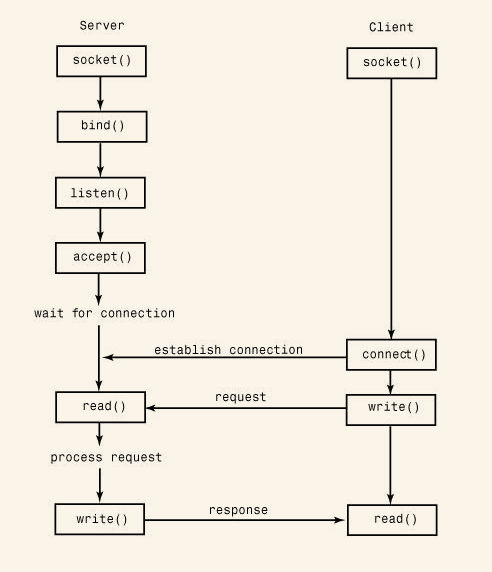
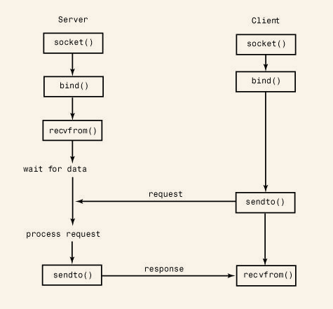

<!-- START doctoc generated TOC please keep comment here to allow auto update -->
<!-- DON'T EDIT THIS SECTION, INSTEAD RE-RUN doctoc TO UPDATE -->
**Table of Contents**  *generated with [DocToc](https://github.com/thlorenz/doctoc)*

- [21.1 Network Programming Basics](#211-network-programming-basics)
- [21.2 `asynchat`](#212-asynchat)
- [21.3 `asyncore`](#213-asyncore)
- [21.4 `select`](#214-select)
  - [When to Consider Asynchronous Networking](#when-to-consider-asynchronous-networking)
- [21.5 `socket`](#215-socket)
  - [Socket Types](#socket-types)
  - [Addressing](#addressing)
  - [Functions](#functions)
  - [Exceptions](#exceptions)
- [21.6 `ssl`](#216-ssl)
- [21.7 `SocketServer`](#217-socketserver)
  - [Servers](#servers)
  - [Defining Customized Servers](#defining-customized-servers)
- [Navigation](#navigation)

<!-- END doctoc generated TOC please keep comment here to allow auto update -->

# 21.1 Network Programming Basics

The TCP protocol is a reliable connection-oriented protocol used to establish a two-way communications stream between machines. UDP is a lower-level packet-based protocol (connectionless) in which machines send and receive discrete packets of information without formally establishing a connection. Unlike TCP, UDP communication is unreliable and thus inherently more complicated to manage in applications that require reliable communications

Both network protocols are handled through a programming abstraction known as a socket. A socket is an object similar to a file that allows a program to accept incoming connections, make outgoing connections, and send and receive data. Before two machines can communicate, both must create a socket object.

The machine receiving the connection (the server) must bind its socket object to a known port number.

TCP connection protocol:

UDP connection protocol:

# 21.2 `asynchat` 

The `asynchat` module simplifies the implementation of applications that implement asynchronous networking using the `asyncore` module. It does this by wrapping the low-level I/O functionality of `asyncore` with a higher-level programming interface that is designed for network protocols based on simple request/response mechanisms (for example, HTTP).   

To use this module, you must define a class that inherits from `async_chat`. Within this class, you must define two methods: `collect_incoming_data()` and `found_terminator()`. The first method is invoked whenever data is received on the network connection. Typically, it would simply take the data and store it someplace. The `found_terminator()` method is called when the end of a request has been detected. For example, in HTTP, requests are terminated by a blank line.

For data output, `async_chat` maintains a producer FIFO queue.

`async_chat([sock])`   Base class used to define new handlers.

An instance, `a`, of `async_chat` has the following methods in addition to those already provided by the asyncore.dispatcher base class:  

- `a.close_when_done()`   Signals an end-of-file on the outgoing data stream by pushing None onto the producer FIFO queue.
- `a.collect_incoming_data(data)`   Called whenever data is received on the channel.
- `a.found_terminator()`   Called when the termination condition set by `set_terminator()` holds.
- `a.push(data)`   Pushes data onto the channel’s outgoing producer FIFO queue.

`simple_producer(data [, buffer_size])`   Creates a simple producer object that produces chunks from a byte string data.

# 21.3 `asyncore`
The `asyncore` module is used to build network applications in which network activity is handled asynchronously as a series of events dispatched by an event loop, built using the `select()` system call.

All the functionality of this module is provided by the dispatcher class, which is a thin wrapper around an ordinary socket object.   

`dispatcher([sock])` Base class defining an event-driven nonblocking socket object.

The following methods of the dispatcher class are called to handle network events. They should be defined in classes derived from dispatcher.  

- `d.handle_accept()` Called on listening sockets when a new connection arrives.
- `d.handle_connect()` Called when a connection is made.
- `d.handle_read()` Called when new data is available to be read from a socket.   
- `d.bind(address)` Binds the socket to address.
- `d.accept()` Accepts a connection.
- `d.bind(address)` Binds the socket to address.
- `d.close()` Closes the socket.   
- `d.connect(address)` Makes a connection. `address` is a tuple `(host, port)`.   
- `d.create_socket(family, type)` Creates a new socket.
- `d.listen([backlog])` Listens for incoming connections.
- `d.recv(size)` Receives at most size bytes.
- `d.send(data)` Sends data. data is a byte string. Called when an attempt to write data is made.

The following functions is used to start the event loop and process events:

- `loop([timeout [, use_poll [, map [, count]]]])` Polls for events indefinitely. The `select()` function is used for polling unless the `use_poll` parameter is `True`, in which case `poll()` is used instead.

# 21.4 `select`

The `select` module provides access to the `select()` and `poll()` system calls.

`select(iwtd, owtd, ewtd [, timeout])`   Queries the input, output, and exceptional status of a group of file descriptors.

`poll()`   Creates a polling object that utilizes the `poll()` system call.

A polling object, p, returned by `poll()` supports the following methods:

- `p.register(fd [, eventmask])`   Registers a new file descriptor, `fd`.
- `p.poll([timeout])`   Polls for events on all the registered file descriptors.

The `select` module is sometimes used to implement servers based on tasklets or coroutines—a technique that can be used to provide concurrent execution without threads or processes.

## When to Consider Asynchronous Networking

An often-cited reason for using asynchronous I/O is to minimize the perceived overhead of programming with a large number of threads, especially when managing a large number of clients and in light of restrictions related to the global interpreter lock.

An important feature of coroutines is that you can write programs that look more like threaded programs in their overall control flow.

if you need to write a server that constantly transmits data over hundreds or even thousands of simultaneous network connections, threads will tend to have superior performance. This is because the performance of `select()` degrades significantly as the number of connections it must monitor increases.

# 21.5 `socket`

The `socket` module provides access to the standard BSD socket interface. The socket interface is designed to be generic and is capable of supporting a wide variety of networking protocols (Internet, TIPC, Bluetooth, and so on). However, the most common protocol is the Internet Protocol (IP), which includes both TCP and UDP.

## Socket Types

The socket type specifies the type of communications (streams or packets) to be used within a given protocol family. The most common socket types are `SOCK_STREAM` and `SOCK_DGRAM` because they correspond to TCP and UDP in the Internet Protocol suite.

## Addressing

- AF_INET(IPv4)
    For Internet applications using IPv4, addresses are specified as a tuple `(host, port)`.
- AF_INET(IPv6)
    For IPv6, addresses are specified as a 4-tuple `(host, port, flowinfo, scopeid)`.

## Functions

- `create_connection(address [, timeout])` Establishes a `SOCK_STREAM` connection to address and returns an already connected socket object.
- `getaddrinfo(host, port [,family [, socktype [, proto [, flags]]]])` Given `host` and `port` information about a host, this function returns a list of tuples containing information needed to open up a socket connection.
- `gethostbyname(hostname)` Translates a `host` name such as 'www.python.org' to an IPv4 address.
- `htonl(x)` Converts 32-bit integers from host to network byte order (big-endian).
- i`net_aton(ip_string)` Converts an IPv4 address provided as a string (for example, '135.128.11.209') to a 32-bit packed binary format for use as the raw-encoding of the address.
- `ntohl(x)` Converts 32-bit integers from network (big-endian) to host byte order.
- `socket(family, type [, proto])` Creates a new socket using the given address family, socket type, and protocol number.
- `socketpair([family [, type [, proto ]]])` Creates a pair of connected socket objects using the given family, type, and proto options, which have the same meaning as for the `socket()` function.

Sockets are represented by an instance of type `SocketType`. The following methods are available on a socket, `s`:   

- `s.accept()`   Accepts a connection and returns a pair `(conn, address)`, where conn is a new socket object that can be used to send and receive data on the connection and address is the address of the socket on the other end of the connection.   
- `s.bind(address)`   Binds the socket to an address.
- `s.connect(address)`   Connects to a remote socket at `address`.
- `s.getsockopt(level, optname [, buflen])`   Returns the value of a socket option.
- `s.listen(backlog)`   Starts listening for incoming connections.
- `s.recv(bufsize [, flags])`   Receives data from the socket.
- `s.send(string [, flags])`   Sends data in string to a connected socket.
- `s.setblocking(flag)`   If flag is zero, the socket is set to nonblocking mode.
- `s.setsockopt(level, optname, value)`   Sets the value of the given socket option.

## Exceptions

`herror`   Error raised for address-related errors.

`gaierror`   Error raised for address-related errors in the `getaddrinfo()` and `getnameinfo()` functions.

`timeout`   Exception raised when a socket operation times out.

# 21.6 `ssl`

The `ssl` module is used to wrap socket objects with the Secure Sockets Layer (SSL), which provides data encryption and peer authentication.

`wrap_socket(sock [, **opts])`   Wraps an existing socket sock (created by the socket module) with SSL support and returns an instance of SSLSocket.

An instance `s` of SSLSocket inherits from socket.socket and additionally supports the following operations:   

- `s.cipher()`   Returns a tuple `(name, version, secretbits)` where name is the cipher name being used, version is the SSL protocol, and secretbits is the number of secret bits being used.
- `s.read([nbytes])`   Reads up to nbytes of data and returns it.
- `s.write(data)`   Writes the byte string data.
- `s.unwrap()`   Shuts down the SSL connection and returns the underlying socket object on which further unencrypted communication can be carried out.

# 21.7 `SocketServer`

This module is called `socketserver` in Python 3. The `SocketServer` module provides classes that simplify the implementation of TCP, UDP, and UNIX domain socket servers.

To use the module, you define a handler class that inherits from the base class `BaseRequestHandler`. An instance `h` of `BaseRequestHandler` implements,

- `h.handle()`   This method is called to perform the actual work of a request.
- `h.setup()`   This method is called before the `handle()` method to perform initialization actions.

## Servers

To use a handler, it has to be plugged into a server object. There are four basic server classes defined:   

- `TCPServer(address, handler)` A server supporting the TCP protocol using IPv4.
- `UDPServer(address, handler)` A server supporting the Internet UDP protocol using IPv4.
- `UnixStreamServer(address, handler)` A server implementing a stream-oriented protocol using UNIX domain sockets. Inherits from `TCPServer`.   
- `UnixDatagramServer(address, handler)` A server implementing a datagram protocol using UNIX domain sockets. This inherits from `UDPServer`.

Instances of all four server classes have the following basic methods:   

- `s.fileno()` Returns the integer file descriptor for the server socket.
- `s.serve_forever()`   Handles an infinite number of requests.
- `s.socket` The socket object being used for incoming requests.

## Defining Customized Servers

This customization is carried out by inheriting from one of the four basic servers described in the previous section. The following class attributes can be defined to customize basic settings of the underlying network socket:

- `Server.address_family`   The address family used by the server socket.
- `Server.request_queue_size`   The size of the request queue that’s passed to the socket’s `listen()` method.
- `Server.socket_type`   The socket type used by the server, such as `socket.SOCK_STREAM` or `socket.SOCK_DGRAM`.
- `Server.activate()`   Method that carries out the `listen()` operation on the server.
- `Server.bind()`   Method that carries out the bind() operation on the server.
- `Server.handle_error(request, client_address)`   Method that handles uncaught exceptions that occur in handling.

Finally, addition server features are available through the use of mixin classes. This is how concurrency via threads or processing forking is added.

- `ForkingMixIn`   A mixin class that adds UNIX process forking to a server, allowing it to serve multiple clients.
- `ThreadingMixIn`   A mixin class that modifies a server so that it can serve multiple clients with threads.

To add these features to a server, you use multiple inheritance where the mixin class is listed first.

# Navigation

[Table of Contents](README.md)

Prev: [20. Threads and Concurrenty](20-threads-concurrency.md)

Next: [22. Internet Application Programming](22-internet-application-programming.md)
