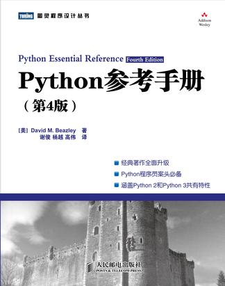

<!-- START doctoc generated TOC please keep comment here to allow auto update -->
<!-- DON'T EDIT THIS SECTION, INSTEAD RE-RUN doctoc TO UPDATE -->
**Table of Contents**  *generated with [DocToc](https://github.com/thlorenz/doctoc)*

- [目录](#%E7%9B%AE%E5%BD%95)
  - [I: The Python Language](#i-the-python-language)
  - [II: The Python Library](#ii-the-python-library)

<!-- END doctoc generated TOC please keep comment here to allow auto update -->

[《Python参考手册》](https://book.douban.com/subject/5401851/)

# 目录

## I: The Python Language

[1、Python简介](1、Python简介.md)

[2、词法约定和语法](2、词法约定和语法.md)

[3、类型与对象](3、类型与对象.md)

[4、运算符与表达式](4、运算符与表达式.md)

[5、程序结构与控制流](5、程序结构与控制流.md)

[6、函数与函数式编程](6、函数与函数式编程.md)

[7、类与面向对象编程](7、类与面向对象编程.md)

[8、模块、包与分发](8、模块、包与分发.md)

[9、输入与输出](9、输入与输出.md)

[10、执行环境](10、执行环境.md)

[11、测试、调试、探查与调优](11、测试、调试、探查与调优.md)

## II: The Python Library

[12. Build-In Functions and Exceptions](12-built-in-functions-and-exceptions.md)

[13. Python Runtime Services](13-python-runtime-services.md)

[14. Mathematics](14-mathematics.md)

[15. Data Strutures, Algorithms, and Code Simplification](15-data-structure-algorithms.md)

[16. String and Text Handling](16-string-text-handling.md)

[17. Python Database Access](17-python-database-access.md)

[18. File and Directory Handling](18-file-directory-handling.md)

[19. Operating System Services](19-operating-system-services.md)

[20. Threads and Concurrenty](20-threads-concurrency.md)

[21. Network Programming and Sockets](21-network-programming-sockets.md)

[22. Internet Application Programming](22-internet-application-programming.md)

[23. Web Programming](23-web-programming.md)

[24. Internet Data Halding and Encoding](24-internet-data-handling-encoding.md)
