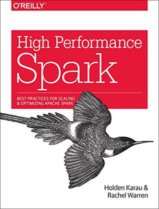

<!-- START doctoc generated TOC please keep comment here to allow auto update -->
<!-- DON'T EDIT THIS SECTION, INSTEAD RE-RUN doctoc TO UPDATE -->
**Table of Contents**  *generated with [DocToc](https://github.com/thlorenz/doctoc)*

- [Table of Contents](#table-of-contents)

<!-- END doctoc generated TOC please keep comment here to allow auto update -->

Reading notes for [《High Performance Spark》](https://book.douban.com/subject/26761862/).

# Table of Contents 

[1. Introduction to High Performance Spark](1-introduction.md)

[2. How Spark Works](2-how-spark-works)
