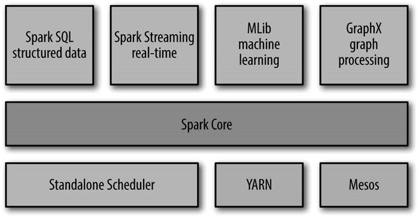

<!-- START doctoc generated TOC please keep comment here to allow auto update -->
<!-- DON'T EDIT THIS SECTION, INSTEAD RE-RUN doctoc TO UPDATE -->
**Table of Contents**  *generated with [DocToc](https://github.com/thlorenz/doctoc)*

- [1.1 Spark是什么](#11-spark%E6%98%AF%E4%BB%80%E4%B9%88)
- [1.2 一个大一统的件站栈](#12-%E4%B8%80%E4%B8%AA%E5%A4%A7%E4%B8%80%E7%BB%9F%E7%9A%84%E4%BB%B6%E7%AB%99%E6%A0%88)
  - [1.2.1 Spark Core](#121-spark-core)
  - [1.2.2 Spark SQL](#122-spark-sql)
    - [1.2.3 Spark  Streaming](#123-spark--streaming)
    - [1.2.4 MLlib](#124-mllib)
    - [1.2.5 GraphX](#125-graphx)
  - [1.2.6 集群管理器](#126-%E9%9B%86%E7%BE%A4%E7%AE%A1%E7%90%86%E5%99%A8)
- [1.3 Spark的用户和用途](#13-spark%E7%9A%84%E7%94%A8%E6%88%B7%E5%92%8C%E7%94%A8%E9%80%94)
- [1.4 Spark简史](#14-spark%E7%AE%80%E5%8F%B2)
- [1.6 Spark的存储层次](#16-spark%E7%9A%84%E5%AD%98%E5%82%A8%E5%B1%82%E6%AC%A1)
- [导航](#%E5%AF%BC%E8%88%AA)

<!-- END doctoc generated TOC please keep comment here to allow auto update -->

# 1.1 Spark是什么

Spark是一个用来实现快速而通用的集群计算的平台。

速度上，Spark扩展了MapReduce计算模型，且支持更多计算模式，包括交互式查询、流处理。Spark的一个主要特点是能够在内存中计算，因而更快。

Spark适用于原先需要多种不同的分布式平台的场景，包括批处理、迭代算法、交互式查询、流处理。Spark使我们可以简单而低耗地将种处理流程整合在一起。

Spark提供了丰富的接口，除了基于Python、Java、Scala和SQL的API及内建的程序库，Spark还能和其他大数据平台密切配合。如，Spark可以运行在Hadoop集群上，访问包括Cassandra在内的任意的Hadoop数据源。

# 1.2 一个大一统的件站栈

Spark的核心是一个对由很多计算任务组成的、运行在多个工作机器或者是一个计算集群上的应用进行调度、分发以及监控的计算引擎。Spark还支持为各种不同应用场景专门设计的高级组件，比如SQL和机器学习等。

各组件间密切结合的设计原理有这样几个优点：

- 软件栈中所有的程序库和高级组件都可以从下层的改进中获益。
- 运行整个软件栈的代价变小了。一个机构只需要运行一套软件系统即可。
- 我们能够构建出无缝整合不同处理模型的应用。

## 1.2.1 Spark Core

Spark Core实现了Spark的基本功能，包含任务调度、内存管理、错误恢复、与存储系统交互等模块。

Spark Core中还包含了对弹性分布式数据集（resilient distributed dataset，简称 RDD）的API定 义。 RDD表示分布在多个计算节点上可以并行操作的元素集合，是Spark主要的编程抽象。Spark Core提供了创建和操作这些集合的多个API。

## 1.2.2 Spark SQL

Spark SQL是Spark用来操作结构化数据的程序包。通过Spark SQL，我们可以使用SQL或者Apache Hive版 本的SQL方言（HQL）来查询数据。

### 1.2.3 Spark  Streaming

Spark Streaming是Spark提供的对实时数据进行流式计算的组件。Spark Streaming提供了用来操作数据流的API，并且与Spark Core中的RDD API高度对应。

### 1.2.4 MLlib

MLlib提供了很多种机器学习算法，包括分类、回归、聚类、协同过滤等，还提供了模型评估、数据导入等额外的支持功能。MLlib还提供了一些更底层的机器学习原语，包括一个通用的梯度下降优化算法。所有这些方法都被设计为可以在集群上轻松伸缩的架构。

### 1.2.5 GraphX

GraphX是用来操作图（比如社交网络的朋友关系图）的程序库，可以进行并行的图计算。与Spark Streaming和Spark SQL类似，GraphX也扩展了Spark的RDD API，能用来创建一个顶点和边都包含任意属性的有向图。GraphX还支持针对图的各种操作和算法。

## 1.2.6 集群管理器

Spark支持在各种集群管理器上运行，如Hadoop YARN，Apache Mesos，以及Spark自带的一个建议调度器，叫做独立调度器。

# 1.3 Spark的用户和用途

Spark 的两大目标群体是：数据科学家和工程师。他们使用Spark的用例并不一致，可分为：

- 数据科学应用

  分析数据并建模，以发现一些潜在的规律。

- 数据处理应用

  Spark为开发用于集群并行执行的程序提供了一条捷径，开发者不需要关注分布式编程这样的复杂问题，也不需要关注网络通信、程序容错性。

# 1.4 Spark简史

Spark于2009年作为一个研究项目在加州大学伯克利分享RAD实验室（AMPLab的前身）诞生。相比于MapReduce，Spark是为了交互式查询和迭代算法设计的，还支持内存式存储和高效的容错机制，提升性能达10 ~ 20 倍。

2011年，AMPLab开始基于Spark开发更高层的组件，如Shark，Spark Streaming。

Spark于2010年3月开源，并于2013年6月交给了Apache基金会。

# 1.6 Spark的存储层次

Spark 不仅可以将任何HDFS上的文件读取为分布式数据集，也支持其他Hadoop接口的系统，比如本地文件、亚马逊S3、Cassandra、Hive、HBase等。

Hadoop并非Spark的必要条件，Spark支持任何实现了Hadoop接口的存储系统。

Spark支持的Hadoop输入格式包括文本文件、SequenceFile、Avro、Parquet等。

# 导航

[目录](README.md)

下一章: [2. Spark下载与入门](2. Spark下载与入门.md)
